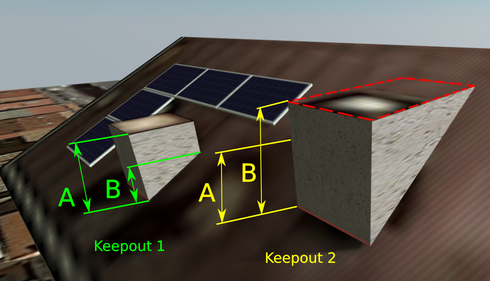

# Introduction

Ezzing 3DLayout is a PV planning tool that allows you to generate a 3d model of a building based on a satellite image. You can model any number of buildings, select between up to five different type of roofs, define keepouts and trees with custom heights...

Inside each roof area you can customize different structures, select module models and get automated previews of your setup.

It also provides you with a perspective view and a sun simulator to determine where the shadows will be in your installation.

Ezzing 3DLayout is an embebible webapp. You can integrate it inside your own system and customize many elements inside, from module models to prefered default settings for each roof type.

In this document you will find a brief showcase of the different areas of the app, a technical explanation on how to integrate this webapp inside your platform, a full description of the API that will allow you to communicate with the 3DLayout, and finally a description of how to customize different parts of the app.

 

You can test the app by visiting this link:

<a href="https://layout.ezzing.com/#/demo">https://layout.ezzing.com/#/demo</a></li>

Also you can follow a tutorial to learn the basics of the 3DLayout in this link:

<a href="https://layout.ezzing.com/#/tutorial">https://layout.ezzing.com/#/tutorial</a></li>

# Screenshots

# 3DLayout Interface

The 3DLayout interface has two diferent parts: the **aside panel** and the **canvas area**.

## Aside Panel

In the aside panel you can find functionalities related to the current active building and other objects in the scene.

 

## Canvas Area

In the canvas area you can see the satellite view and three different sets of elements: the **buildings index** on the left side, the **main options buttons** on the top, and the **control buttons** on the bottom-right corner.

### Buildings Index

In the buildings index you can see the active building and select another one to become active.

 

### Main Options

These are the main options in the canvas area:

All these buttons are the **main options custom buttons**. You can customize this set of buttons by hidding some of them, by sorting them, or by adding new buttons.

The default custom buttons are:

* Save
* Search address
* Snapshot
* Fullscreen
* Sun simulation
* Perspective view
* Renderer
* Satellite provider selector (only showed if available)

> Please, visit the section [Custom Buttons](#custom-buttons) to learn how to add your own buttons.

### Control Buttons

These are map related buttons. You can also customize the upper section of this set of buttons by hidding some of them or by adding new buttons.

Fixed buttons in this area:

* Zoom in
* Zoom out

3D control custom buttons:

* Compass (centers 3D view to north)
* Geolocation (centers 3D view to the project)
* Zoom in
* Zoom out

> Please, visit the section [Custom Buttons](#custom-buttons) to learn how to add your own functions.

# Keepouts

## Keepout height calculations

When creating keepouts, please note the height selected for the keepout is not always the final keepout height.

Depending on the roof inclination and the keepout dimensions and positions, there is a minimum keepout height to avoid keepouts under the roof surface.
<!-- FIX
Let's see an example:

In keepout 1, A is the desired height, and B is the minimum height for this keepout. As A is bigger than B then the keepout is created with the desired height (A).

In keepout 2, A is also the desired height, but the keepout can't be drawn correctly if the height is less than B measure, as some parts of the keepout will stay below the roof, so keepout 2 will be created with the minimum calculated height (B).
-->
> Note that for flat roofs it is posible to create 0 height keepouts, but for inclinated roofs you need to use the invisible keepouts feature to allow keepouts at roof surface level.

## Invisible keepouts

If you want to simulate a skylight or any keepout object without drawing the 3d volume you can check the 'Invisible keepout' option to hide the 3D volume but still taking the obstacle into account.

## Crop keepout to the building shape

When editing the vertices of a keepout you can check the 'Crop shape to building limits' option. This helps you to draw keepouts that extends to the border of the building with more precision.

If you uncheck this option then the keepout can be floating outside the building limits. At least one vertex of the keepout should be inside the building limits to be created.

# Subareas

## Subarea creation

A subarea is a region inside an area that allows you to define a modules installation just in a section of the area.

To create a subarea click on the 'Create subarea' button.

Once the subarea is created, you will be able to:

* Edit
* Move
* Refresh (only if the area has one subarea)
* Remove (only if the area has more than one subarea)
* Clone

## Add subarea

By clicking the 'Create subarea' button you enter in the subarea creation process.

### Crop subarea to the area shape

When editing the vertices of a subarea you can check the 'Crop' option. This helps you to draw subareas that extends to the border of the building with more precision.

If you uncheck this option then the subarea can extend outside the area, following the area plane.

### Edit subarea vertices

By clicking this button you can modify subarea vertices and the subarea will be recalculated.

### Remove subarea

By clicking this button you can remove a single subarea from the subareas list.

# Layout Coordinate Systems

The 3DLayout works in four different coordinate systems, depending on which context we are requesting info.

## World Coordinate System

World coordinate system works with spherical coordinates, latitude and longitude.

The values stored in this system and the API calls to retrieve this data are:

* Layout project center     >     getLayout

## Scene Coordinate System

Scene coordinate system works with cartesian coords, with origin in the layout project center and distances measured in meters. It is used to place each building relative to the project center.

The values stored in this system and the API calls to retrieve this data are:

* Building data center     >      getBuildingInfo()

## Building Coordinate System

Building coordinate System works with cartesian coords, with origin in the building center and measured in meters. Al tilted surfaces are represented in ortographic view.

The values stored in this system and the API calls to retrieve this data are:

* Building vertices (verticesMCoords)    >    getBuildingInfo()

## Area Coordinate System

Area Coordinate System works in cartesian coords, with origin in the bottom-left corner of the area, and rotated with the exterior wall azimuth of the area. On flat roofs the first wall drawed is considered the main wall.

The values stored in this system and the API calls to retrieve this data are:

* Area vertices  (verticesMCoords)              >    getAreaInfo()
* Area offset vertices (verticesOffsetMCoords)  >    getAreaInfo()
* Area modules coords (modulesData (x/y))       >    getAreaInfo()

This is the same for subareas, just using **getSubareaInfo**
