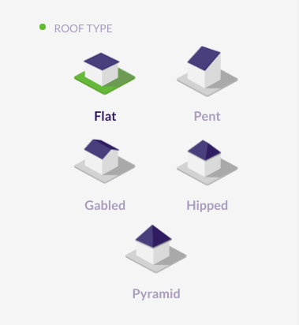

# Introduction

Ezzing 3DLayout is a PV planning tool that allows you to generate a 3d model of a building based on a satellite image. You can model any number of buildings, select between up to five different type of roofs, define keepouts and trees with custom heights...

Inside each roof area you can customize different structures, select module models and get automated previews of your setup.

It also provides you with a perspective view and a sun simulator to determine where the shadows will be in your installation.

Ezzing 3DLayout is an embebible webapp. You can integrate it inside your own system and customize many elements inside, from module models to prefered default settings for each roof type.

In this document you will find a brief showcase of the different areas of the app, a technical explanation on how to integrate this webapp inside your platform, a full description of the API that will allow you to communicate with the 3DLayout, and finally a description of how to customize different parts of the app.

 

You can test the app by visiting this link:

<a href="https://layout.ezzing.com/#/demo">https://layout.ezzing.com/#/demo</a></li>

# Screenshots

# 3DLayout Interface

The 3DLayout interface has two diferent parts: the **aside panel** and the **canvas area**.

## Aside Panel

In the aside panel you can find functionalities related to the current active building and other objects in the scene.

 

## Canvas Area

In the canvas area you can see the satellite view and three different sets of elements: the **buildings index** on the left side, the **main options buttons** on the top, and the **control buttons** on the bottom-right corner.

### Buildings Index

In the buildings index you can see the active building and select another one to become active. The color represented on each index is the color of the building.

### Main Options

These are the main options in the canvas area:

All these buttons are the **main options custom buttons**. You can customize this set of buttons by hidding some of them, by sorting them, or by adding new buttons.

The default custom buttons are:

* Save: saves the layout in crm
* Search address: moves the project center to the address specified
* Snapshot: takes a photograph of the project (with or without modules in jpg format, or in svg format)
* Fullscreen
* Sun simulation: sun and shadow simulation
* Perspective view: switches to 2D/3D view
* Renderer
* Satellite provider selector (only showed if available)

> Please, visit the section [Custom Buttons](#custom-buttons) to learn how to add your own buttons.

### Control Buttons

These are map related buttons. You can also customize the upper section of this set of buttons by hidding some of them or by adding new buttons.

Fixed buttons in this area:

* Zoom in
* Zoom out

 

3D control custom buttons:

* Compass: centers 3D view to north
* Geolocation: centers 3D view to the project
* Zoom in
* Zoom out

> Please, visit the section [Custom Buttons](#custom-buttons) to learn how to add your own functions.

### Notifications

Everytime an operation is being executed, it will appear at the bottom of the canvas a bar with the name of that operation. Its color represents the type of notification:

* Red: error
* Orange: warning (you should wait until the operation is finished)
* Green: success
* Blue: info

# Buildings

## Building creation

To start using the tool you need to create your first building. You will be able to customize its shape, name or height (from gutter or ridge).

The 'Populated with modules' option determines if the building will be created with or without modules. It is useful to deactivate it for simulating the shadows of the buildings.

You can activate the modules in the building edition (this configuration will be shown everytime the layout is loaded) or enabling the corresponding area in the area section.

> Please, visit the section [Drawing with Snaps](#drawing-with-snaps) to learn how to draw.

The next step once you have drawn the building is configurating the roof. There are different types of roofs depending on the shape of the building (if the building is irregular, the roof can only be flat or pent).

These are all the types of roof (available on regular buildings):

Each roof is composed of a determined number of areas that are automatically created.

You can also choose a roof material despite it is only informative. The material options are common for all roof types (tiled, trapezoidal, and corrugated) except for the flat ones (gravel, bitumen, membrane, and concrete):

When the operation is finished, the textures of the building are generated using the mapper tool and the modules appear in a default subarea.

> Please, visit the section [Textures](#textures) to learn how they are generated.

Once the building is created, you will be able to:

* Edit
* Move
* Remove
* Clone (it will be cloned with the same settings)
* Paint

## Add building

By clicking the '+' button at the top-left of the canvas you enter in the building creation process. There is no limit on buildings to create.

## Edit building

You can select between editing the building or editing the roof.

In the first option you can modify the building vertices following the steps of the building creation.
If you edit the roof you can select any type of roof and it will be recalculated.

<!-- Fiorella - Imagen distinguiendo de algunas maneras las dos opciones -->

# Areas

The areas are sections on the roof that are automatically created when selecting the type of roof.

Each area is composed of at least one subarea and has the information of the number of modules it contains and the power that generates.

If you want to disable one area, you can click on the eye button next to its name. By doing this, its module count and power generated will be set to 0.

## Edit area

To edit an area you can modify the edge zone value. It is a numeric value that specifies the distance between the building limits and the subareas that exist within that area.

# Subareas

## Subarea creation

A subarea is a region inside an area that allows you to define a modules installation just in a section of the area.

To create a subarea click on the 'Create subarea' button.

Once the subarea is created, you will be able to:

* Edit
* Move
* Refresh
* Remove (only if the area has more than one subarea)
* Clone (it will be cloned with the same settings)

If you want to disable one subarea, you can click on the eye button next to its name. By doing this, its module count and power generated will be set to 0.

## Add subarea

By clicking the 'Create subarea' button you enter in the subarea creation process.

If you create the first subarea it will replace the default one.

### Crop subarea to the area shape

When editing the vertices of a subarea you can check the 'Crop' option. This helps you to draw subareas that extends to the border of the building with more precision.

If you uncheck this option then the subarea can extend outside the area, following the area plane.

### Edit subarea vertices

By clicking this button you can modify subarea vertices and the subarea will be recalculated.

## Edit subarea

By clicking on a subarea you enter in the subarea edition process.

You will be able to refresh, paint or move all the modules.

These are all the subarea edition options:

* Module model: there are different module models available that have different size, weight and watt peak capacity
* Module orientation: you can choose between 'landscape' and 'portrait'
* Panels orientation: you can choose between 'south' and 'east/west'
* Module inclination
* Distance between modules
* Distance between rows
* Distance between centers
* Use max. shadow calculation: calculates the distance between rows and centers depending on the module inclination
* Azimuth: modules rotation
* Staggered enabled
* Dilatation lines enabled

Here, you can click on any module to enable/disable it. If you right click on a module it will be displayed its position (row and column).

## Remove subarea

By clicking this button you can remove a single subarea from the subareas list. It is only available if there exists more than one subarea.

# Keepouts

Keepouts are created for simulating any obstacle that might interrupt the installation of modules.

When a keepout is created, there can't be any module that occupies the same position.

You can customize them by changing their height, offset and type (vertical or inclined).

<!-- FIX

## Keepout height calculations

When creating keepouts, please note the height selected for the keepout is not always the final keepout height.

Depending on the roof inclination and the keepout dimensions and positions, there is a minimum keepout height to avoid keepouts under the roof surface.
Let's see an example:

In keepout 1, A is the desired height, and B is the minimum height for this keepout. As A is bigger than B then the keepout is created with the desired height (A).

In keepout 2, A is also the desired height, but the keepout can't be drawn correctly if the height is less than B measure, as some parts of the keepout will stay below the roof, so keepout 2 will be created with the minimum calculated height (B).
-->

> Note that for flat roofs it is posible to create 0 height keepouts, but for inclinated roofs you need to use the invisible keepouts feature to allow keepouts at roof surface level.

## Invisible keepouts

If you want to simulate a skylight or any keepout object without drawing the 3D volume you can check the 'Invisible keepout' option to hide the 3D volume but still taking the obstacle into account.

## Crop keepout to the building shape

When editing the vertices of a keepout you can check the 'Crop shape to building limits' option. This helps you to draw keepouts that extends to the border of the building with more precision.

If you uncheck this option then the keepout can be floating outside the building limits. At least one vertex of the keepout should be inside the building limits to be created.

## Vertical and inclined keepouts

You can create a keepout as vertical or inclined. If the keepout is inclined, it will be created starting from the inclination of the building.

# Trees

Trees belong to the scene, not to a building.

It is important to create trees for simulating the shadows on the roofs. Therefore, you will be able to move them and modify their height and radius. The shape of the tree is calculated according to the proportion of these values.

# Drawing with Snaps

The snap is a helpful tool for drawing buildings, subareas and keepouts.

There are two ways for drawing points: using **guide lines** or a **grid**.

## Guide lines

'Guide lines' is the default option when drawing. There are two ways for drawing points that can be combined to make the process easier: lines and vertices.

To use them, you need first to draw two points. Once you have drawn them, there will appear parallel and perpendicular guide lines to the last drawn point. This way you can create regular shapes with right angles (it is also possible to move points along these guide lines).

Switching to the 'Vertices' option allows you to draw points at the intersections of the guide lines and the vertices of the buildings.

> Please, visit the section [Context panel](#context-panel) to see more drawing features.

## Grid

When selecting this option appears a grid that occupies the entire canvas area.

You can customize it by specifying a number for the grid size (size of each square) and an offset in the x and y coordinates for moving the grid.

> Please, visit the section [Context panel](#context-panel) to see more drawing features.

## Context panel

This menu is available in both options, guide lines and grid, by right clicking on a point or edge.

When right clicking a point, you can:

* Draw guides here (only in 'Guide lines' option): draws parallel and perpendicular guide lines to this point in relation to the selected edge
* Remove all guides (only in 'Guide lines' option): removes all guide lines except the ones to the selected point
* Select/deselect point: this is useful for moving many points along a guide line at once
* Deselect all points: deselects all points except the last selected one
* Delete point

When right clicking an edge (only in 'Guide lines' option), you can:

* Select/deselect edge as guide: redraws the parallel and its perpendicular guide lines to the selected edge
* Select/deselect all edges as guide

It is also available by right clicking on a module in the subarea view.

By doing this, it will display:

* The position of the module (col and row)
* Its index position in the row
* Its index position in the column

If dilatation lines are disabled, there are also two buttons to:

* Change row modules orientation
* Add row offset

# Textures

The textures are images obtained from the satellite displayed on the roof, with the same size and position.

They are generated by default when a building is created. You can disable their automatic creation in the Preferences panel.

> Please, visit the section [Layout Rules](#layout-rules) to learn how to customize this property.

In the building panel you can see the different options for the satellite image textures:

* '+' : adds satellite texture for the active building
* Refresh (available when the active building has textures)
* Remove (available when the active building has textures)
* Generate for all buildings
* Remove all satellite textures

> Note that the textures generation might fail because of the speed of the internet connection or the speed of response of the satellite image provider. For preventing the failure you can select each building and wait for the satellite images to load or refresh the textures individually.

# Shortcuts

The shortcuts can be used in the following cases:

* When drawing:
    * To enable/disable snap to guides, press 'S'
    * To toggle between guide lines and vertices you can hold 'Ctrl'
    * To select/deselect vertices, click on them while pressing 'Shift'
* Editing a subarea:
    * Hold 'Shift' for selecting the hole row
    * Hold 'Ctrl' for selecting the hole column
* Moving a building, subarea or keepout:
    * Down: Numpad 1, 2, 3 | 'End' | 'Down arrow' | 'Page down'
    * Left: Numpad 1, 4, 7 | 'End' | 'Left arrow' | 'Home'
    * Right: Numpad 3, 6, 9 | 'Page down' | 'Right arrow' | 'Page up'
    * Center: Numpad 5 | 'Clear'
* Save: for saving the project in crm you can press 'Ctrl + Shift + S'
* Widgets:
    * To cancel the operation or close widget, press 'Esc'
    * To confirm the operation, press 'Intro'

Anyways, these shortcuts will be displayed on a widget, so you can consult them when necessary.

