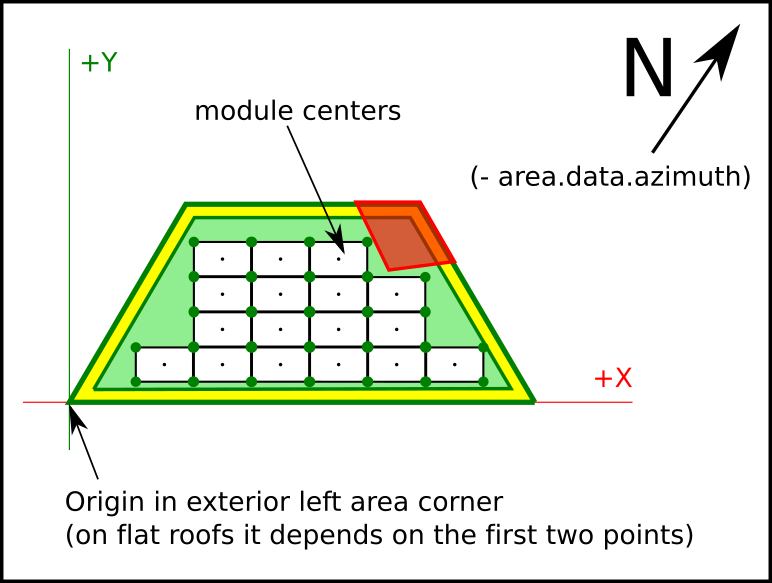

# Layout Coordinate Systems

The 3DLayout works in four different coordinate systems, depending on which context we are requesting info.

## World Coordinate System

World coordinate system works with spherical coordinates, latitude and longitude.

The values stored in this system and the API calls to retrieve this data are:

* Layout project center     >     getLayout

## Scene Coordinate System

Scene coordinate system works with cartesian coords, with origin in the layout project center and distances measured in meters. It is used to place each building relative to the project center.

The values stored in this system and the API calls to retrieve this data are:

* Building data center     >      getBuildingInfo()

## Building Coordinate System

Building coordinate System works with cartesian coords, with origin in the building center and measured in meters. Al tilted surfaces are represented in ortographic view.

The values stored in this system and the API calls to retrieve this data are:

* Building vertices (verticesMCoords)    >    getBuildingInfo()

## Area Coordinate System

Area Coordinate System works in cartesian coords, with origin in the bottom-left corner of the area, and rotated with the exterior wall azimuth of the area. On flat roofs the first wall drawed is considered the main wall.

The values stored in this system and the API calls to retrieve this data are:

* Area vertices  (verticesMCoords)              >    getAreaInfo()
* Area offset vertices (verticesOffsetMCoords)  >    getAreaInfo()
* Area modules coords (modulesData (x/y))       >    getAreaInfo()

This is the same for subareas, just using **getSubareaInfo**

# How to use

## API key and autentication

The 3DLayout allows you to provide Google and Bing API keys.

In case these API keys don't exist, the default provider will be Open Street Maps.

To add them as layout rules, please visit the [Scene preferences](#scene-preferences) section within the [Layout Rules](#layout-rules) section.

## DOM element

You need an element in the body of your html page, a div where **the 3DLayout will fit inside this element**.

> This div can't be bigger than the view size, and **no scroll** has to be applied to the html page.

You should not change the ezzing3d element size (width or height) but change the size of this container div.

    

        <ezzing3d id='ezzing3d'></ezzing3d>
    

## Basic functions

Adding the `client.min.js` script with a valid API key makes available the `Ezzing3DClient` global object, which we will use to start using the 3DLayout.

The Ezzing3DClient object has the following functions:

* createLayout
* getLayout
* listLayouts
* loadLayout
* destroyLayout

### createLayout

Create a new layout with the specified information.

    var data = {
        title: "EzzingSolar",
        latitude: 40.428121,
        longitude: -3.698695,
        address: "Calle de Sagasta, 18",
        zip: "28004",
        city: "Madrid",
        province: "Madrid",
        country: "Spain"
    };

Where all values are optional except latitude and longitude that are required.

    Ezzing3DClient.createLayout(data, function(err, layoutData) {
        if (err) throw err;
        console.log(layoutData);
    });

Which will return the information from the created layout:

    {
      id: 1093,
      title: "EzzingSolar",
      address: "Calle de Sagasta, 18",
      zip: "28004",
      city: "Madrid",
      province: "Madrid",
      country: "Spain",
      latitude: "40.428121",
      longitude: "-3.698695",
      created_at: "2016-08-18T17:15:15+0000",
      updated_at: "2016-08-19T10:14:34+0000",
      url: "https://layout.ezzing.com/#/GXXlgzDk0rPsrdxWfDsE5Cdi9FwUrBPx7GfuxSf0::1093"
    }

where:

* **id**: the layout id, you need this id to load the project or retrieve information,
* **title**: A title for the project,
* **address**: the address
* **city**: the city,
* **province**: the province,
* **country**: the contry,
* **zip**: the zip code,
* **latitude**: latitude value in decimal degrees (remember to include the negative sign for south and west coordinates) ,
* **longitude**:longitude value in decimal degrees (remember to include the negative sign for south and west coordinates),
* **created_at**: creation date,
* **updated_at**: modification date,
* **url**: an url to visit the project or embed it as an iframe

> The url can be used to embed a readonly version of the project. You can read a description of this methods in the [Showcase mode](#showcase-mode) section.

The data types in which each value is stored are:

* **id**: integer
* **title**: string 255 chars
* **address**: string 255 chars
* **city**: string 255 chars
* **province**: string 255 chars
* **country**: string 255 chars
* **zip**: string 255 chars
* **latitude**: decimal (+/-)xx.yyyyyyyy (max. precision 8 decimal digits)
* **longitude**: decimal (+/-)xxx.yyyyyyyy (max. precision 8 decimal digits)
* **created_at**: ISO8601
* **updated_at**: ISO8601
* **url**: string 2000 chars

### getLayout

Returns the information of a layout related to the given id

    Ezzing3DClient.getLayout(layoutId, function(err, layoutData, container) {
        if (err) throw err;
        console.log(layoutData);
    });

### listLayouts

Returns a list of all your created layouts.

    Ezzing3DClient.listLayouts(function(err, layoutData) {
        if (err) throw err;
        console.log(layoutData);
    });

### loadLayout

Sets up the 3DLayout interface into the ezzing3D container and loads the project related to the given id.

    Ezzing3DClient.loadLayout(layoutId, function(err, layoutApi, container) {
        if (err) throw err;
    });

loadLayout can receive an `options` argument where you can setup some customizations.

> You can read a description of this methods in the [Layout Rules](#layout-rules) section.

    var rules = {};

    Ezzing3DClient.loadLayout(layoutId, rules, function(err, layoutApi, container) {
        if (err) throw err;
    });

This method returns two objects, where:

* layout: Exposes an object with methods to interact with the 3DLayout.

> You can read a description of this methods in the [3DLayout Communication System](#dlayout-communication-system) section.

* container: the DOM element where the 3DLayot is created.

## Showcase mode

If you want to show the layout to a customer or embed it in read-only mode in another page of your platform (to act as a thumbnail of the project) you can do it by adding an iframe element to an html page, with a modified version of the url of the layout.

### Showcase without camera spin

    <iframe src=(url + "/showcase")> </iframe>

In this mode the 3DLayout will show the project in perspective mode without any gui elements and a quiet 3d view. You can click and drag with the mouse to rotate the view and zoom with the mouse wheel.

### Showcase with camera spin

    <iframe src=(url + "/spin-showcase")> </iframe>

In this mode the 3DLayout will show the project in perspective mode without any gui elements and a rotating 3d view. You can click and drag with the mouse to rotate the view and zoom with the mouse wheel. Once clicked the rotation will stop.
