# ezzing3DLayout

## PV planning tool - User Documentation

# Table of contents

  - [Introduction](#introduction)
  - [Screenshots](#screenshots)
  - [3DLayout Interface](#3dlayout-interface)
      - [Aside Panel](#aside-panel)
      - [Canvas Area](#canvas-area)
          - [Buildings Index](#buildings-index)
          - [Main Options](#main-options)
          - [Control Buttons](#control-buttons)
          - [Notifications](#notifications)
  - [Buildings](#buildings)
      - [Building creation](#building-creation)
          - [Custom shapes](#custom-shapes)
          - [Draw shape](#draw-shape)
      - [Select building](#select-building)
      - [Edit building](#edit-building)
      - [Roof editor](#roof-editor)
          - [Pent and pergola](#pent-and-pergola)
          - [Pyramid](#pyramid)
          - [Gabled](#gabled)
          - [Hipped](#hipped)
          - [Mansard](#mansard)
  - [Areas](#areas)
      - [Edit area](#edit-area)
  - [Subareas](#subareas)
      - [Subarea creation](#subarea-creation)
      - [Add subarea](#add-subarea)
          - [Crop subarea to the area
            shape](#crop-subarea-to-the-area-shape)
          - [Edit subarea vertices](#edit-subarea-vertices)
      - [Edit subarea](#edit-subarea)
      - [Remove subarea](#remove-subarea)
  - [Keepouts](#keepouts)
      - [Invisible keepouts](#invisible-keepouts)
      - [Crop keepout to the building
        shape](#crop-keepout-to-the-building-shape)
      - [Vertical and inclined
        keepouts](#vertical-and-inclined-keepouts)
  - [Trees](#trees)
  - [Drawing with Snaps](#drawing-with-snaps)
      - [Without Snap](#without-snap)
      - [Guide lines](#guide-lines)
      - [Grid](#grid)
      - [Context panel](#context-panel)
          - [On a point](#on-a-point)
          - [On an edge](#on-an-edge)
          - [On a module](#on-a-module)
          - [On a keepout in subarea
            view](#on-a-keepout-in-subarea-view)
          - [On an object](#on-an-object)
  - [Textures](#textures)
  - [Shortcuts](#shortcuts)
  - [Progress bar](#progress-bar)
  - [Changelog](#changelog)
      - [v3.25.0 (24/03/2020)](#v3250-24032020)
          - [Features](#features)
          - [Fixes](#fixes)
      - [v3.24.0 (10/02/2020)](#v3240-10022020)
          - [Features](#features-1)
          - [Fixes](#fixes-1)
      - [v3.23.0 (20/11/2019)](#v3230-20112019)
          - [Features](#features-2)
          - [Fixes](#fixes-2)
      - [v3.21.0 (23/09/2019)](#v3210-23092019)
          - [Features](#features-3)
          - [Fixes](#fixes-3)
      - [v3.20.0 (29/08/2019)](#v3200-29082019)
          - [Features](#features-4)
          - [Fixes](#fixes-4)
      - [v3.19.0 (09/08/2019)](#v3190-09082019)
          - [Features](#features-5)
          - [Fixes](#fixes-5)
      - [v3.18.0 (03/06/2019)](#v3180-03062019)
          - [Features](#features-6)
          - [Fixes](#fixes-6)
      - [v3.17.1 (29/05/2019)](#v3171-29052019)
          - [Fixes](#fixes-7)
      - [v3.17.0 (13/05/2019)](#v3170-13052019)
          - [Features](#features-7)
          - [Fixes](#fixes-8)
      - [v3.16.0 (30/04/2019)](#v3160-30042019)
          - [Features](#features-8)
          - [Fixes](#fixes-9)

# Introduction

Ezzing 3DLayout is a PV planning tool that allows you to generate a 3d
model of a building based on a satellite image. You can model any number
of buildings, select between up to five different type of roofs, define
keepouts and trees with custom heights...

Inside each roof area you can customize different structures, select
module models and get automated previews of your setup.

It also provides you with a perspective view and a sun simulator to
determine where the shadows will be in your installation.

Ezzing 3DLayout is an embebible webapp. You can integrate it inside your
own system and customize many elements inside, from module models to
prefered default settings for each roof type.

In this document you will find a brief showcase of the different areas
of the app, a technical explanation on how to integrate this webapp
inside your platform, a full description of the API that will allow you
to communicate with the 3DLayout, and finally a description of how to
customize different parts of the app.

  

You can test the app by visiting this link:

<https://layout.ezzing.com/#/demo>

# Screenshots

  
  

# 3DLayout Interface

The 3DLayout interface has two diferent parts: the **aside panel** and
the **canvas area**.

## Aside Panel

In the aside panel you can find functionalities related to the current
active building and other objects in the scene.

  
  
  
  
  
  
  
  
  
  
  

## Canvas Area

In the canvas area you can see the satellite view and three different
sets of elements: the **buildings index** on the top-left side, the
**main options buttons** on the top-right, and the **control buttons**
on the bottom-right corner.

### Buildings Index

In the buildings index you can see the active building and select
another one to become active. The color represented on each index is the
color of the building.

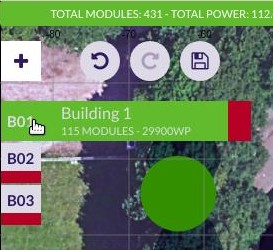

### Main Options

These are the main options in the canvas area:

All these buttons are the **main options custom buttons**. You can
customize this set of buttons by hidding some of them, by sorting them,
or by adding new buttons.

The default custom buttons are:

  - Undo/Redo
  - Save: saves the layout in crm
  - Search address: moves the project center to the address specified
  - Snapshot: takes a photograph of the project (with or without modules
    in jpg format, or in svg format)
  - Fullscreen
  - Sun simulation: sun and shadow simulation
  - Perspective view: switches to 2D/3D view
  - Renderer
  - Satellite provider selector (only showed if available)

### Control Buttons

These are map related buttons. You can also customize the upper section
of this set of buttons by hidding some of them or by adding new buttons.

Fixed buttons in this area:

  - Zoom in
  - Zoom out

  

3D control custom buttons:

  - Compass: centers 3D view to north
  - Geolocation: centers 3D view to the project
  - Zoom in
  - Zoom out

### Notifications

Everytime an operation is being executed, it will appear at the top of
the canvas a bar with the name of that operation. Its color represents
the type of notification:

  - Red: error
  - Orange: warning (you should wait until the operation is finished)
  - Green: success
  - Blue: info

# Buildings

## Building creation

To start using the tool you need to create your first building. To do so
you can either click on the start button in the aside panel or in the
'+' icon, in the top left corner inside the canvas area. There is no
limit on the number of buildings to create.

Since v3.24.0, once you click to create a new building, you will be
prompted to choose which mode to use, there are available two ways of
creating buildings:

### Custom shapes

Custon Shapes lets you quickly create a building from a predefined set.
This mode is designed to quickly add buidings to the project with common
shapes. The current ones are:

Once you select one it will be created in the project center. You can
tweak this custom shape from the aside panel (note that the canvas
points can't be edited as they're grayed out). Configure the size of the
edges and the building rotation in the panel. Clicking on *Finish* you
will proceed to edit the building as regular one (see next section *Draw
Shape*). Once the building is created you can move it like any other
building to the desired place.

Special mention to the *Step by step* type. This powerful option lets
you define a bulding wall by wall:

In the example above the user has configured the settings of 4 walls
with their respective lengths and angles, plus a closing wall from the
first to the last point. The closing wall is calculated automatically so
you don´t have to worry about it.

To add a new wall you only need to click the *Add Step* button in the
panel, the new wall will be listed below the ones already there and you
can set it up as you wish.

### Draw shape

Draw shape: the conventional way of creating buildings, in this mode you
have to click on the canvas tu add each of the points that will define
the shape of your building.

> Please, visit the section [Drawing with Snaps](#drawing-with-snaps) to
> learn how to draw.

Keep in mind that the different parts of the user interface serve
different purposes:

  - In the canvas area, you will be able to customize the shape of the
    building by clicking in the desired places.
  - In the aside panel, you will be able to change options such as
    'Populate with modules' and 'Building height'.

The 'Building Height' input can be configured to:

  - Gutter: the height will be measured from the floor to the lowest
    point of the roof.
  - Ridge: the height will be measured from the floor to the peak of the
    roof. Is the place where usually two (or more) opposing planes meet.

> Change height units clicking on the current units to the right of the
> height number.

The 'Populated with modules' option determines if the building will be
created with or without modules. It is useful to deactivate it for
simulating the shadows of the buildings.

You can activate the modules in the building edition (this configuration
will be shown everytime the layout is loaded) or enabling the
corresponding area in the area section.

> Please, visit the section [Drawing with Snaps](#drawing-with-snaps) to
> learn how to draw.

The next step once you have drawn the building is setting up the roof.
There are different types of roofs depending on the shape of the
building (if the building is irregular, the roof can only be flat or
pent).

These are all the types of roof (available on regular buildings):

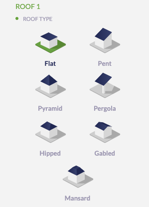

Each roof is composed of a determined number of areas that are
automatically created.

You can also choose a roof material despite it is only informative. The
material options are common for all roof types (tiled, trapezoidal, and
corrugated):

Except for the flat roof type (gravel, bitumen, membrane, and concrete):

When the operation is finished, the textures of the building are
generated using the mapper tool and the modules appear in a default
subarea.

> Please, visit the section [Textures](#textures) to learn how they are
> generated.

Once the building is created, you will be able to:

  - Edit
  - Move
  - Remove
  - Clone (it will be cloned with the same settings)
  - Paint

## Select building

By clicking in the buildings indexes, below the add building button ('+'
icon), you can select them. The selected building will become the active
one and the canvas will be centered on that building. This is very
useful when you are on a projects with several buildings and you want to
focus your view on one. After selecting a building, the aside panel will
show the properties of the building.

## Edit building

You can select between editing the building or editing the roof.

In the first option you can modify the building vertices following the
steps of the building creation. If you edit the roof you can select any
type of roof and it will be recalculated.

## Roof editor

You can edit a roof by clicking in the pencil icon in the roof section:

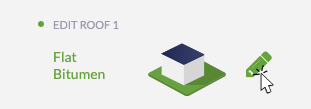

After that, you can change the roof type in a similar way as you did
when creating the building. To know the interactions available in each
roof type, read the draggable help window that displays the interactions
with each roof:

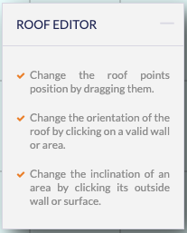

> You can click on the upper right corner to minimize the helper if you
> need more available space to work.

### Pent and pergola

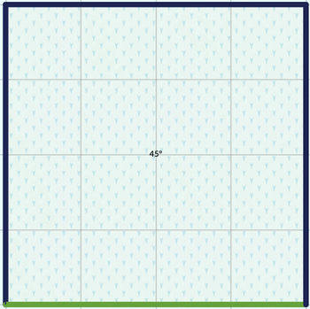

Lets you modify the angle of inclination by clicking somewhere inside
the roof and changing the angle. You can change the orientation of the
roof by clicking one of the roof edges and selecting "Change
Orientation".

### Pyramid

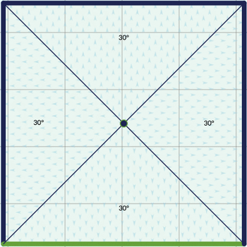

Similar to pents but this roof has four faces instead of one and you can
move the top vertex (the peak of the pyramid) to adjust to the desired
shape.

### Gabled

Gabled roofs lets you move the edge of the ridge along the whole roof
base. You can also change the inclination of the planes as with previous
roofs. To change the orientation of the ridge you can click on one edge
(like with pent roofs) or using the icons in the aside panel called:
East/West or South/North.

### Hipped

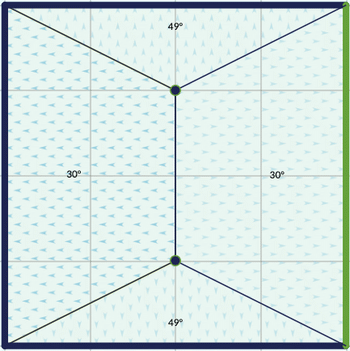

Similar in options to a gabled roof, but slightly more complex. The main
difference is that in hipped you have two vertex that define the ridge
of the roof (the edge at the peak). There's a switch in the aside panel
to ensure the symmetry of the ridge.

### Mansard

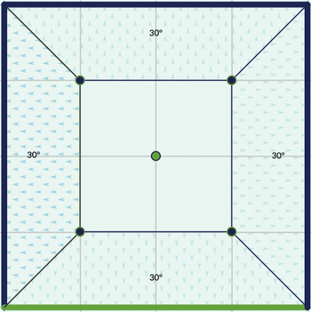

The first time you convert a roof to a mansard you'll see that a basic
mansards is like a pyramid roof that has the upper part sectioned.

In a mansard roof, besides the inclination settings available in other
roof types, it is possible to change the size of a four-sided ridge. If
the symmetric ridge switch in the panel is on, the ridge will have a
perfect square ratio.

After clicking *Finish* with a mansard roof, you will see two roofs in
the aside panel:

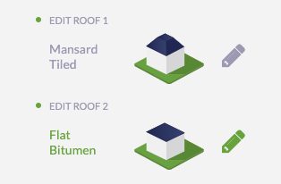

You can change the default flat roof (Roof 2 in the previous image)
created on top of the mansard to other type of roof. The image below
shows a mansard with a pent roof on top as an example:

# Areas

The areas are sections on the roof that are automatically created when
selecting the type of roof.

Each area is composed of at least one subarea and has the information of
the number of modules it contains and the power that generates.

If you want to disable one area, you can click on the eye button next to
its name. By doing this, its module count and power generated will be
set to 0.

## Edit area

To edit an area you can modify the edge zone value. It is a numeric
value that specifies the distance between the building limits and the
subareas that exist within that area.

# Subareas

A subarea is a region inside an area that allows you to define a modules
installation just in a section of the area.

By clicking on a subarea, two views will appear: the project view (top)
and the subarea view (bottom).

The subarea view is hidden by default. To toggle its view, you have to
click on the button 'Open subarea view' or 'Close subarea view' at the
bottom of the canvas.

> Note that when moving the subarea or changing its azimuth the subarea
> view will be opened. This is because this view hasn't got any
> deformation.

## Subarea creation

To create a subarea click on the 'Create subarea' button.

Once the subarea is created, you will be able to:

  - Edit
  - Move
  - Refresh
  - Remove (only if the area has more than one subarea)
  - Clone (it will be cloned with the same settings)

If you want to disable one subarea, you can click on the eye button next
to its name. By doing this, its module count and power generated will be
set to 0.

## Add subarea

By clicking the 'Create subarea' button you enter in the subarea
creation process.

If you create the first subarea it will replace the default one.

### Crop subarea to the area shape

When editing the vertices of a subarea you can check the 'Crop' option.
This helps you to draw subareas that extends to the border of the
building with more precision.

If you uncheck this option then the subarea can extend outside the area,
following the area plane.

### Edit subarea vertices

By clicking this button you can modify subarea vertices and the subarea
will be recalculated.

## Edit subarea

By clicking on a subarea you enter in the subarea edition process.

You will be able to refresh, paint or move all the modules.

These are all the subarea edition options:

  - Module model: there are different module models available that have
    different size, weight and watt peak capacity
  - Module orientation: you can choose between 'landscape' and
    'portrait'
  - Panels orientation: you can choose between 'south' and 'east/west'
  - Module inclination
  - Distance between modules
  - Distance between rows
  - Distance between centers
  - Use max. shadow calculation: calculates the distance between rows
    and centers depending on the module inclination
  - Azimuth: modules rotation
  - Staggered enabled
  - Sails
  - Dilatation lines

Here, you can click on any module to enable/disable it. If you right
click on a module it will be displayed its position (row and column).

## Remove subarea

By clicking this button you can remove a single subarea from the
subareas list. It is only available if there exists more than one
subarea.

# Keepouts

Keepouts are created for simulating any obstacle that might interrupt
the installation of modules.

When a keepout is created, there can't be any module that occupies the
same position.

You can customize them by changing their height, offset and type
(vertical or inclined).

> Note that for flat roofs it is posible to create 0 height keepouts,
> but for inclinated roofs you need to use the invisible keepouts
> feature to allow keepouts at roof surface level.

## Invisible keepouts

If you want to simulate a skylight or any keepout object without drawing
the 3D volume you can check the 'Invisible keepout' option to hide the
3D volume but still taking the obstacle into account.

## Crop keepout to the building shape

When editing the vertices of a keepout you can check the 'Crop shape to
building limits' option. This helps you to draw keepouts that extends to
the border of the building with more precision.

If you uncheck this option then the keepout can be floating outside the
building limits. At least one vertex of the keepout should be inside the
building limits to be created.

## Vertical and inclined keepouts

You can create a keepout as vertical or inclined. If the keepout is
inclined, it will be created starting from the inclination of the
building.

# Trees

Trees belong to the scene, not to a building.

It is important to create trees for simulating the shadows on the roofs.
Therefore, you will be able to move them and modify their height and
radius. The shape of the tree is calculated according to the proportion
of these values.

# Drawing with Snaps

The snap is a helpful tool for drawing buildings, subareas and keepouts.

There are three ways for drawing points: without snap, using **guide
lines** or a **grid**.

## Without Snap

You can draw unassisted disabling both snap options. With this option
you can put a point anywhere.

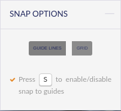

## Guide lines

'Guide lines' is the default option when drawing. There are two ways for
drawing points that can be combined to make the process easier: lines
and vertices.

To use them, you need first to draw two points. Once you have drawn
them, there will appear parallel and perpendicular guide lines to the
last drawn point. This way you can create regular shapes with right
angles (it is also possible to move points along these guide lines).

Switching to the 'Vertices' option allows you to draw points at the
intersections of the guide lines and the vertices of the buildings.

> Please, visit the section [Context panel](#context-panel) to see more
> drawing features.

## Grid

When selecting this option appears a grid that occupies the entire
canvas area.

You can customize it by specifying a number for the grid size (size of
each square) and an offset in the x and y coordinates for moving the
grid.

> Please, visit the section [Context panel](#context-panel) to see more
> drawing features.

## Context panel

### On a point

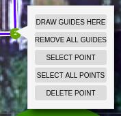

When right clicking a point, you can:

  - Draw guides here (only in 'Guide lines' option): draws parallel and
    perpendicular guide lines to this point in relation to the selected
    edge
  - Remove all guides (only in 'Guide lines' option): removes all guide
    lines except the ones to the selected point
  - Select/deselect point: this is useful for moving many points along a
    guide line at once
  - Deselect all points: deselects all points except the last selected
    one
  - Delete point

### On an edge

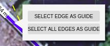

When right clicking an edge (only in 'Guide lines' option), you can:

  - Select/deselect edge as guide: redraws the parallel and its
    perpendicular guide lines to the selected edge
  - Select/deselect all edges as guide

### On a module

By right clicking a module, it will display:

  - The position of the module (column and row)
  - Its index position in the row
  - Its index position in the column

If dilatation lines are disabled, there are also two buttons to:

  - Change row modules orientation
  - Add row offset

### On a keepout in subarea view

By right clicking on a keepout in the subarea view you can set that
keepout as active, closing the subarea view.

### On an object

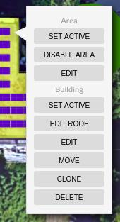

You can also right click on any object in the svgProject. You will be
able to set active, edit, move, etc the current object and its parents
objects (ex: from a subarea you can execute areas and building
operations).

# Textures

The textures are images obtained from the satellite displayed on the
roof, with the same size and position.

They are generated by default when a building is created. You can
disable their automatic creation in the Preferences panel.

In the building panel you can see the different options for the
satellite image textures:

  - '+' : adds satellite texture for the active building
  - Refresh (available when the active building has textures)
  - Remove (available when the active building has textures)
  - Generate for all buildings
  - Remove all satellite textures

> Note that the textures generation might fail because of the speed of
> the internet connection or the speed of response of the satellite
> image provider. For preventing the failure you can select each
> building and wait for the satellite images to load or refresh the
> textures individually.

# Shortcuts

The shortcuts can be used in the following cases:

  - To navigate between tabs, press 1, 2, 3 or 4
  - To execute undo press 'Ctrl + Z', and to execute redo press 'Ctrl +
    Y'
  - When drawing:
      - To enable/disable snap to guides, press 'S'
      - To toggle between guide lines and vertices you can hold 'Ctrl' /
        '⌘'
      - To select/deselect vertices, click on them while pressing
        'Shift'
  - Editing a subarea:
      - Hold 'Shift' for selecting the hole row
      - Hold 'Ctrl' / '⌘' for selecting the hole column
  - Moving a building, subarea or keepout:
      - Down: Numpad 1, 2, 3 | 'End' | 'Down arrow' | 'Page down'
      - Left: Numpad 1, 4, 7 | 'End' | 'Left arrow' | 'Home'
      - Right: Numpad 3, 6, 9 | 'Page down' | 'Right arrow' | 'Page up'
      - Center: Numpad 5 | 'Clear'
  - Save: for saving the project in crm you can press 'Ctrl + Shift + S'
    / '⌘ + Shift + S'
  - Widgets:
      - To cancel the operation or close the widget, press 'Esc'
      - To confirm the operation, press 'Enter'

Anyways, these shortcuts will be displayed on a widget, so you can
consult them when necessary.

> For users with Mac operating system, Ctrl key in shortcuts will be
> disabled using the Command key instead (⌘).

# Progress bar

Everytime a long operation is being executed, it will be displayed a
progress bar to inform the user.

The progress bar it's composed of:

  - Title: name of the operation being executed
  - Label 1: function withing the operation
  - Label 2: step of the funcion
  - Bar: if there is a determinate number of steps it will be increasing
    its value, if not, it will be shown as an animation
  - Cancel button: only visible on 'Waiting for satellite tiles'
    generating textures step

# Changelog

## v3.25.0 (24/03/2020)

### Features

  - Read-only mode.
  - New roof type: mansard.
  - Navbar (Building/Areas/Object/Map/...) located at the very top:
    better visualization of panel options\!
  - Enhanced undo/redo feature. We've got you covered\!
  - Map snapshots.

### Fixes

  - Fix bug due to users ommiting modals messages while changing
    attributes.
  - Performance boost.
  - Stability improvements.
  - Other minor fixes.

## v3.24.0 (10/02/2020)

### Features

  - Building Shapes: you can use common predesigned building shapes.
    Let's skyrocket that productivity\!
  - Improved roof geometries.
  - New roof type: pergola.
  - You can move roof points symmetrically (hipped roofs).
  - Turkish translations: Selam\!

### Fixes

  - Fix default module height was displayed in millimeters (instead of
    meters).
  - Labels displaying wrong when dilatation lines were added.
  - Snap to grid now behaves correctly.
  - Now modules being dragged show their right color.
  - Other minor fixes.

## v3.23.0 (20/11/2019)

### Features

  - Improved drawing speed.
  - New context panel buttons (by right-clicking on buildings, areas,
    subares, etc. from canvas).
  - When moving an object, other objects don't interfere.
  - Subareas can be moved with keyboard shortcuts.

### Fixes

  - Finish panels button is locked when the operation has not been
    validated.
  - Drawing alignment when switching perspective mode from 3D to 2D.

## v3.21.0 (23/09/2019)

### Features

  - New drawing in svgProject.
  - New cancel button on progress bar when generating textures.
  - Manage area habilitation from context menu (by right clicking on an
    area in svgProject).

### Fixes

  - Deprecated layoutRules on aside header creation refactor.

## v3.20.0 (29/08/2019)

### Features

  - Undo/redo feature.
  - New module sails (available in subarea info panel).

### Fixes

  - Implemented compass rotation in the subarea view.
  - Fixed autocad export error.
  - Update system info when changing dilatation lines values.
  - Close subarea panel on tab change.
  - Keepout projection error.
  - Removed vertical line on project loading screen.
  - Bug when switching perspective mode with an active subarea.
  - Error on zoom when Player is disabled.

## v3.19.0 (09/08/2019)

### Features

  - Compass and Center view buttons have been added in Showcase mode.
  - New benchmarks with 1000 and 100000 modules for performance testing.
  - New layoutRule to include inset in dilatation lines.
  - Path editor is now created as a json.

### Fixes

  - The Showcase widget has been removed and the old shortcuts have been
    restored (camera traslation and rotation).
  - Removed Mapper flickering when redrawing buttons.
  - Fixed zoom when selecting a tree.
  - Cloning a subarea displays its information updated.
  - Fixed a bug in building indexes when canceling the creation of a
    building.
  - Fixed the Move subarea button performance when cloning a subarea
    repeatedly.
  - Fixed an error when creating a building after editing another one.
  - Json editor buttons click work properly.
  - It is now controlled when buildings have to be rendered.
  - Fixed 'Invalid Lat, Lng' console error.
  - Fixed resize listener related to bootstrap error.

## v3.18.0 (03/06/2019)

### Features

  - Created new tree shapes.
  - Changed cancel widget button background color to gray.
  - Logo and attributions aren't displayed when Mapper is deactivated.
  - Recovered sun and flares in the sky.
  - Change project center depending on first building vertex distance
    from original center.

### Fixes

  - Perspective widget is displayed at the left side of the canvas.
  - Changed providers selector style.
  - Fixed bottom buttons interruption on canvas drag.

## v3.17.1 (29/05/2019)

### Fixes

  - Change initial perspective widget position.

## v3.17.0 (13/05/2019)

### Features

  - New alert: the layout blocks when browser is not Chrome.
  - New features in sun simulation widget. Now you can set the date with
    the shortest or longest shadow, and reset the date to its default
    value. A new layoutRule has been defined to modify the default date
    of the simulator.
  - Shortcuts widgets style improvements.
  - There are new shortcuts to navigate between the main tabs. By
    pressing keys 1, 2, 3 and 4 you can navigate between Building,
    Areas, Objects and Preferences panels, respectively.
  - New alternative of using Command key instead of Ctrl in computers
    with mac OS operating system.

### Fixes

  - Fixed a bug related to the subarea clone.
  - Fixed the translation and rotation in perspective mode and changed
    shortcuts.

## v3.16.0 (30/04/2019)

### Features

  - Context panel improvements on hover.
  - New button to show and hide subarea view.
  - Modified the progress bar (new styles showing information for the
    user).
  - Snap to vertices shortcuts improvements in Windows and Mac.
  - Created browser check.

### Fixes

  - Reset modules when changing orientation.
  - Fixed unnecessary console warning.
  - Check modules number before deleting them.
