ezzing3DLayout
==============

PV planning tool - API Documentation
------------------------------------

Table of contents
=================

-   [Introduction](#introduction)
-   [Screenshots](#screenshots)
-   [3DLayout Interface](#dlayout-interface)
    -   [Aside Panel](#aside-panel)
    -   [Canvas Area](#canvas-area)
        -   [Buildings Index](#buildings-index)
        -   [Main Options](#main-options)
        -   [Control Buttons](#control-buttons)
-   [Keepouts](#keepouts)
    -   [Keepout height calculations](#keepout-height-calculations)
    -   [Invisible keepouts](#invisible-keepouts)
    -   [Crop keepout to the building shape](#crop-keepout-to-the-building-shape)
-   [Subareas](#subareas)
    -   [Subarea creation](#subarea-creation)
    -   [Add subarea](#add-subarea)
        -   [Crop subarea to the area shape](#crop-subarea-to-the-area-shape)
        -   [Edit subarea vertices](#edit-subarea-vertices)
        -   [Remove subarea](#remove-subarea)
-   [Layout Coordinate Systems](#layout-coordinate-systems)
    -   [World Coordinate System](#world-coordinate-system)
    -   [Scene Coordinate System](#scene-coordinate-system)
    -   [Building Coordinate System](#building-coordinate-system)
    -   [Area Coordinate System](#area-coordinate-system)
-   [How to use](#how-to-use)
    -   [Api key and autentication](#api-key-and-autentication)
    -   [DOM element](#dom-element)
    -   [Basic functions](#basic-functions)
        -   [createLayout](#createlayout)
        -   [getLayout](#getlayout)
        -   [listLayouts](#listlayouts)
        -   [loadLayout](#loadlayout)
    -   [Showcase mode](#showcase-mode)
        -   [Showcase without camera spin](#showcase-without-camera-spin)
        -   [Showcase with camera spin](#showcase-with-camera-spin)
-   [3DLayout Communication System](#dlayout-communication-system)
    -   [Info Events sent by 3DLayout](#info-events-sent-by-3dlayout)
        -   [zoomChanged](#zoomchanged)
        -   [fullscreen](#fullscreen)
        -   [tabChanged](#tabchanged)
        -   [editArea](#editarea)
        -   [editKeepout](#editkeepout)
        -   [editTree](#edittree)
        -   [areaChanged](#areachanged)
        -   [buildingChanged](#buildingchanged)
        -   [roofChanged](#roofchanged)
        -   [editRoof](#editroof)
        -   [editVertices](#editvertices)
        -   [buildingRemoved](#buildingremoved)
        -   [buildingSelected](#buildingselected)
        -   [buildingCreated](#buildingcreated)
    -   [Functions to retrieve info from 3DLayout](#functions-to-retrieve-info-from-3dlayout)
        -   [Generic Functions](#generic-functions)
        -   [Building related functions](#building-related-functions)
        -   [Area related functions](#area-related-functions)
        -   [Subarea related functions](#subarea-related-functions)
    -   [Functions to send info to the 3DLayout](#functions-to-send-info-to-the-3dlayout)
        -   [CustomAlert event](#customalert-event)
-   [Layout Rules](#layout-rules)
    -   [Special Behaviours](#special-behaviours)
        -   [Perspective](#perspective)
        -   [Spin](#spin)
        -   [Read only](#read-only)
        -   [Showcase](#showcase)
        -   [zoom](#zoom)
        -   [logo](#logo)
        -   [azimuthOffset](#azimuthoffset)
    -   [Default Values](#default-values)
        -   [modules](#modules)
        -   [DefaultRoofs](#defaultroofs)
        -   [DefaultBuilding](#defaultbuilding)
        -   [CustomPalette](#custompalette)
        -   [maxBuildingHeight](#maxbuildingheight)
    -   [Custom Buttons](#custom-buttons)
        -   [MainoptionsCustomButtons](#mainoptionscustombuttons)
        -   [ControlCustomButtons](#controlcustombuttons)
    -   [Custom Logo](#custom-logo)
    -   [Custom Loading Animation](#custom-loading-animation)
    -   [Custom Logo in tutorial section](#custom-logo-in-tutorial-section)
    -   [Customize Go back button in the tutorial menu](#customize-go-back-button-in-the-tutorial-menu)

Introduction
============

Ezzing 3DLayout is a PV planning tool that allows you to generate a 3d model of a building based on a satellite image. You can model any number of buildings, select between up to five different type of roofs, define keepouts and trees with custom heights…

Inside each roof area you can customize different structures, select module models and get automated previews of your setup.

It also provides you with a perspective view and a sun simulator to determine where the shadows will be in your installation.

Ezzing 3DLayout is an embebible webapp. You can integrate it inside your own system and customize many elements inside, from module models to prefered default settings for each roof type.

In this document you will find a brief showcase of the different areas of the app, a technical explanation on how to integrate this webapp inside your platform, a full description of the API that will allow you to communicate with the 3DLayout, and finally a description of how to customize different parts of the app.

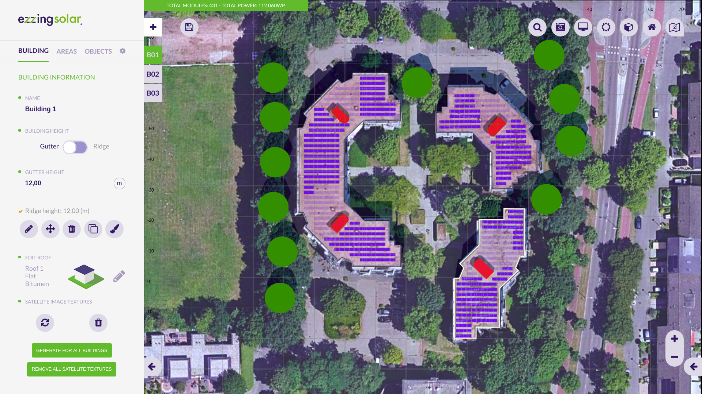

You can test the app by visiting this link:

<https://layout.ezzing.com/#/demo>

Also you can follow a tutorial to learn the basics of the 3DLayout in this link:

<https://layout.ezzing.com/#/tutorial>

Screenshots
===========

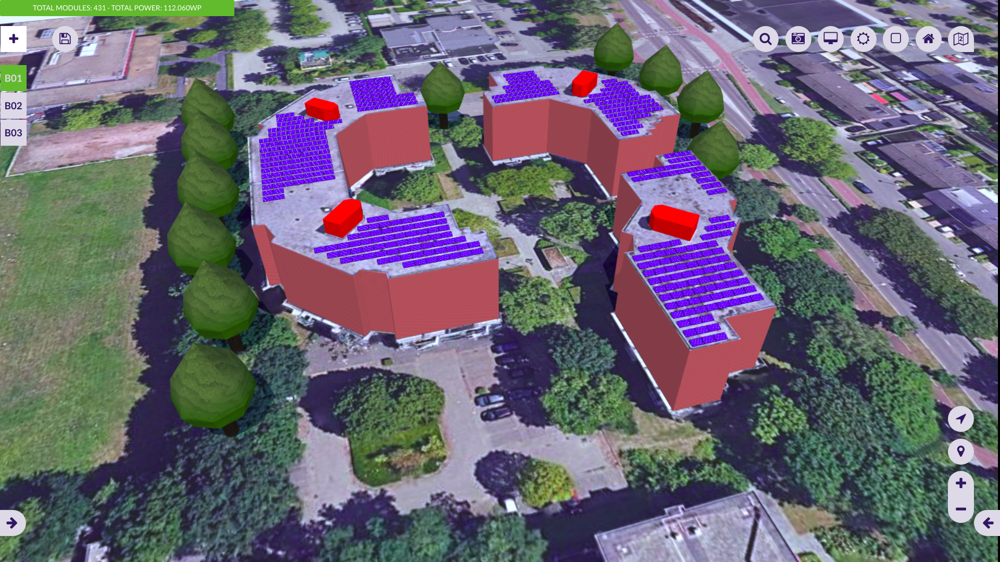

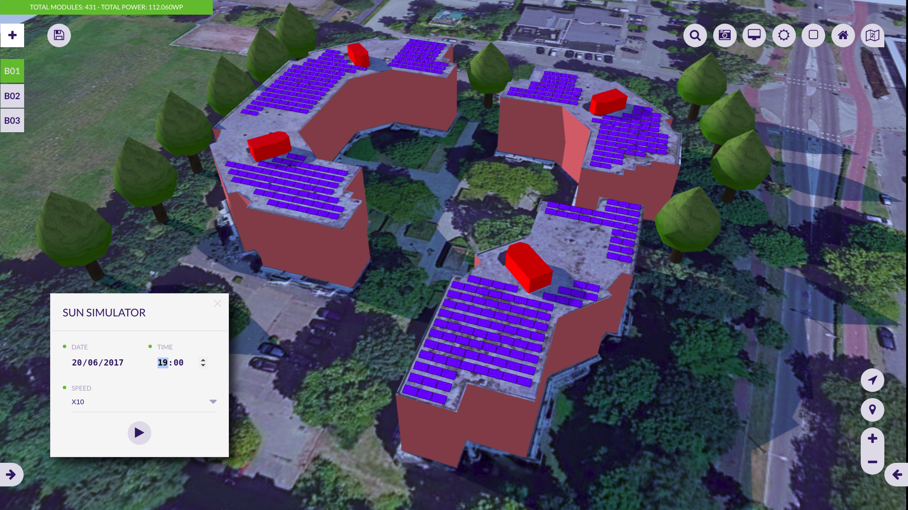

3DLayout Interface
==================

The 3DLayout interface has two diferent parts: the **aside panel** and the **canvas area**.

Aside Panel
-----------

In the aside panel you can find functionalities related to the current active building and other objects in the scene.

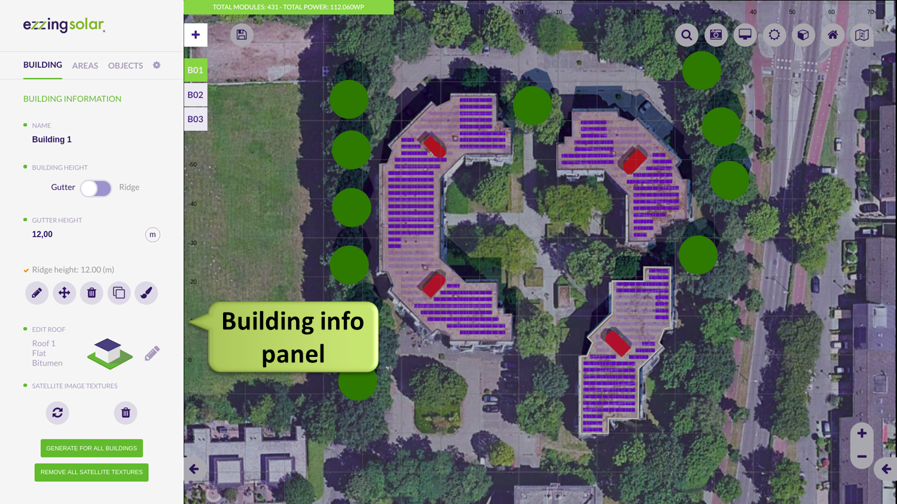

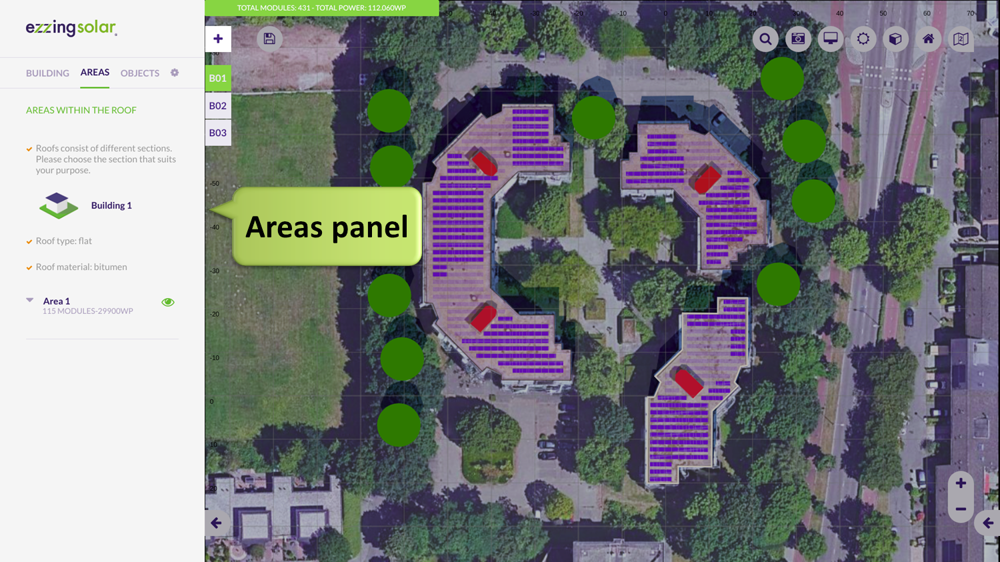

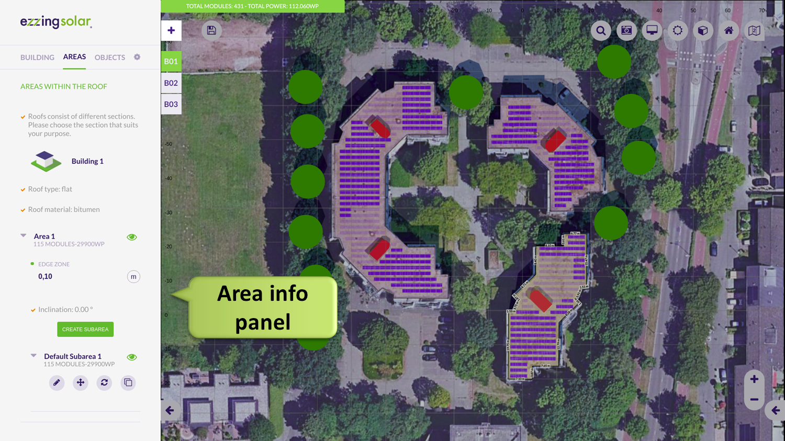

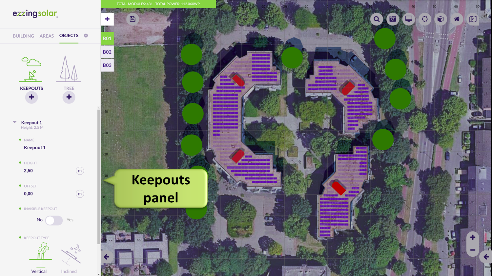

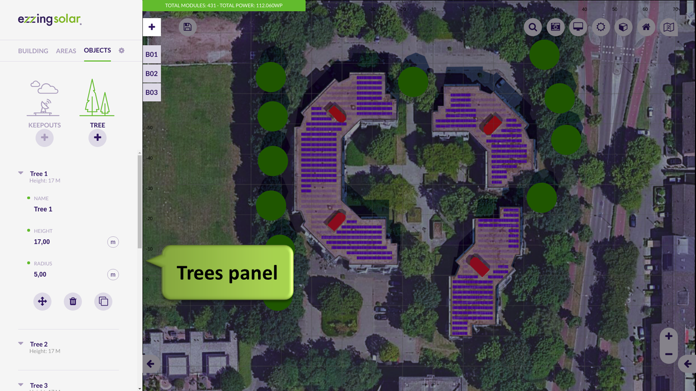

Canvas Area
-----------

In the canvas area you can see the satellite view and three different sets of elements: the **buildings index** on the left side, the **main options buttons** on the top, and the **control buttons** on the bottom-right corner.

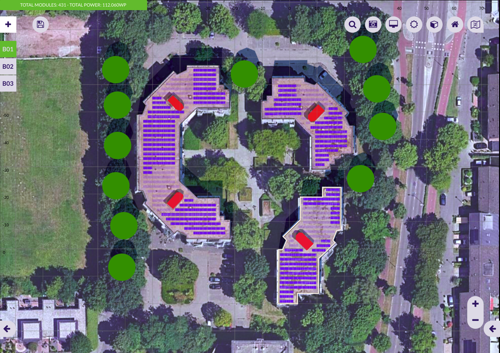

### Buildings Index

In the buildings index you can see the active building and select another one to become active.

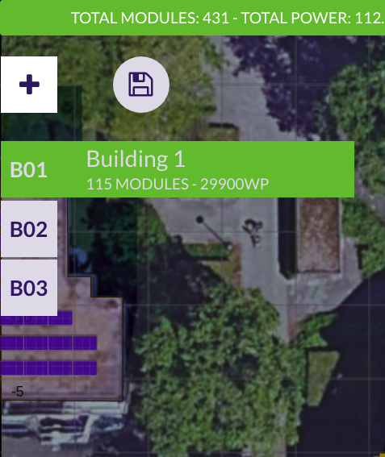

### Main Options

These are the main options in the canvas area:

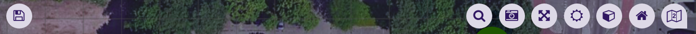

All these buttons are the **main options custom buttons**. You can customize this set of buttons by hidding some of them, by sorting them, or by adding new buttons.

The default custom buttons are:

-   Save
-   Search address
-   Snapshot
-   Fullscreen
-   Sun simulation
-   Perspective view
-   Renderer
-   Satellite provider selector (only showed if available)

> Please, visit the section [Custom Buttons](#custom-buttons) to learn how to add your own buttons.

### Control Buttons

These are map related buttons. You can also customize the upper section of this set of buttons by hidding some of them or by adding new buttons.

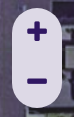

Fixed buttons in this area:

-   Zoom in
-   Zoom out

3D control custom buttons:

-   Compass (centers 3D view to north)
-   Geolocation (centers 3D view to the project)
-   Zoom in
-   Zoom out

> Please, visit the section [Custom Buttons](#custom-buttons) to learn how to add your own functions.

Keepouts
========

Keepout height calculations
---------------------------

When creating keepouts, please note the height selected for the keepout is not always the final keepout height.

Depending on the roof inclination and the keepout dimensions and positions, there is a minimum keepout height to avoid keepouts under the roof surface.

> Note that for flat roofs it is posible to create 0 height keepouts, but for inclinated roofs you need to use the invisible keepouts feature to allow keepouts at roof surface level.

Invisible keepouts
------------------

If you want to simulate a skylight or any keepout object without drawing the 3d volume you can check the ‘Invisible keepout’ option to hide the 3D volume but still taking the obstacle into account.

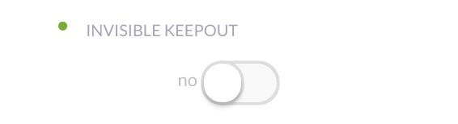

Crop keepout to the building shape
----------------------------------

When editing the vertices of a keepout you can check the ‘Crop shape to building limits’ option. This helps you to draw keepouts that extends to the border of the building with more precision.

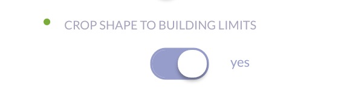

If you uncheck this option then the keepout can be floating outside the building limits. At least one vertex of the keepout should be inside the building limits to be created.

Subareas
========

Subarea creation
----------------

A subarea is a region inside an area that allows you to define a modules installation just in a section of the area.

To create a subarea click on the ‘Create subarea’ button.

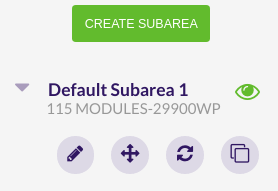

Once the subarea is created, you will be able to:

-   Edit
-   Move
-   Refresh (only if the area has one subarea)
-   Remove (only if the area has more than one subarea)
-   Clone

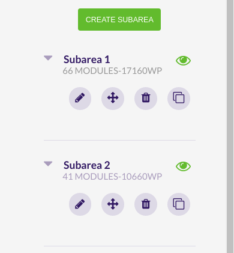

Add subarea
-----------

By clicking the ‘Create subarea’ button you enter in the subarea creation process.

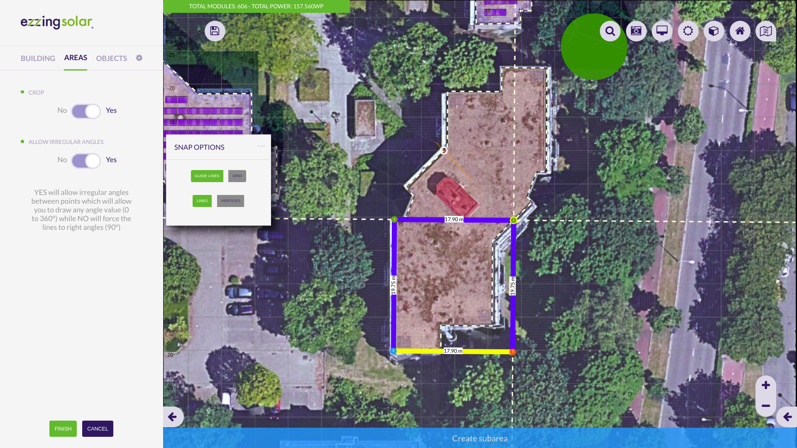

### Crop subarea to the area shape

When editing the vertices of a subarea you can check the ‘Crop’ option. This helps you to draw subareas that extends to the border of the building with more precision.

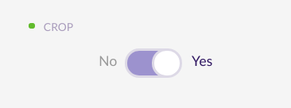

If you uncheck this option then the subarea can extend outside the area, following the area plane.

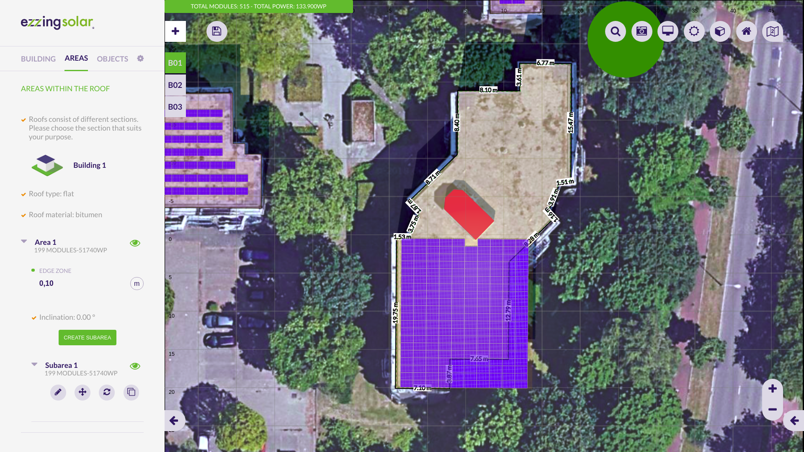

### Edit subarea vertices

By clicking this button you can modify subarea vertices and the subarea will be recalculated.

### Remove subarea

By clicking this button you can remove a single subarea from the subareas list.

Layout Coordinate Systems
=========================

The 3DLayout works in four different coordinate systems, depending on which context we are requesting info.

World Coordinate System
-----------------------

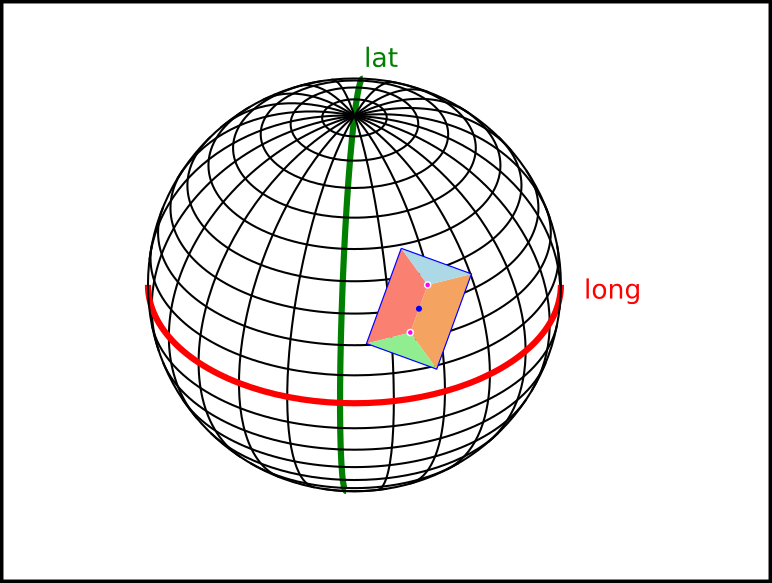

World coordinate system works with spherical coordinates, latitude and longitude.

The values stored in this system and the API calls to retrieve this data are:

-   Layout project center &gt; getLayout

Scene Coordinate System
-----------------------

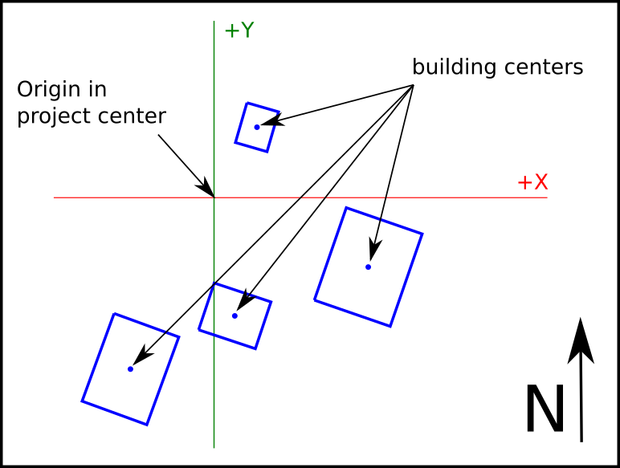

Scene coordinate system works with cartesian coords, with origin in the layout project center and distances measured in meters. It is used to place each building relative to the project center.

The values stored in this system and the API calls to retrieve this data are:

-   Building data center &gt; getBuildingInfo()

Building Coordinate System
--------------------------

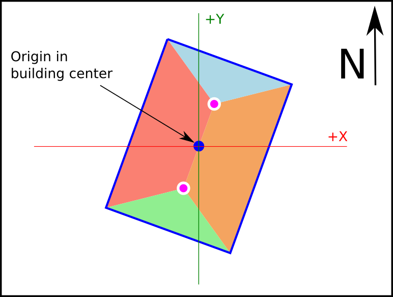

Building coordinate System works with cartesian coords, with origin in the building center and measured in meters. Al tilted surfaces are represented in ortographic view.

The values stored in this system and the API calls to retrieve this data are:

-   Building vertices (verticesMCoords) &gt; getBuildingInfo()

Area Coordinate System
----------------------

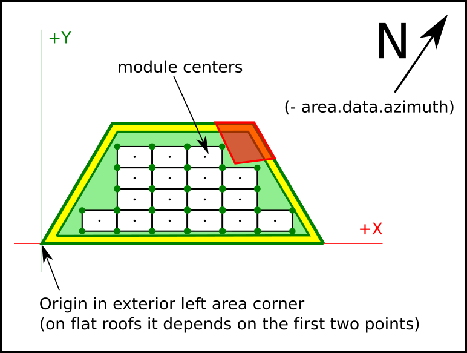

Area Coordinate System works in cartesian coords, with origin in the bottom-left corner of the area, and rotated with the exterior wall azimuth of the area. On flat roofs the first wall drawed is considered the main wall.

The values stored in this system and the API calls to retrieve this data are:

-   Area vertices (verticesMCoords) &gt; getAreaInfo()
-   Area offset vertices (verticesOffsetMCoords) &gt; getAreaInfo()
-   Area modules coords (modulesData (x/y)) &gt; getAreaInfo()

This is the same for subareas, just using **getSubareaInfo**

How to use
==========

Api key and autentication
-------------------------

To start using the 3DLayout in your platform, you need to add the following script:

    

where you would replace `API_KEY_HERE` by an API key we provide you for your account.

DOM element
-----------

You need an element in the body of your html page, a div where **the 3DLayout will fit inside this element**.

> This div can’t be bigger than the view size, and **no scroll** has to be applied to the html page.

You should not change the ezzing3d element size (width or height) but change the size of this container div.

    

        <ezzing3d id='ezzing3d'></ezzing3d>
    

Basic functions
---------------

Adding the `client.min.js` script with a valid API Key makes available the `Ezzing3DApi` global object, which we will use to start using the 3DLayout.

The Ezzing3DApi object has the following functions:

-   createLayout
-   getLayout
-   listLayouts
-   loadLayout
-   destroyLayout

### createLayout

Create a new layout with the specified information.

    var data = {
        title: "EzzingSolar",
        latitude: 40.428121,
        longitude: -3.698695,
        address: "Calle de Sagasta, 18",
        zip: "28004",
        city: "Madrid",
        province: "Madrid",
        country: "Spain"
    };

Where all values are optional except latitude and longitude that are required.

    Ezzing3DApi.createLayout(data, function(err, layoutData) {
        if (err) throw err;
        console.log(layoutData);
    });

Which will return the information from the created layout:

    {
      id: 1093,
      title: "EzzingSolar",
      address: "Calle de Sagasta, 18",
      zip: "28004",
      city: "Madrid",
      province: "Madrid",
      country: "Spain",
      latitude: "40.428121",
      longitude: "-3.698695",
      created_at: "2016-08-18T17:15:15+0000",
      updated_at: "2016-08-19T10:14:34+0000",
      url: "https://layout.ezzing.com/#/GXXlgzDk0rPsrdxWfDsE5Cdi9FwUrBPx7GfuxSf0::1093"
    }

where:

-   **id**: the layout id, you need this id to load the project or retrieve information,
-   **title**: A title for the project,
-   **address**: the address
-   **city**: the city,
-   **province**: the province,
-   **country**: the contry,
-   **zip**: the zip code,
-   **latitude**: latitude value in decimal degrees (remember to include the negative sign for south and west coordinates) ,
-   **longitude**:longitude value in decimal degrees (remember to include the negative sign for south and west coordinates),
-   **created\_at**: creation date,
-   **updated\_at**: modification date,
-   **url**: an url to visit the project or embed it as an iframe

> The url can be used to embed a readonly version of the project. You can read a description of this methods in the [Showcase mode](#showcase-mode) section.

The data types in which each value is stored are:

-   **id**: integer
-   **title**: string 255 chars
-   **address**: string 255 chars
-   **city**: string 255 chars
-   **province**: string 255 chars
-   **country**: string 255 chars
-   **zip**: string 255 chars
-   **latitude**: decimal (+/-)xx.yyyyyyyy (max. precision 8 decimal digits)
-   **longitude**: decimal (+/-)xxx.yyyyyyyy (max. precision 8 decimal digits)
-   **created\_at**: ISO8601
-   **updated\_at**: ISO8601
-   **url**: string 2000 chars

### getLayout

Returns the information of a layout related to the given id

    Ezzing3DApi.getLayout(id, function(err, layoutData) {
        if (err) throw err;
        console.log(layoutData);
    });

### listLayouts

Returns a list of all your created layouts.

    Ezzing3DApi.listLayouts(function(err, layoutData) {
        if (err) throw err;
        console.log(layoutData);
    });

### loadLayout

Sets up the 3DLayout interface into the ezzing3D container and loads the project related to the given id.

    Ezzing3DApi.loadLayout(id, function(err, layout, container) {
        if (err) throw err;
    });

loadLayout can receive an `options` argument where you can setup some customizations.

> You can read a description of this methods in the [Layout Rules](#layout-rules) section.

    var rules = {};

    Ezzing3DApi.loadLayout(id, rules, function(err, layout, container) {
        if (err) throw err;
    });

This method returns two objects, where:

-   layout: Exposes an object with methods to interact with the 3DLayout.

> You can read a description of this methods in the [3DLayout Communication System](#dlayout-communication-system) section.

-   container: the DOM element where the 3DLayot is created.

Showcase mode
-------------

If you want to show the layout to a customer or embed it in read-only mode in another page of your platform (to act as a thumbnail of the project) you can do it by adding an iframe element to an html page, with a modified version of the url of the layout.

### Showcase without camera spin

    <iframe src=(url + "/showcase")> </iframe>

In this mode the 3DLayout will show the project in perspective mode without any gui elements and a quiet 3d view. You can click and drag with the mouse to rotate the view and zoom with the mouse wheel.

### Showcase with camera spin

    <iframe src=(url + "/spin-showcase")> </iframe>

In this mode the 3DLayout will show the project in perspective mode without any gui elements and a rotating 3d view. You can click and drag with the mouse to rotate the view and zoom with the mouse wheel. Once clicked the rotation will stop.

3DLayout Communication System
=============================

Info Events sent by 3DLayout
----------------------------

The 3DLayout triggers different events to report actions when they are accomplished or to inform on GUI changes.

An example on how to listen this events:

    var container = window.document.getElementById('ezzing3d');

    container.addEventListener("buildingSelected", function(event, data){
        console.log(event.detail);
    });

The full list of events emmited by the 3DLayout are:

-   zoomChanged
-   fullscreen
-   tabChanged
-   editArea
-   editKeepout
-   editTree
-   areaChanged
-   buildingChanged
-   roofChanged
-   editRoof
-   editVertices
-   buildingRemoved
-   buildingSelected
-   buildingCreated
-   customAlertOk

### zoomChanged

This event is triggered when the zoom is changed in the canvas. It sends the zoom level value.

### fullscreen

This event is triggered when the user changes from normal view to fullscreen. It sends **true** when changing to fullscreen and **false** when disabling fullscreen mode.

### tabChanged

This event is triggered every time the user changes the aside panel navigation tab. It sends a string with the current tab name, the values can be one of this: \[ “building”, “areas”, “keepouts”, “trees” \].

### editArea

This event is triggered every time the user enters the edit section of an area. The event sends the **area.id**.

### editKeepout

This event is triggered every time the user enters the edit section of a keepout. The event sends the **keepout.id**.

### editTree

This event is triggered every time the user enters the edit section of a tree. The event sends the **tree.id**.

### areaChanged

This event is triggerd every time an area attribute is changed. The event sends back an array with this info:

    [area.id, attribute, value]

### buildingChanged

This event is triggered every time a building is changed. The event sends back an array with this info:

    [building.id, building attribute, value]

### roofChanged

This event is triggered every time a roof attribute is changed. The event sends back an array with this info:

    [building.id, roof attribute, value]

### editRoof

This event is triggered every time the user enters the roof edit section of a building. The event sends the **building.id**

### editVertices

This event is triggered every time the user enters the vertices edit section of a building. The event sends the **building.id**

### buildingRemoved

This event is triggered every time a building is deleted. The event sends the **building.id** (after this operation this building won’t longer exist in the project)

### buildingSelected

This event is triggered every time a new building becomes active. The event sends the **building.id**

### buildingCreated

This event is triggered every time a new building is created. The event sends the **building.id**

Functions to retrieve info from 3DLayout
----------------------------------------

There is a set of functions to retrieve information from the 3DLayout.

For all these functions you can pass a callback as an argument to be executed when data is retrieved.

### Generic Functions

Set of generic functions to retrieve project information from the layout. You just need to pass the **callback**, no other arguments are needed.

-   getCurrentBuildingId
-   getLayoutData
-   getNumberOfModules
-   getTotalPower
-   getPower

#### getCurrentBuildingId

    layout.getCurrentBuildingId(callback);

This function returns the id value of the current active building.

#### getLayoutData

    layout.getLayoutData(callback);

This function returns a JSON with an array of buildings.

Each building in the array contains:

    {
        id: the building id,
        name: the building name,
        areas: an array of areas in the building
    }

Each area in the areas array contains:

    {
        id: the area id,
        name: the area name,
        subareas: an array of subareas in the area
    }

Each subarea in the subareas array contains:

    {
        id: the subarea id,
        name: the subarea name
    }

#### getNumberOfModules

    layout.getNumberOfModules(callback);

This function returns a JSON with an array of buildings.

Each building in the array contains:

    {
        id: the building id,
        name: the building name,
        modules: total of modules in the building
        areas: an array of areas in the building
    }

Each area in the areas array contains:

    {
        id: the area id,
        name: the area name,
        modules: total of modules in the area,
        subareas: an array of subareas in the area
    }

Each subarea in the subareas array contains:

    {
        id: the subarea id,
        name: the subarea name,
        modules: total of modules in the subarea
    }

#### getTotalPower

    layout.getTotalPower(callback);

Returns the total power for all the buildings in the project.

#### getPower

    layout.getPower(callback);

Returns an array of all buildings in the project.

Each building in the array contains:

    {
        id: the building id,
        name: the building name,
        power: the total power for this building,
        areas: array of areas in this building
    }

Each area in the areas array contains:

    {
        id: the area id,
        name: the area name,
        power: total power in this area,
        subareas: an array of subareas in the area
    }

Each subarea in the subareas array contains:

    {
        id: the subarea id,
        name: the subarea name,
        power: total power in this subarea
    }

### Building related functions

Set of generic functions to retrieve building related information from the layout. In this set of functions you should pass an existing building id and a callback.

-   getBuildingInfo
-   getRoofInfo
-   getBuildingPosition

#### getBuildingInfo

    layout.getBuildingInfo(id, callback);

Returns building information for a given building.id

The data returned is:

    {
        id: the building id,
        name: the building name,
        height: building height (in meters),
        regular: true if building angles are all equal to 90º, false otherwise.
        buildingArea: building area measure (in square meters),
        centerDeg: building center in World coordinate system,
        centerMCoords: building center in Scene coordinate system,
        vertices: building vertices in world coordinate system  [DEPRECATED],
        verticesMCoords: building vertices in building coordinate system,
        modules: total of modules in the building
        power: total power of the building,
        areas: array of areas in this building
    }

Each area in the areas array contains:

    {
        id: the area id,
        name: the area name,
        subareas: an array of subareas in the area
    }

Each subarea in the subareas array contains:

    {
        id: the subarea id,
        name: the subarea name
    }

#### getRoofInfo

    layout.getRoofInfo(id, callback);

Returns roof information for a given building.id\]

The data returned is:

    {
        height: roof height (in meters, not including building height),
        inclination: roof angle (in degrees),
        material: roof material (i.e: tiled/corugated),
        orientation: roof orientation (i.e: east/west or nort/south),
        type: roof type (i.e: flat, pent, gabled, etc...)
    }

#### getBuildingPosition

    layout.getBuildingPosition(id, callback);

Returns building position info for a given building.id.

The data returned is:

    {
        center: building center in world coord system [DEPRECATED],
        vertices: array of building vertices, world coord system [DEPRECATED],
        centerDeg: building center in World coord system,
        centerMCoords: building center in Scene coord system,
        verticesMCoords: building vertices in building coord system,
    }

### Area related functions

Set of generic functions to retrieve Area related information from the layout. In this set of functions you should pass an existing area id and a callback.

-   getAreaInfo
-   getModuleInfoByArea
-   getModulesStructureByArea
-   getAreaOffset

#### getAreaInfo

    layout.getAreaInfo(id, callback);

Returns area info for a given area.id.

The data returned is:

    {
        id: the area id,
        name: the area name,
        offset: the area offset,
        placement: placement (i.e: portrait / landscape),
        structure: i.e: east-west / standard,
        inclination: modules inclination (in degrees),
        azimuth: modules azimuthal inclination (in degrees),
        areaMCoords: array with area vertices coordinates in Area system coords [DEPRECATED],
        areaOffsetMCoords: array with offseted area vertices in Area system coords [DEPRECATED],
        verticesMCoords: array with area vertices coordinates in Area system coords,
        verticesOffsetMCoords: array with offseted area vertices in Area system coords,
        wallSizes: size in meters for each area wall,
        wallAzimuth: azimuthal angle for the external area wall,
        power: total power of the area,
        subareas: an array of subareas in the area
    }

Each subarea in the subareas array contains:

    {
        id: the subarea id,
        name: the subarea name
    }

#### getModuleInfoByArea

    layout.getModuleInfoByArea(id, callback);

Returns module info for a given area.id.

The data returned is:

    {
        id: the module id,
        name: the module model name,
        reference: extra model information,
        width: the width of the module (in meters),
        height: the height of the module (in meters),
        length: the lenght of the module (in meters),
        power: the power of the module
    }

#### getModulesStructureByArea

    layout.getModulesStructureByArea(id, callback);

Returns a JSON with an array of modules for a given area.id.

The data for each module in the array is:

    {
        x: x position of the module in Area system coords,
        y: y position of the module in Area system coords,
        col: column to which the module belongs,
        row: row to which the module belongs,,
        rX: rotation of the module in the X axis (inclination),
        rZ: rotation of the module in the Z axis (azimuth),
        color: the color of the module (only exist if color is not default),
    }

#### getAreaOffset

    layout.getAreaOffset(id, offset, callback);

Returns an array of vertices containing the offseted area for a given area.id and offset.

If the offset is a negative value, then the area is reduced by the offset value (in meters).

### Subarea related functions

Set of generic functions to retrieve Area related information from the layout. In this set of functions you should pass an existing area id and a callback.

-   getSubareaInfo
-   getModuleInfoBySubarea
-   getModulesStructureBySubarea

#### getSubareaInfo

    layout.getSubareaInfo(id, callback);

Returns subarea info for a given subarea.id.

The data returned is:

    {
        id: the subarea id,
        name: the subarea name,
        offset: the subarea offset,
        placement: placement (i.e: portrait / landscape),
        structure: i.e: east-west / standard,
        inclination: modules inclination (in degrees),
        azimuth: modules azimuthal inclination (in degrees),
        verticesMCoords: array with subarea vertices coordinates in Area system coords,
        verticesOffsetMCoords: array with offseted subarea vertices in Area system coords,
        wallSizes: size in meters for each subarea wall,
        wallAzimuth: azimuthal angle for the external area wall,
        power: total power of the subarea,
    }

#### getModuleInfoBySubarea

    layout.getModuleInfoBySubarea(id, callback);

Returns module info for a given subarea.id.

The data returned is:

    {
        id: the module id,
        name: the module model name,
        reference: extra model information,
        width: the width of the module (in meters),
        height: the height of the module (in meters),
        length: the lenght of the module (in meters),
        power: the power of the module
    }

#### getModulesStructureBySubarea

    layout.getModulesStructureBySubarea(id, callback);

Returns a JSON with an array of modules for a given subarea.id.

The data for each module in the array is:

    {
        x: x position of the module in Area system coords,
        y: y position of the module in Area system coords,
        col: column to which the module belongs,
        row: row to which the module belongs,,
        rX: rotation of the module in the X axis (inclination),
        rZ: rotation of the module in the Z axis (azimuth),
        color: the color of the module (only exist if color is not default),
    }

Functions to send info to the 3DLayout
--------------------------------------

### CustomAlert event

You can send this event to show an alert with some information to the user at any time.

    layout.customAlert(title_text_string, body_text_string, callback);

Layout Rules
============

The user can customize many options in the 3DLayout. By passing a ‘rules’ attribute to the 3DLayout instance with a collection of objects, you can define the default values, add special behaviours to the 3DLayout and customize the interface.

Example of rules object:

    var rules = {
        'display': true,
        'zoom': 21,
        'logo': false,
        'CustomPalette': ['#ff0000', '#00ff00']
    }

Available rule objects expected by the 3DLayout:

-   Special
    -   perspective
    -   spin
    -   readonly
    -   showcase
    -   zoom
    -   logo
    -   azimuthOffset
-   Default Values
    -   modules
    -   DefaultRoofs
    -   DefaultBuilding
    -   CustomPalette
    -   maxBuildingHeight
-   Custom Buttons
    -   MainoptionsCustomButtons
    -   ControlCustomButtons
    -   AsideCustomButtons

Special Behaviours
------------------

### Perspective

When this options is set to true, the project starts in perspective mode.

    {'perspective': true}

### Spin

It only works in combination with perspective option. When this options is set to true, the project starts in perspective mode and the camera slowly rotate around.

    {'spin': true}

### Read only

It only works in combination with perspective option. When this options is set to true, the project starts in perspective mode and all the GUI is hidden, avoiding the user to change anything in the layout.

    {'readonly': true}

### Showcase

When this option is set to true, the project starts in perspective and write-only mode. This is an special feature to showcase the layout.

    {'showcase': true}

### zoom

You can set the starting zoom value. Zoom values use to range between 17 (far) to 24 (near).

    {'zoom': 21}

### logo

You can choose to show (true) or hide (false) the ezzingsolar logo from the top part of the aside panel.

    {'logo': true}

### azimuthOffset

Add an offset value to define your prefered convention for south faced modules.

Set azimuthOffset to 180 to have modules oriented to south with azimuth value of 180.

Set azimuthOffset to 0 or skip this value to have modules oriented to south with azimuth value of 0.

    {'azimuthOffset': 180}

Default Values
--------------

User can define the default values for modules, buildings, roofs and even the color palete for modules.

### modules

User can define the solar modules available in the 3DLayout.

Sample values to define modules:

    {
        "modules": [
            {
                "id": 4410,
                "name": "Canadian Solar",
                "reference": "250Wp Polykristallijn",
                "power": 250,
                "length": 1.638,
                "width": 0.982,
                "height": 0.04
            }, {
                "id": 41403,
                "name": "Canadian Solar",
                "reference": "260WP All Black",
                "power": 260,
                "length": 1.638,
                "width": 0.982,
                "height": 0.04
            }
        ]
    }

The attributes for each module are:

    {
        id: a reference number (should be unique for each model)
        name: brand and model of the module
        reference: the reference of the model
        power: power generated by the module (in watts peak)
        lenght: lenght of the module (in meters)
        width: width of the module (in meters)
        height: height of the module (in meters)
    }

Note: the **id** value should be different for each module in the list.

### DefaultRoofs

User can define the default values for each roof type.

The 3DLayout currently has five available roof types: **flat**, **pent**, **gabled**, **hipped** and **pyramid**.

> Only roof types described in this objects are available to the user.

Sample values to define Default Roofs:

    {
        "DefaultRoofs": {
            'gabled': {
                //roof related
                "roofMaterial": "tiled",
                "availableRoofMaterial": ["tiled", "corrugated"],
                "orientation": "EW",
                "availableorientation": ["EW", "SN"],
                "roofInclination": 30,
                //area related
                "moduleId": 47113,
                "structure": "Standard",
                "availableStructures": ["Standard", "EW"],
                "offset": 0.4,
                "inset": {
                    "x": 0.02,
                    "y": 0.02
                },
                "azimuth": "",
                "moduleInclination": 0,
                "moduleType": "portrait",
                "availableModuleType": ["portrait", "landscape"],
                "locked": [],
                "hidden": []
            },
            'hipped': {
                //roof related
                "roofMaterial": "tiled",
                "availableRoofMaterial": ["tiled", "corrugated"],
                "orientation": "EW",
                "availableorientation": ["EW", "SN"],
                "roofInclination": 30,
                //area related
                "moduleId": 47113,
                "structure": "Standard",
                "availableStructures": ["Standard", "EW"],
                "offset": 0.4,
                "inset": {
                    "x": 0.02,
                    "y": 0.02
                },
                "azimuth": "",
                "moduleInclination": 0,
                "moduleType": "portrait",
                "availableModuleType": ["portrait", "landscape"],
                "locked": [],
                "hidden": []
            },
            'pyramid': {
                //roof related
                "roofMaterial": "tiled",
                "availableRoofMaterial": ["tiled", "corrugated"],
                "orientation": "",
                "availableorientation": [],
                "roofInclination": 30,
                //area related
                "moduleId": 47113,
                "structure": "Standard",
                "availableStructures": ["Standard", "EW"],
                "offset": 0.4,
                "inset": {
                    "x": 0.02,
                    "y": 0.02
                },
                "azimuth": "",
                "moduleInclination": 0,
                "moduleType": "portrait",
                "availableModuleType": ["portrait", "landscape"],
                "locked": [],
                "hidden": []
            },
            'pent': {
                //roof related
                "roofMaterial": "tiled",
                "availableRoofMaterial": ["tiled", "corrugated"],
                "orientation": "S",
                "availableorientation": ["E", "W", "N", "S"],
                "roofInclination": 30,
                //area related
                "moduleId": 47113,
                "structure": "Standard",
                "availableStructures": ["Standard", "EW"],
                "offset": 0.4,
                "inset": {
                    "x": 0.02,
                    "y": 0.02
                },
                "azimuth": "",
                "moduleInclination": 0,
                "moduleType": "portrait",
                "availableModuleType": ["portrait", "landscape"],
                "locked": [],
                "hidden": []
            },
            'flat': {
                //roof related
                "roofMaterial": "Bitum",
                "availableRoofMaterial": ["Bitum", "Concrete", "EPDM", "PVC"],
                "orientation": "",
                "availableorientation": [],
                "roofInclination": 0,
                //area related
                "moduleId": 47113,
                "structure": "EW",
                "availableStructures": ["EW", "Standard"],
                "offset": 1,
                "inset": {
                    "x": 0.02,
                    "y": 0.01
                },
                "azimuth": "",
                "moduleInclination": 10,
                "availableModuleInclination": [10, 15, 20],
                "moduleType": "landscape",
                "availableModuleType": ["portrait", "landscape"],
                "locked": [],
                "hidden": []
            }
        }
    }

Attributes explanation for default roof description:

    {
        //roof related
        "roofMaterial": should be one from the availableRoofMaterial list,
        "availableRoofMaterial": array of strings with the roof material names,
        "orientation": should be one from the availableorientation list, it can be an empty string for flat types,
        "availableorientation": array of strings with the orientation names. ['EW', 'SN'] or ["E", "W", "N", "S"]
        "roofInclination": angle for the roof (in degrees),
        //area related
        "moduleId": it is the default module model id, it is an optional attribute, if it doesn't exist the first model in the module list will be used,
        "structure": should be one from the availableStructures list,
        "availableStructures": array of strings with the structure names ["EW", "Standard"],
        "offset": the distance to avoid from area borders (in meters),
        "inset": {
            "x": the distance between module borders in the x axis (in meters) ,
            "y":  the distance between module borders in the x axis (in meters)
        },
        "azimuth": angle between the module and the north pole, it can be set as an empty string to let the 3DLayout to calculate the angle according to the external wall of the area,
        "moduleInclination": default module inclination. if availableModuleInclination is an array, this value should match one of the options in the array,
        "availableModuleInclination": this value can be an array of integers to restrict the inclination to this values. It can also be defined as an empty string to ignore the restriction,
        "moduleType": should be one from the availableModuleType list,
        "availableModuleType": array of strings with the available module types (i.e ["landscape", "portrait"])
        "locked": array of strings with the area attributes that should be locked,
        "hidden": array of strings with the area attributes that should be hidden
    }

### DefaultBuilding

User can define the default building. These are the default values for each new created building.

Sample values to define default building:

    {
        "DefaultBuilding": {
            data: {
                height: 10,
                roof: {
                    type: 'gabled',
                    inclination: 30,
                    orientation: 'EW',
                    material: 'tiled'
                },
                vertices: [],
                areas: [],
                keepouts: []
            }
        }
    }

The attributes for the default building:

    {
        data: {
            height: default height of the building (in meters),
            roof: {
                type: roof type (one of the available types in the defaultRoofs object),
                inclination: angle for the roof (in degrees),
                orientation: orientation of the roof ridge ('EW' for east-west or 'NS' for  north-south orientation),
                material: material of the roof (one of the available materials in the defaultRoofs object),
            },
            vertices: []
            areas: [],
            keepouts: []
        }
    }

### CustomPalette

User can define a custom set of hexadecimal colors. These colors are used to define module colors.

To define your own color palette use this squeme:

    {
        "CustomPalette": [
            '#242345',
            '#000000',
            '#ff0000'
        ]
    }

### maxBuildingHeight

User can limit the maximum height of buildings in the layout by defining this value.

    {
        "maxBuildingHeight": 25    (value in meters)
    }

Custom Buttons
--------------

There are several areas in the 3DLayout where the user can add his own functions. This areas are the **main options buttons** and the **control buttons**. Each one are defined in a JSON description that can be added to the layoutRules object.

When the user adds a new button, this is defined as a event emitter.
We use the fontawesome icons collection, so you can use it to define new buttons.

### MainoptionsCustomButtons

The buttons on top of the canvas are custom buttons. User can define new custom buttons in this area.

Here you can hide some existing buttons, change the order of them and create new ones with the ability to trigger an event.

This is the default MainoptionsCustomButtons:

    {
        "MainoptionsCustomButtons": [
            {
                click: 'undo.undo()',
                tooltip: 'undo',
                class: 'fa fa-fw fa-undo',
                location: 'left'
            },
            {
                click: 'undo.redo()',
                tooltip: 'redo',
                class: 'fa fa-fw fa-repeat',
                location: 'left'
            },
            {
                click: 'save(true)',
                tooltip: 'save',
                ngclass: 'saveButtonClass()',
                location: 'left'
            },
            {
                click: "snapshot()",
                tooltip: "takeSnapshot",
                class: "fa fa-fw fa-camera-retro"
            }, {
                click: "widgets.simulation.toggle()",
                tooltip: "sunSimulation",
                class: "fa fa-fw fa-sun-o"
            }, {
                click: "setCamera('orthographic')",
                hide: "display.camera.name === 'orthographic'",
                tooltip: "switchTo2D",
                class: "fa fa-fw fa-square-o"
            }, {
                click: "setCamera('perspective')",
                hide: "display.camera.name === 'perspective'",
                tooltip: "switchTo3D",
                class: "fa fa-fw fa-cube"
            },{
                click: "setScreen('full')",
                hide: "fullScreen",
                tooltip: "switch to full screen",
                class: "fa fa-fw fa-arrows-alt"
            }, {
                click: "setScreen('normal')",
                hide: "!fullScreen",
                tooltip: "cancel full screen",
                class: "fa fa-fw fa-desktop"
            }, {
                click: "setProvider(0)",
                hide: "map.provider === 0 || map.provider === 1",
                tooltip: "cyclomedia",
                class: "fa fa-fw fa-map"
            }, {
                click: "setProvider(1)",
                hide: "map.provider === 1 || map.provider === 2",
                tooltip: "grid",
                class: "fa fa-fw fa-th"
            }, {
                click: "setProvider(2)",
                hide: "map.provider === 2 || map.provider === 0",
                tooltip: "google",
                class: "fa fa-fw fa-google"
            }
        ]
    }

To customize these buttons you can comment out the lines of the button you want to hide or extend the list by adding new objects with the same structure.

When you add new buttons, an event with the name you define in the click field is sent every time the button is clicked.

You can use location: ‘left’ to align the buttons to the left, and use location: ‘right’ or nothing to align the buttons to the right side.

    {
        click: a string with the event name you want to trigger,
        hide: a condition to hide the button (this value is optional),
        tooltip: a string with the operator description, to show as a tooltip,
        class: a fontawesome class to define the icon,
        location: where to align the button, if not defined, the button goes to the right
    }

### ControlCustomButtons

The buttons over the zoom in and zoom out can be customized the same way the mainoptions custom buttons.

This is the default ControlCustomButtons:

    {    
        "ControlCustomButtons": [
            {
                click: 'widgets.geocoding.toggle()',
                tooltip: 'searchAddress',
                class: 'fa fa-fw fa-search'
            },
            {
                click: '!geolocating && geolocate()',
                hide: 'geolocating',
                tooltip: 'geolocation',
                class: 'fa fa-fw fa-map-marker'
            },
            {
                click: '!geolocating && geolocate()',
                hide: '!geolocating',
                tooltip: 'geolocation',
                class: 'fa fa-fw fa-spinner ng-class:{"fa-spin": geolocating}'
            }
        ]
    }

To customize this buttons you can comment out the lines of the button you want to hide or extend the list by adding new objects with the same structure.

    {
        click: a string with the event name you want to trigger,
        hide: a condition to hide the button (this value is optional),
        tooltip: a string with the operator description, to show as a tooltip,
        class: a fontawesome class to define the icon
    }

Custom Logo
-----------

You can easily customize the logo showed in the aside by setting a new CSS style to the loading element. Just add this code to the styles part of your html file:

    #ez3d-logo {
        background-image: url(path-to-your-png-logo) !important;
        background-size: 140px !important;
        background-position: 40px center !important;
        background-repeat: no-repeat !important;
    }

Note you should use the **!important** attribute to overwrite the 3DLayout styles.

Please use a transparent background png for better results.

Custom Loading Animation
------------------------

You can easily customize the loading animation showed when starting the 3DLayout by setting a new CSS style to the loading element. Just add this code to the styles part of your html file:

    #ez3d-loader {
        background-image: url(path-to-your-animated-gif) !important;
        background-size: auto 75% !important;
        background-position: center center !important;
        background-repeat: no-repeat !important;
    }

Note you should use the **!important** attribute to overwrite the 3DLayout styles.

Please use a transparent background animated gif or png for better results.

Custom Logo in tutorial section
-------------------------------

You can easily customize the logo showed in the tutorial section by setting a new CSS style to the loading element. Just add this code to the styles part of your html file:

    #ez3d-logo-tuto {
        background: url(path-to-your-png-logo) top center no-repeat !important;
        background-size: auto 75px !important;
    }

Customize Go back button in the tutorial menu
---------------------------------------------

If you want to hide the go-back button you can use this css declaration:

    #ez3d-goback-tuto {
      display: none;
    }

Or you can modify more in deep the href of the element via javascript by using the id: ‘ez3d-goback-tuto’

