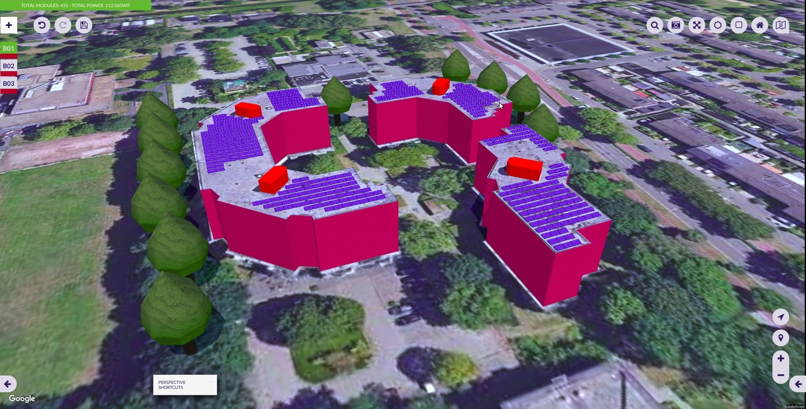
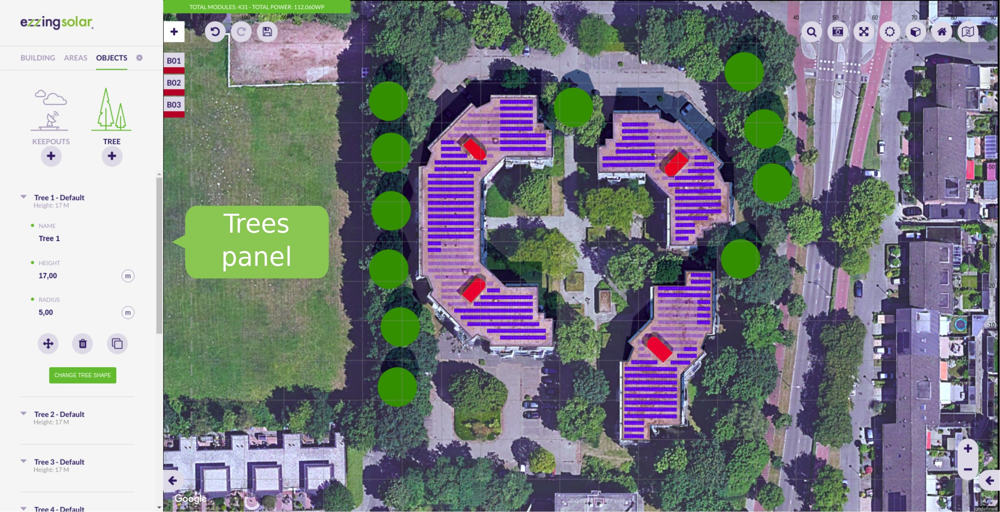
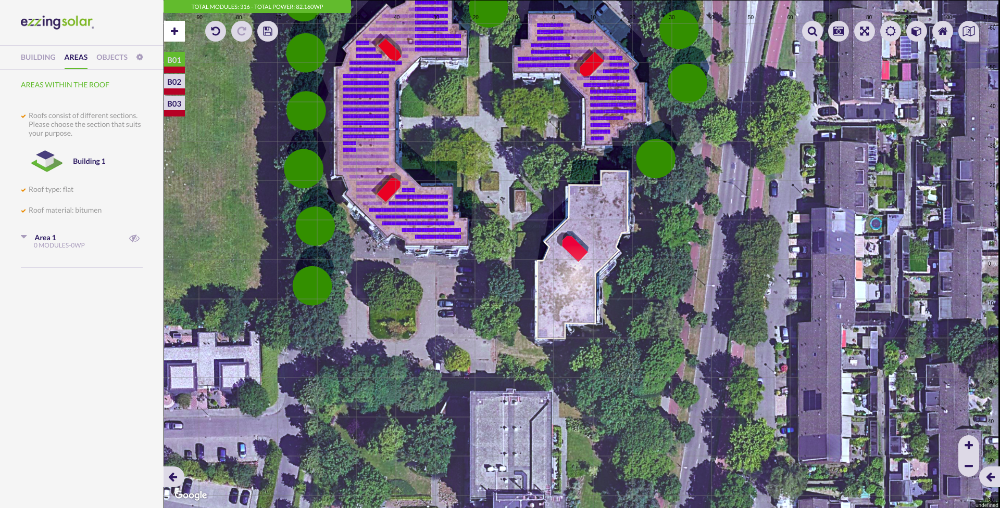
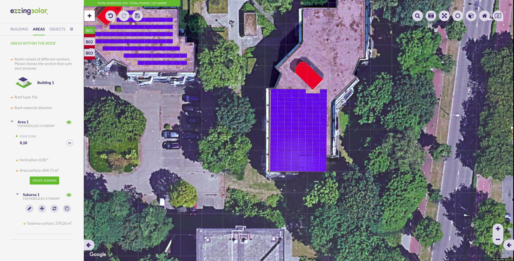
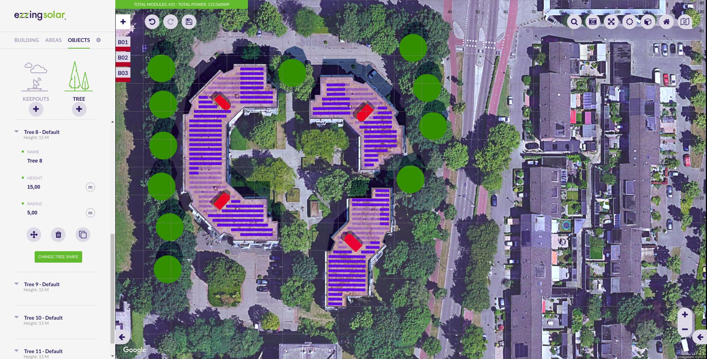

# ezzing3DLayout

## PV planning tool - API Documentation

# Table of contents

  - [Introduction](#introduction)
  - [Screenshots](#screenshots)
  - [3DLayout Interface](#3dlayout-interface)
      - [Aside Panel](#aside-panel)
      - [Canvas Area](#canvas-area)
          - [Buildings Index](#buildings-index)
          - [Main Options](#main-options)
          - [Control Buttons](#control-buttons)
          - [Notifications](#notifications)
  - [Buildings](#buildings)
      - [Building creation](#building-creation)
      - [Add building](#add-building)
      - [Edit building](#edit-building)
  - [Areas](#areas)
      - [Edit area](#edit-area)
  - [Subareas](#subareas)
      - [Subarea creation](#subarea-creation)
      - [Add subarea](#add-subarea)
          - [Crop subarea to the area
            shape](#crop-subarea-to-the-area-shape)
          - [Edit subarea vertices](#edit-subarea-vertices)
      - [Edit subarea](#edit-subarea)
      - [Remove subarea](#remove-subarea)
  - [Keepouts](#keepouts)
      - [Invisible keepouts](#invisible-keepouts)
      - [Crop keepout to the building
        shape](#crop-keepout-to-the-building-shape)
      - [Vertical and inclined
        keepouts](#vertical-and-inclined-keepouts)
  - [Trees](#trees)
  - [Drawing with Snaps](#drawing-with-snaps)
      - [Guide lines](#guide-lines)
      - [Grid](#grid)
      - [Context panel](#context-panel)
  - [Textures](#textures)
  - [Shortcuts](#shortcuts)
  - [Progress bar](#progress-bar)
  - [Layout Coordinate Systems](#layout-coordinate-systems)
      - [World Coordinate System](#world-coordinate-system)
      - [Scene Coordinate System](#scene-coordinate-system)
      - [Building Coordinate System](#building-coordinate-system)
      - [Area Coordinate System](#area-coordinate-system)
  - [How to use](#how-to-use)
      - [API key and autentication](#api-key-and-autentication)
      - [DOM element](#dom-element)
      - [Basic functions](#basic-functions)
          - [getLayout](#getlayout)
          - [createLayout](#createlayout)
          - [listLayouts](#listlayouts)
          - [loadLayout](#loadlayout)
      - [Showcase mode](#showcase-mode)
          - [Showcase without camera
            spin](#showcase-without-camera-spin)
          - [Showcase with camera spin](#showcase-with-camera-spin)
  - [3DLayout Communication System](#3dlayout-communication-system)
      - [Info Events sent by 3DLayout](#info-events-sent-by-3dlayout)
      - [Functions to retrieve info from
        3DLayout](#functions-to-retrieve-info-from-3dlayout)
          - [General functions](#general-functions)
          - [Panels functions](#panels-functions)
          - [Buildings functions](#buildings-functions)
          - [Areas functions](#areas-functions)
          - [Subarea functions](#subarea-functions)
      - [Functions to send info to the
        3DLayout](#functions-to-send-info-to-the-3dlayout)
  - [Alert widgets](#alert-widgets)
  - [Progress bar customization](#progress-bar-customization)
  - [Custom panels](#custom-panels)
      - [Panel blocks](#panel-blocks)
  - [Layout Rules](#layout-rules)
      - [Scene preferences](#scene-preferences)
          - [Project](#project)
          - [Development](#development)
          - [3D canvas](#3d-canvas)
          - [Model](#model)
          - [GUI](#gui)
      - [Default buttons](#default-buttons)
      - [Default languages](#default-languages)
      - [Default colors](#default-colors)
          - [Css colors](#css-colors)
          - [Building and roof colors](#building-and-roof-colors)
          - [Keepout colors](#keepout-colors)
          - [Area colors](#area-colors)
          - [Dilatation lines colors](#dilatation-lines-colors)
          - [Module colors](#module-colors)
          - [Tree colors](#tree-colors)
          - [Custom colors](#custom-colors)
      - [Default modules](#default-modules)
      - [Default providers](#default-providers)
      - [Default model values](#default-model-values)
          - [Default model area values](#default-model-area-values)
          - [Default model building
            values](#default-model-building-values)
          - [Default model keepout
            values](#default-model-keepout-values)
          - [Default model roof by type
            values](#default-model-roof-by-type-values)
          - [Default model roof values](#default-model-roof-values)
          - [Default model subarea by roof type
            values](#default-model-subarea-by-roof-type-values)
          - [Default model subarea
            values](#default-model-subarea-values)
          - [Default model tree values](#default-model-tree-values)
  - [Changelog](#changelog)
      - [v3.20.0 (29/08/2019)](#v3200-29082019)
          - [Features](#features)
          - [Fixes](#fixes)
      - [v3.19.0 (09/08/2019)](#v3190-09082019)
          - [Features](#features-1)
          - [Fixes](#fixes-1)
      - [v3.18.0 (03/06/2019)](#v3180-03062019)
          - [Features](#features-2)
          - [Fixes](#fixes-2)
      - [v3.17.1 (29/05/2019)](#v3171-29052019)
          - [Fixes](#fixes-3)
      - [v3.17.0 (13/05/2019)](#v3170-13052019)
          - [Features](#features-3)
          - [Fixes](#fixes-4)
      - [v3.16.0 (30/04/2019)](#v3160-30042019)
          - [Features](#features-4)
          - [Fixes](#fixes-5)

# Introduction

Ezzing 3DLayout is a PV planning tool that allows you to generate a 3d
model of a building based on a satellite image. You can model any number
of buildings, select between up to five different type of roofs, define
keepouts and trees with custom heights...

Inside each roof area you can customize different structures, select
module models and get automated previews of your setup.

It also provides you with a perspective view and a sun simulator to
determine where the shadows will be in your installation.

Ezzing 3DLayout is an embebible webapp. You can integrate it inside your
own system and customize many elements inside, from module models to
prefered default settings for each roof type.

In this document you will find a brief showcase of the different areas
of the app, a technical explanation on how to integrate this webapp
inside your platform, a full description of the API that will allow you
to communicate with the 3DLayout, and finally a description of how to
customize different parts of the app.

  

You can test the app by visiting this link:

<https://layout.ezzing.com/#/demo>

# Screenshots

  
  

# 3DLayout Interface

The 3DLayout interface has two diferent parts: the **aside panel** and
the **canvas area**.

## Aside Panel

In the aside panel you can find functionalities related to the current
active building and other objects in the scene.

  
  
  
   
  
  
  
 

## Canvas Area

In the canvas area you can see the satellite view and three different
sets of elements: the **buildings index** on the top-left side, the
**main options buttons** on the top-right, and the **control buttons**
on the bottom-right corner.

### Buildings Index

In the buildings index you can see the active building and select
another one to become active. The color represented on each index is the
color of the building.

### Main Options

These are the main options in the canvas area:

All these buttons are the **main options custom buttons**. You can
customize this set of buttons by hidding some of them, by sorting them,
or by adding new buttons.

The default custom buttons are:

  - Undo/Redo
  - Save: saves the layout in crm
  - Search address: moves the project center to the address specified
  - Snapshot: takes a photograph of the project (with or without modules
    in jpg format, or in svg format)
  - Fullscreen
  - Sun simulation: sun and shadow simulation
  - Perspective view: switches to 2D/3D view
  - Renderer
  - Satellite provider selector (only showed if available)

> Please, visit the section [Custom Buttons](#custom-buttons) to learn
> how to add your own buttons.

### Control Buttons

These are map related buttons. You can also customize the upper section
of this set of buttons by hidding some of them or by adding new buttons.

Fixed buttons in this area:

  - Zoom in
  - Zoom out

  

3D control custom buttons:

  - Compass: centers 3D view to north
  - Geolocation: centers 3D view to the project
  - Zoom in
  - Zoom out

> Please, visit the section [Custom Buttons](#custom-buttons) to learn
> how to add your own functions.

### Notifications

Everytime an operation is being executed, it will appear at the top of
the canvas a bar with the name of that operation. Its color represents
the type of notification:

  - Red: error
  - Orange: warning (you should wait until the operation is finished)
  - Green: success
  - Blue: info

# Buildings

## Building creation

To start using the tool you need to create your first building. You will
be able to customize its shape, name or height (from gutter or ridge).

The 'Populated with modules' option determines if the building will be
created with or without modules. It is useful to deactivate it for
simulating the shadows of the buildings.

You can activate the modules in the building edition (this configuration
will be shown everytime the layout is loaded) or enabling the
corresponding area in the area section.

> Please, visit the section [Drawing with Snaps](#drawing-with-snaps) to
> learn how to draw.

The next step once you have drawn the building is configurating the
roof. There are different types of roofs depending on the shape of the
building (if the building is irregular, the roof can only be flat or
pent).

These are all the types of roof (available on regular buildings):

Each roof is composed of a determined number of areas that are
automatically created.

You can also choose a roof material despite it is only informative. The
material options are common for all roof types (tiled, trapezoidal, and
corrugated) except for the flat ones (gravel, bitumen, membrane, and
concrete):

When the operation is finished, the textures of the building are
generated using the mapper tool and the modules appear in a default
subarea.

> Please, visit the section [Textures](#textures) to learn how they are
> generated.

Once the building is created, you will be able to:

  - Edit
  - Move
  - Remove
  - Clone (it will be cloned with the same settings)
  - Paint

## Add building

By clicking the '+' button at the top-left of the canvas you enter in
the building creation process. There is no limit on buildings to create.

## Edit building

You can select between editing the building or editing the roof.

In the first option you can modify the building vertices following the
steps of the building creation. If you edit the roof you can select any
type of roof and it will be recalculated.

# Areas

The areas are sections on the roof that are automatically created when
selecting the type of roof.

Each area is composed of at least one subarea and has the information of
the number of modules it contains and the power that generates.

If you want to disable one area, you can click on the eye button next to
its name. By doing this, its module count and power generated will be
set to 0.

## Edit area

To edit an area you can modify the edge zone value. It is a numeric
value that specifies the distance between the building limits and the
subareas that exist within that area.

# Subareas

A subarea is a region inside an area that allows you to define a modules
installation just in a section of the area.

By clicking on a subarea, two views will appear: the project view (top)
and the subarea view (bottom).

The subarea view is hidden by default. To toggle its view, you have to
click on the button 'Open subarea view' or 'Close subarea view' at the
bottom of the canvas.

> Note that when moving the subarea or changing its azimuth the subarea
> view will be opened. This is because this view hasn't got any
> deformation.

## Subarea creation

To create a subarea click on the 'Create subarea' button.

Once the subarea is created, you will be able to:

  - Edit
  - Move
  - Refresh
  - Remove (only if the area has more than one subarea)
  - Clone (it will be cloned with the same settings)

If you want to disable one subarea, you can click on the eye button next
to its name. By doing this, its module count and power generated will be
set to 0.

## Add subarea

By clicking the 'Create subarea' button you enter in the subarea
creation process.

If you create the first subarea it will replace the default one.

### Crop subarea to the area shape

When editing the vertices of a subarea you can check the 'Crop' option.
This helps you to draw subareas that extends to the border of the
building with more precision.

If you uncheck this option then the subarea can extend outside the area,
following the area plane.

### Edit subarea vertices

By clicking this button you can modify subarea vertices and the subarea
will be recalculated.

## Edit subarea

By clicking on a subarea you enter in the subarea edition process.

You will be able to refresh, paint or move all the modules.

These are all the subarea edition options:

  - Module model: there are different module models available that have
    different size, weight and watt peak capacity
  - Module orientation: you can choose between 'landscape' and
    'portrait'
  - Panels orientation: you can choose between 'south' and 'east/west'
  - Module inclination
  - Distance between modules
  - Distance between rows
  - Distance between centers
  - Use max. shadow calculation: calculates the distance between rows
    and centers depending on the module inclination
  - Azimuth: modules rotation
  - Staggered enabled
  - Sails
  - Dilatation lines enabled

Here, you can click on any module to enable/disable it. If you right
click on a module it will be displayed its position (row and column).

## Remove subarea

By clicking this button you can remove a single subarea from the
subareas list. It is only available if there exists more than one
subarea.

# Keepouts

Keepouts are created for simulating any obstacle that might interrupt
the installation of modules.

When a keepout is created, there can't be any module that occupies the
same position.

You can customize them by changing their height, offset and type
(vertical or inclined).

> Note that for flat roofs it is posible to create 0 height keepouts,
> but for inclinated roofs you need to use the invisible keepouts
> feature to allow keepouts at roof surface level.

## Invisible keepouts

If you want to simulate a skylight or any keepout object without drawing
the 3D volume you can check the 'Invisible keepout' option to hide the
3D volume but still taking the obstacle into account.

## Crop keepout to the building shape

When editing the vertices of a keepout you can check the 'Crop shape to
building limits' option. This helps you to draw keepouts that extends to
the border of the building with more precision.

If you uncheck this option then the keepout can be floating outside the
building limits. At least one vertex of the keepout should be inside the
building limits to be created.

## Vertical and inclined keepouts

You can create a keepout as vertical or inclined. If the keepout is
inclined, it will be created starting from the inclination of the
building.

# Trees

Trees belong to the scene, not to a building.

It is important to create trees for simulating the shadows on the roofs.
Therefore, you will be able to move them and modify their height and
radius. The shape of the tree is calculated according to the proportion
of these values.

# Drawing with Snaps

The snap is a helpful tool for drawing buildings, subareas and keepouts.

There are two ways for drawing points: using **guide lines** or a
**grid**.

## Guide lines

'Guide lines' is the default option when drawing. There are two ways for
drawing points that can be combined to make the process easier: lines
and vertices.

To use them, you need first to draw two points. Once you have drawn
them, there will appear parallel and perpendicular guide lines to the
last drawn point. This way you can create regular shapes with right
angles (it is also possible to move points along these guide lines).

Switching to the 'Vertices' option allows you to draw points at the
intersections of the guide lines and the vertices of the buildings.

> Please, visit the section [Context panel](#context-panel) to see more
> drawing features.

## Grid

When selecting this option appears a grid that occupies the entire
canvas area.

You can customize it by specifying a number for the grid size (size of
each square) and an offset in the x and y coordinates for moving the
grid.

> Please, visit the section [Context panel](#context-panel) to see more
> drawing features.

## Context panel

This menu is available in both options, guide lines and grid, by right
clicking on a point or edge.

When right clicking a point, you can:

  - Draw guides here (only in 'Guide lines' option): draws parallel and
    perpendicular guide lines to this point in relation to the selected
    edge
  - Remove all guides (only in 'Guide lines' option): removes all guide
    lines except the ones to the selected point
  - Select/deselect point: this is useful for moving many points along a
    guide line at once
  - Deselect all points: deselects all points except the last selected
    one
  - Delete point

When right clicking an edge (only in 'Guide lines' option), you can:

  - Select/deselect edge as guide: redraws the parallel and its
    perpendicular guide lines to the selected edge
  - Select/deselect all edges as guide

It is also available by right clicking on a module in the subarea view.

By doing this, it will display:

  - The position of the module (column and row)
  - Its index position in the row
  - Its index position in the column

If dilatation lines are disabled, there are also two buttons to:

  - Change row modules orientation
  - Add row offset

# Textures

The textures are images obtained from the satellite displayed on the
roof, with the same size and position.

They are generated by default when a building is created. You can
disable their automatic creation in the Preferences panel.

> Please, visit the section [Layout Rules](#layout-rules) to learn how
> to customize this property.

In the building panel you can see the different options for the
satellite image textures:

  - '+' : adds satellite texture for the active building
  - Refresh (available when the active building has textures)
  - Remove (available when the active building has textures)
  - Generate for all buildings
  - Remove all satellite textures

> Note that the textures generation might fail because of the speed of
> the internet connection or the speed of response of the satellite
> image provider. For preventing the failure you can select each
> building and wait for the satellite images to load or refresh the
> textures individually.

# Shortcuts

The shortcuts can be used in the following cases:

  - To navigate between tabs, press 1, 2, 3 or 4
  - To execute undo press 'Ctrl + Z', and to execute redo press 'Ctrl +
    Y'
  - When drawing:
      - To enable/disable snap to guides, press 'S'
      - To toggle between guide lines and vertices you can hold 'Ctrl' /
        '⌘'
      - To select/deselect vertices, click on them while pressing
        'Shift'
  - Editing a subarea:
      - Hold 'Shift' for selecting the hole row
      - Hold 'Ctrl' / '⌘' for selecting the hole column
  - Moving a building, subarea or keepout:
      - Down: Numpad 1, 2, 3 | 'End' | 'Down arrow' | 'Page down'
      - Left: Numpad 1, 4, 7 | 'End' | 'Left arrow' | 'Home'
      - Right: Numpad 3, 6, 9 | 'Page down' | 'Right arrow' | 'Page up'
      - Center: Numpad 5 | 'Clear'
  - Save: for saving the project in crm you can press 'Ctrl + Shift + S'
    / '⌘ + Shift + S'
  - Widgets:
      - To cancel the operation or close the widget, press 'Esc'
      - To confirm the operation, press 'Enter'

Anyways, these shortcuts will be displayed on a widget, so you can
consult them when necessary.

> For users with Mac operating system, Ctrl key in shortcuts will be
> disabled using the Command key instead (⌘).

# Progress bar

Everytime a long operation is being executed, it will be displayed a
progress bar to inform the user.

The progress bar it's composed of:

  - Title: name of the operation being executed
  - Label 1: function withing the operation
  - Label 2: step of the funcion
  - Bar: if there is a determinate number of steps it will be increasing
    its value, if not, it will be shown as an animation

> Please, visit the section [Progress bar
> customization](#progress-bar-customization) to learn how to customize
> the progress bar.

# Layout Coordinate Systems

The 3DLayout works in four different coordinate systems, depending on
which context we are requesting info.

## World Coordinate System

World coordinate system works with spherical coordinates, latitude and
longitude.

The values stored in this system and the API calls to retrieve this data
are:

  - Layout project center \> getLayout

## Scene Coordinate System

Scene coordinate system works with cartesian coords, with origin in the
layout project center and distances measured in meters. It is used to
place each building relative to the project center.

The values stored in this system and the API calls to retrieve this data
are:

  - Building data center \> getBuildingInfo()

## Building Coordinate System

Building coordinate System works with cartesian coords, with origin in
the building center and measured in meters. Al tilted surfaces are
represented in ortographic view.

The values stored in this system and the API calls to retrieve this data
are:

  - Building vertices (verticesMCoords) \> getBuildingInfo()

## Area Coordinate System

Area Coordinate System works in cartesian coords, with origin in the
bottom-left corner of the area, and rotated with the exterior wall
azimuth of the area. On flat roofs the first wall drawed is considered
the main wall.

The values stored in this system and the API calls to retrieve this data
are:

  - Area vertices (verticesMCoords) \> getAreaInfo()
  - Area offset vertices (verticesOffsetMCoords) \> getAreaInfo()
  - Area modules coords (modulesData (x/y)) \> getAreaInfo()

This is the same for subareas, just using **getSubareaInfo**

# How to use

## API key and autentication

The 3DLayout allows you to provide Google and Bing API keys.

In case these API keys don't exist, the default provider will be Open
Street Maps.

To add them as layout rules, please visit the [Scene
preferences](#scene-preferences) section within the [Layout
Rules](#layout-rules) section.

## DOM element

You need an element in the body of your html page, a div where **the
3DLayout will fit inside this element**.

> This div can't be bigger than the view size, and **no scroll** has to
> be applied to the html page.

You should not change the ezzing3d element size (width or height) but
change the size of this container div.

    

        <ezzing3d id='ezzing3d'></ezzing3d>
    

## Basic functions

Adding the `client.min.js` script with a valid API key makes available
the `Ezzing3DClient` global object, which we will use to start using the
3DLayout.

The Ezzing3DClient object has the following functions:

  - getLayout
  - createLayout
  - listLayouts
  - loadLayout
  - destroyLayout

### getLayout

Returns the information of a layout related to the given
    id.

    Ezzing3DClient.getLayout(layoutId, function(err, layoutData, container) {
        if (err) throw err;
        console.log(layoutData);
    });

### createLayout

Creates a new layout with the specified information.

    var data = {
        title: "EzzingSolar",
        latitude: 40.428121,
        longitude: -3.698695,
        address: "Calle de Sagasta, 18",
        zip: "28004",
        city: "Madrid",
        province: "Madrid",
        country: "Spain"
    };

Where the only required values are latitude and longitude.

    Ezzing3DClient.createLayout(data, function(err, layoutData) {
        if (err) throw err;
        console.log(layoutData);
    });

This will return the information from the created layout with the
following properties:

    {
      id: 1093,
      title: "EzzingSolar",
      address: "Calle de Sagasta, 18",
      zip: "28004",
      city: "Madrid",
      province: "Madrid",
      country: "Spain",
      latitude: "40.428121",
      longitude: "-3.698695",
      created_at: "2016-08-18T17:15:15+0000",
      updated_at: "2016-08-19T10:14:34+0000",
      url: "https://layout.ezzing.com/#/GXXlgzDk0rPsrdxWfDsE5Cdi9FwUrBPx7GfuxSf0::1093"
    }

where:

    {
      id: layout id needed for loading the project or retrieving information,
      title: a title for the project,
      address: project address,
      zip: zip code,
      city: city name,
      province: province name,
      country: country name,
      latitude: latitude value in decimal degrees (remember to include the negative sign for south and west coordinates),
      longitude: longitude value in decimal degrees (remember to include the negative sign for south and west coordinates),
      created_at: creation date (ISO8601),
      updated_at: creation date (ISO8601),
      url: an url to visit the project or embed it as an iframe
    }

> The url can be used to embed a readonly version of the project. You
> can read a description of this methods in the [Showcase
> mode](#showcase-mode) section.

### listLayouts

Returns a list of all your created layouts.

    Ezzing3DClient.listLayouts(function(err, layoutData) {
        if (err) throw err;
        console.log(layoutData);
    });

### loadLayout

Sets up the 3DLayout interface into the ezzing3D container and loads the
project related to the given id.

    var rules = {};
    
    Ezzing3DClient.loadLayout(layoutId, rules, function(err, layoutApi, container) {
        if (err) throw err;
    });

loadLayout can receive an `options` argument where you can setup some
customizations.

> You can read a description of this methods in the [Layout
> Rules](#layout-rules) section.

This method returns the following objects:

  - layout: Exposes an object with methods to interact with the
    3DLayout.

> You can read a description of this methods in the [3DLayout
> Communication System](#dlayout-communication-system) section.

  - container: the DOM element where the 3DLayout is created.

## Showcase mode

If you want to show the layout to a customer or embed it in read-only
mode in another page of your platform (to act as a thumbnail of the
project) you can do it by adding an iframe element to an html page, with
a modified version of the url of the layout.

It can be displayed with and without camera spin.

### Showcase without camera spin

    <iframe src=(url + "/showcase")> </iframe>

In this mode the 3DLayout will show the project in perspective mode
without any gui elements and a quiet 3d view. You can click and drag
with the mouse to rotate the view and zoom with the mouse wheel.

### Showcase with camera spin

    <iframe src=(url + "/spin-showcase")> </iframe>

In this mode the 3DLayout will show the project in perspective mode
without any gui elements and a rotating 3d view. You can click and drag
with the mouse to rotate the view and zoom with the mouse wheel. Once
clicked the rotation will stop.

# 3DLayout Communication System

## Info Events sent by 3DLayout

The 3DLayout triggers different events to report actions when they are
accomplished or to inform on GUI changes.

Here is an example of how to listen to these events:

    var container = window.document.getElementById('ezzing3d');
    
    container.addEventListener('buildingSelected', function(event, data){
        console.log(event.detail);
    });

The full list of events emmited by the 3DLayout are:

Active changed: triggered every time the user activates this object or
enters its edit section. The event sends the **object.id**.

  - Building: activeBuilding, editBuilding
  - Area: activeArea, editArea
  - Subarea: activeSubarea, editSubarea, resetSubarea
  - Tree: activeTree, editTree
  - Keepout: activeKeepout, editKeepout

Finish creation: triggered every time a one of the following objects is
created. The event sends the **object.id**.

  - buildingCreated
  - subareaCreated
  - keepoutCreated

Edit points: triggered every time the user enters the vertices/roof edit
section of a building. The event sends the **building.id**).

  - editVertices
  - editRoof
  - editRoofFinished

Close panel:

  - editSubareaFinished

Set attribute changed: triggered every time any of these objects
attribute is changed. The event sends back an array with **\[object.id,
attribute, value\]**.

  - buildingChanged
  - areaChanged
  - subareaChanged
  - treeChanged
  - keepoutChanged
  - roofChanged
  - sceneChanged

Delete object: triggered every time any of these objects is deleted. The
event sends the **object.id** (after this operation this object won't
longer exist in the project).

  - buildingRemoved
  - areaRemoved
  - subareaRemoved
  - treeRemoved
  - keepoutRemoved

Change tab: triggered every time the aside panel navigation tab changes.
It sends a string with the current tab name ('building', 'areas',
'keepouts', 'trees', 'keepout-info' or 'tree-info').

  - tabChangedApi

Save project:

  - layoutProjectSaved

Clone:

  - buildingCloned
  - areaCloned
  - subareaCloned
  - treeCloned
  - keepoutCloned

Move points:

  - locationChanged

Edit subarea:

  - editSubareaPath

Move subarea:

  - subareaMoved

Move system finished:

  - modulesMoved

Delete subarea:

  - subareaRemoved

Fullscreen enabled/disabled: triggered when the user changes from normal
view to fullscreen. It sends **true** when changing to fullscreen and
**false** when disabling it mode.

  - ez3d-fullscreen-disabled
  - ez3d-fullscreen-enabled

Lock interface:

  - lockInterface

Invalid offset:

  - invalidOffset

Undo/Redo panels: triggered when a customProperty has been changed
sending the panel name.

  - changePanelOnUndoRedo

Undo/Redo executed: triggered every time a undo or redo operation has
been executed.

  - executedUndoRedo

## Functions to retrieve info from 3DLayout

There is a set of functions to retrieve information from the 3DLayout.

For all these functions you can send a callback as an argument to be
executed when data is retrieved.

### General functions

  - saveProject(callback)
  - refreshViewport

### Panels functions

  - setCustomPanel(customPanelData, callback): creates a new panel
  - setUnits(unitToChange, callback): set a new unit (m, cm, mm, ...)

### Buildings functions

Set of functions to retrieve buildings information from the layout. The
**callback** argument is always needed.

#### getCurrentBuildingId(callback)

Returns the id of the current active building.

#### getLayoutData(callback)

Returns a JSON with an array of buildings:

    {
        id: building id,
        name: building name,
        areas: {
            id: area id,
            name: area name,
            subareas: {
                id: subarea id,
                name: subarea name
            }
        }
    }

#### getBuildingInfo(id, callback)

Returns all the building information for a given building.id:

    {
        id: the building id,
        name: the building name,
        height: building height (in meters),
        regular: true if building angles are all equal to 90º, false otherwise.
        buildingArea: building area measure (in square meters),
        centerDeg: building center in World coordinate system,
        centerMCoords: building center in Scene coordinate system,
        vertices: building vertices in world coordinate system  [DEPRECATED],
        verticesMCoords: building vertices in building coordinate system,
        modules: total of modules in the building
        power: total power of the building,
        areas: {
            id: the area id,
            name: the area name,
            subareas: {
                id: the subarea id,
                name: the subarea name
            }
        }
    }

#### getRoofsInfo(id, callback)

Returns roof information for a given building.id:

    {
        height: roof height (in meters, not including building height),
        inclination: roof angle (in degrees),
        material: roof material (i.e: tiled/corugated),
        orientation: roof orientation (i.e: east/west or nort/south),
        type: roof type (i.e: flat, pent, gabled, etc...)
    }

#### getBuildingPosition(id, callback)

Returns building position info for a given building.id:

    {
        center: building center in world coord system [DEPRECATED],
        vertices: array of building vertices, world coord system [DEPRECATED],
        centerDeg: building center in World coord system,
        centerMCoords: building center in Scene coord system,
        verticesMCoords: building vertices in building coord system,
    }

#### getNumberOfModules(callback)

Returns a JSON with an array of buildings with the following properties:

    {
        id: building id,
        name: building name,
        modules: total of modules in the building,
        areas: {
            id: area id,
            name: area name,
            modules: total of modules in the area,
            subareas: {
                id: subarea id,
                name: subarea name,
                modules: total of modules in the subarea
            }
        }
    }

#### getTotalPower(callback)

Returns the total power for all the buildings in the project.

#### getPower(callback)

Returns an array of all buildings in the project with the following
properties:

    {
        id: the building id,
        name: the building name,
        power: the total power for this building,
        areas: {
            id: the area id,
            name: the area name,
            power: total power in this area,
            subareas: {
                id: the subarea id,
                name: the subarea name,
                power: total power in this subarea
            }
        }
    }

### Areas functions

Set of generic functions to retrieve Area related information from the
layout. In this set of functions you should pass an existing area id and
a callback.

  - getAreaInfo
  - getAreaOffset

#### getAreaInfo(id, callback)

Returns area info for a given area.id:

    {
        id: area id,
        name: area name,
        offset: area offset,
        placement: placement (ex: portrait/landscape),
        structure: (ex: east-west/standard),
        inclination: modules inclination (in degrees),
        azimuth: modules azimuth inclination (in degrees),
        areaMCoords: array with area vertices coordinates in Area system coords [DEPRECATED],
        areaOffsetMCoords: array with offseted area vertices in Area system coords [DEPRECATED],
        verticesMCoords: array with area vertices coordinates in Area system coords,
        verticesOffsetMCoords: array with offseted area vertices in Area system coords,
        wallSizes: size in meters for each area wall,
        wallAzimuth: azimuthal angle for the external area wall,
        power: total power of the area,
        subareas: {
            id: subarea id,
            name: subarea name
        }
    }

#### getAreaOffset(id, offset, callback)

Returns an array of vertices containing the offseted area for a given
area.id and offset.

If the offset is a negative value, then the area is reduced by the
offset value (in meters).

### Subarea functions

Set of generic functions to retrieve area related information from the
layout. In this set of functions you should pass an existing area id and
a callback.

  - getSubareaInfo
  - getModuleInfoBySubarea
  - getModulesStructureBySubarea

#### getSubareaInfo(id, callback)

Returns subarea info for a given subarea.id:

    {
        id: subarea id,
        name: subarea name,
        offset: subarea offset,
        placement: placement (ex: portrait/landscape),
        structure: (ex: east-west/standard),
        inclination: modules inclination (in degrees),
        azimuth: modules azimuth inclination (in degrees),
        verticesMCoords: array with subarea vertices coordinates in Area system coords,
        verticesOffsetMCoords: array with offseted subarea vertices in Area system coords,
        wallSizes: size in meters for each subarea wall,
        wallAzimuth: azimuthal angle for the external area wall,
        power: total power of the subarea,
    }

#### getModuleInfoBySubarea(id, callback)

Returns module info for a given subarea.id:

    {
        id: module id,
        name: module model name,
        reference: extra model information,
        width: width of the module (in meters),
        height: height of the module (in meters),
        length: lenght of the module (in meters),
        power: power of the module
    }

#### getModulesStructureBySubarea(id, callback)

Returns a JSON with an array of modules for a given subarea.id:

    {
        x: x position of the module in Area system coords,
        y: y position of the module in Area system coords,
        col: column to which the module belongs,
        row: row to which the module belongs,,
        rX: rotation of the module in the X axis (inclination),
        rZ: rotation of the module in the Z axis (azimuth),
        color: color of the module (only exist if color is not default),
    }

## Functions to send info to the 3DLayout

Set of functions to change values inside the project:

  - setAttribute(objectId, attr, value, callback)
  - updateRender
  - setActive(objectId, callback)
  - disabledMap(callback)
  - cleanResult(list)

# Alert widgets

It's important to notify user when a change is going to be made or an
error has appeared. You can create new customizable widgets on any panel
element when its value is going to be changed.

To create a widget, you have to add two json properties on the json of
the element whose value is being modified: 'confirmation' and
'confirmationWidget'.

    paint: {
        type: 'button',
        tooltip: 'paint',
        classed: 'ez3d-button fa-paint-brush',
        confirmation: true,
        confirmationWidget: {
            'name': 'color-palette-selector-building',
            'title': 'colorPaletteSelector',
            'functionOnCreation': ['colorPaletteWidget', 'building']
            'eventCancel': ['close_widget_notification', ''],
        }
    }

The 'confirmation' property is a boolean that determines if the widget
will be shown or not. It can be a raw value (true/false) or a function
that returns a boolean value.

The 'confirmationWidget' property is an object composed of:

    confirmationWidget: {
        'name': widget id,
        'title': title displayed on the header,
        'content': string with the content of the widget
        'functionOnCreation': function with a json of the elements to create in the widget content container
        'eventOk': [optional] the changes will be applied
        'eventCancel': [optional] the changed value won't be applied and the panels will update
    }

If the widget is going to be only informative, there must be an
'eventOk' property so that the changes are applied.

> Notice that both 'content' and 'functionOnCreation' properties create
> the content of the widget but in different ways, therefore you can
> only use one of these.

# Progress bar customization

The progress bar is managed by events. It has 4 listeners:

  - showProgressBar
  - resetProgressBar
  - updateProgressBar
  - hideProgressBar

Resetting the progress bar will remove its width and set the bar
animation. We recommend you to emit this event before updating the
progress bar with a value.

To update the progress bar it is important to first open it by emitting
the event 'showProgressBar'. The values will be sent as an object this
way:

    ee.emitEvent('updateProgressBar', [{
        title: 'Title of the operation'
        label1: 'Name of function',
        label2 : 'Step withing the function',
        value: 50
    }]);

There are some cases that need to be mentioned when sending these
parameters:

  - If 'title' is undefined, it will keep its last value. If it's
    different than the current one, the progress bar will reset
  - If 'label1' is undefined, it will keep its last value. If title has
    changed, it won't have a value
  - If 'label2' is undefined it won't have a value
  - If 'value' is undefined it will be displayed the animation in the
    bar. Otherwise, it's value will be added to the width of the bar.

> The simplest example is generating all the textures. If the project
> has 3 bulidings, you will have to divide 100 by number of buildings,
> so that the bar width will increase a 33.3% each time the event is
> emitted.

When the progress bar is being hidden, all of its texts are removed and
the animation is shown.

# Custom panels

You can customize all of the panels by changing their content.

There is a function in the API called setCustomPanel that receives as
parameter a json that contains the panel info, content, functions and
listeners.

To create a new panel, the panel elements must be in a 'json' property
and a 'populate' property must be valued with 'updatePanel'.

    var newPanel = {
        name: 'panel-name',
        model: 'EZModelKeepout',
        customMethods: {},
        customGuiMethods: {},
        customListeners: {},
        json: {
            name: {
                type: 'string',
                property: 'name',
                label: 'keepout_name',
                value: this.name
            }
        },
        populate: 'updatePanel'
    }

To create a group of panels, they have to be declared as customMethods:

    var keepoutPanels = {
        name: 'custom-keepouts-panels',
        model: 'EZModelKeepout',
        customMethods: {
            keepoutCreate: customKeepoutCreatePanel,
            keepoutEdit: customKeepoutEditPanel,
            keepoutInfo: customKeepoutInfoPanel
        },
        customGuiMethods: {}
    };

These panels are also jsons that define the content of each panel by
blocks.

> Please, visit the section [Panel blocks](#panel-blocks) to learn how
> to create different blocks in panels.

CustomMethods are functions that extend the given model (for example,
EZModelKeepout). For executing these, you have to use the runMethod
operator in an eventOnClick/eventOnChange
    property:

    eventOnChange: ['EZModelKeepout_runMethodListener', 'nameOfTheCustomMethod']

CustomGUIMethod will be executed directly in a
functionOnClick/functionOnChange giving arguments as a second
paramenter:

    functionOnClick: ['nameOfTheGUIMethod', argument],

CustomListeners define which event are listening to, and which
customGUIMethod will run:

    nameOfProperty: ['eventToListen', 'nameOfTheGUIMethod']

## Panel blocks

To create different blocks, each element must have a 'type' property.
These are the available types:

  - string
  - float / integer
  - boolean
  - select
  - selectByImage
  - selectBySVGImage
  - azimuthRange
  - helper
  - link
  - groupBlock
  - button
  - listResume
  - blockList
  - foldableBlock
  - subareaBlock
  - blockResume
  - title
  - compass
  - invisibleKeepout
  - stringWidget
  - selectWidget
  - buttonsPanelWidget
  - buttonWidget
  - rangeWidget
  - dateTimeWidget
  - booleanWidget
  - imageNavigator
  - navigator

# Layout Rules

The user can customize many options in the 3DLayout. By passing a
'rules' attribute to the 3DLayout instance with a collection of objects,
you can define the default values, add special behaviours to the
3DLayout and customize the interface.

Example of rules object:

    var rules = {
        'display': true,
        'zoom': 21,
        'logo': false,
        'CustomPalette': ['#ff0000', '#00ff00']
    }

Available rule objects expected by the 3DLayout:

  - Scene preferences
      - Project
      - Development
      - 3D canvas
      - Model
      - GUI
  - Default buttons
  - Default languages
  - Default colors
      - Css colors
      - Building and roof colors
      - Keepout colors
      - Area colors
      - Dilatation lines colors
      - Module colors
      - Tree colors
      - Custom colors
  - Default modules
  - Default providers
  - Default model values
      - Default model area values
      - Default model building values
      - Default model keepout values
      - Default model roof by type values
      - Default model roof values
      - Default model subarea by roof type values
      - Default model subarea values
      - Default model tree values

## Scene preferences

### Project

The attributes are:

    {
        defaultProjectId: crm project to load if there's no hash (set to 0 to load the demo version),
        loadMockup: if true it loads a mockup,
        userToken: user token
    }

### Development

All the attributes are boolean:

    {
        debugPromises: debug promises (console log),
        enableUndoRedo: enable undo/redo feature,
        enableApi: enable Api feature,
        snapShotCrm: allow snapshots to be sent to crm,
        debugListeners: debug number of listeners in console.log,
        debugOpTime: shows the time an operation takes to be done,
        recordOperators: record all the executed operators with their args
        debugContainers: show or ignore console.logs in code
        showOldSystemProject: show old drawing in svgProject container
        showOldSystemArea: show old drawing in svgArea container
        showNewSystemProject: show new drawing in svgProject container
        showNewSystemArea: show new drawing in svgArea container
    }

### 3D canvas

Sample values:

    {
        activeMapper: true,
        activeRenderer: true,
        buildingTextures: true,
        zoomRatio: 1,
        translationRatio: 1,
        rotationRatio: 1,   
        enablePlayer: true,
        customDateTime: false,
        defaultDateTime: '2019-01-01T10:00'
    }

The attributes are:

    {
        activeMapper: activate mapper on start,
        activeRenderer: activate renderer on start,
        buildingTextures: generate building textures when creating a building,
        zoomRatio: zoom ratio for 3D mode,
        translationRatio: translation ratio for 3D mode,
        rotationRatio: rotation ratio for 3D mode,
        enablePlayer: enable three.js canvas,
        customDateTime: enable custom date time for sun simulation,
        defaultDateTime: date time for sun simulation (customDateTime must be true, or defaultDateTime will be calculated depending on hemisphere)
    }

### Model

Sample values:

    {
        collisionBias: 0.03,
        angleBias: 0.5,
        maxAreaInclination: 75,
        sunSpeed: 3,
        googleApiKey: '',
        bingApiKey: '',
        maxDistanceFromCenter: 1000
        includeInsetInDL: false,
        limitUndoRedo: 10
    }

The attributes are:

    {
        collisionBias: factor to validate collisions (with bigger values less collision),
        angleBias: factor to validate regular angles (with bigger values less angle precision),
        maxAreaInclination: area is disabled when the area inclination is bigger than this value,
        sunSpeed: position of element of the sun simulator speed,
        googleApiKey: Google api key for provider,
        bingApiKey: Bing api key for provider,
        maxDistanceFromCenter: max distance in meters allowed from the first drawn building vertex to the project center
        includeInsetInDL: include inset in DL height and width,
        limitUndoRedo: maximum number of operations stored in the undo/redo history
    }

### GUI

Sample values:

    {
        closeRightCanvas: true,
        showCoordinates: false,
        showTotalPower: true,
        customLogo: 'default',
        customNav: 'default',
        showNav: true,
        showLogo: true,
        defaultLanguage: 'en',
        defaultUnits: 'm',
        enableNotifications: true,
        manageFullscreen: true,
        movementStep: 0.1,
        snapToGrid: false,
        gridSize: 1,
        gridOffsetX: 0,
        gridOffsetY: 0,
        snapToGuides: true,
        snapToLines: true,
        snapToVertices: false,
        maxAllowedBuildings: 0,
        viewportMode: 4,
        customRowOffset: true,
        customRowOrientation: true,
        hidden: []
    }

The attributes are:

    {
        closeRightCanvas: close right canvas on start,
        showCoordinates: show coordinates of the mouse in the right bottom corner,
        showTotalPower: show 'Total power' indicator in the left upper corner,
        customLogo: custom logo url,
        customNav: show or hide nav ('default' shows nav),
        showNav: creates structure of panels,
        showLogo: show logo,
        defaultLanguage: string from available keys at 'defaultLanguages',
        defaultUnits: string from available keys at 'units',
        enableNotifications: enable operator notifications feature,
        manageFullscreen: manage fullscreen mode,
        movementStep: amount of movement in meters when using arrow keys to move solar panels,
        snapToGrid: enable snap vertices to grid,
        gridSize: grid distance to use as snap when using snap to move vertices,
        gridOffsetX: offset grid drawing in x axis,
        gridOffsetY: offset grid drawing in y axis,
        snapToGuides: activate snap to guides,
        snapToLines: enable snap to guidelines or edges,
        snapToVertices: enable snap to vertices or guideline intersections,
        maxAllowedBuildings: hides the button to create new buildings when their quantity is >= to this value (if it's 0 there is no max quantity),
        viewportMode: viewport mode,
        customRowOffset: enable custom row offset (right click on modules),
        customRowOrientation: enable custom row orientation (right click on modules),
        hidden: array of json properties within that json that don't want to be shown in panels
    }

The viewportMode options are:

  - 0: invisible interface
  - 1: showcase mode
  - 2: open street map
  - 3: hide interface \[DEPRECATED\]
  - 4: google streetview
  - 5: default values editor
  - 6: simple mode
  - 7: documentation
  - 8: autocad export

## Default buttons

There are several areas in the 3DLayout where the user can add his own
functions. The defaultButtons property has different properties
depending on the area of the buttons:

    {
        buttonsPanelLeft: { },
        buttonsPanelRight: { },
        buttonsPanelBottomZoom: { },
        buttonsPanelBottomRight: { },
        buttonsPanelBottomLeft: { },
        buttonsPanelBottomCenter: { },
        buttonsPanelRightViewportRight: { }
    }

Each buttons panel has the following properties:

    buttonsPanelRight: {
        position: 'right',
        buttonsPanel: {
            type: 'groupBlock',
            elements: { }
        }
    }

To create a button panel you must specify its type ('groupBlock').

The 'elements' property within 'buttonsPanel' contains all the buttons
that exist in that button panel. For example, to create the 'Snapshot'
and 'Fullscreen' buttons at the right-top of the canvas:

    elements: {
        classed: 'ez3d-panel-buttons ez3d-flex-start-wrap-row viewport_left_controls_left',
        snapshot: {
            type: 'button',
            tooltip: 'snapshot',
            classed: 'ez3d-button fa-camera-retro',
            confirmation: true,
            confirmationWidget: {
                'name': 'snapshot',
                'title': 'snapShot',
                'functionOnCreation': ['managerWidgetSnapShot', 'snapshot']
            }
        },
        fullScreen: {
            type: 'button',
            tooltip: 'fullScreen',
            classed: 'ez3d-button ez3d-screen-icon',
            changeIcon: 'screen',
            functionOnClick: ['fullScreen', '']
        },
    }

The 'elements' property is composed of a 'classed' property to position
the buttons, and the buttons by their name.

All the properties that a button can have are:

    buttonName: {
        type: 'button',
        id: button id,
        classed: class button attribute,
        content: button text,
        tooltip: button tooltip,
        property: attribute only model,
        confirmation: boolean for showing a button confirmation widget,
        confirmationWidget: {
            'eventOk': event sent when clicking on the 'Ok' button,
            'eventCancel': event sent when clicking on the 'Cancel' button,
            'name': widget id,
            'title': widget title,
            'content': widget content,
            'functionOnCreation': function called when creating the widget
        }
        value: button value,
        changeIcon: toggle button icon string,
        editable: disabled button attribute,
        active: active button class,
        elements: foldable elements list (object),
        functionOnClick: function called when clicking on the button,
        eventOnClick: event sent when clicking on the button
    }

It is very important to specify the type of element (in this case
'button') for creating correctly these elements.

These buttons will be created following the order of the
'buttonsPanel.elements' object.

## Default languages

To customize the existing languages or add new ones, you have to edit
them or create a new json property with the name of that language
abbreviation ('EN', 'FR', 'ES', etc).

    var defaultLanguages = {
        'EN': {
            'key': 'english key value'
        },
        'FR': {
            'key': 'french key value'
        }
    }

## Default colors

All the customizable colors can be also edited in the Preferences menu
selecting the 'Default values editor' on the viewport mode. These are:

    var defaultColors = {
        cssColors: { },
        buildingColors: { },
        roofPointsColors: { },
        roofRidgeColors: { },
        keepoutColors: { },
        areaColors: { },
        subareaColors: { },
        dilatationLinesColors: { },
        moduleColors: { },
        treeColors: { },
        customColor: { }
    }

### Css colors

These colors are used in the viewport and buttons in the canvas areas.

    cssColors: {
        first: '#7AAD37',
        second: '#222960',
        third: '#E68A14',
        lightgray: '#DDDCE6',
        mediumgray: '#A7A3BC',
        darkgray: '#999',
        disabledbuttons: '#808080',
        disabledCustomSwtch: '#e0dfe4',
        primaryFont: '#ff0000',
        white: '#ffffff',
    }

### Building and roof colors

Building and roof colors have the same main attributes:

    {
        fill: '#a52a2a',
        fillOpacity: 0.1,
        stroke: '#000',
        strokeWidth: 0.4,
        strokeDasharray: 0
    }

These attributes can belong to different properties. For example
'standard', 'hover', 'active', 'vertices', etc.

> Note that every time it appears an empty object ({ }) in the examples,
> these main attributes exist in them.

    buildingColors: {
        path: {
            standard: {
                fill: '#a52a2a',
                fillOpacity: 0.1,
                stroke: '#000',
                strokeWidth: 0.4,
                strokeDasharray: 0
            },
            hover: { },
            active: { },
            roofContext: { },
            move: { }
        },
        vertices: {
            standard: { }
        },
        center: { },
        autocad: { }
    }

Also, in 'roofPointsColors' and 'roofRidgeColors' properties there's a
new property called 'radius' on each property.

    roofPointsColors: {
        standard: {
            fill: '#008000',
            fillOpacity: 1,
            stroke: '#fff',
            strokeWidth: 0,
            strokeDasharray: 0,
            radius: 3
        },
        locked: { }
    },
    roofRidgeColors: {
        path: {
            standard: { }
        }
    }

### Keepout colors

In keepout colors property there are two new properties called
'offsettedPath' and 'autocad':

    keepoutColors: {
        path: {
            standard: { },
            active: { },
            hover: { },
            move: { },
            offsettedPath: { }
        },
        autocad: { }

### Area colors

Areas and subareas have the same properties except for 'autocad'
property, which is only available in areaColors.

    areaColors: {
        path: {
            standard: { },
            active: { },
            move: { },
            hover: { },
            offsettedPath: { },
        },
        vertices: {
            standard: { },
            move: { }
        },
        autocad: {
            fill: 'transparent',
            fillOpacity: 1,
            stroke: '#ff3047',
            strokeWidth: 0.3,
            strokeDasharray: 0,
            strokeLine: '#6fff6d',
            strokeWidthLine: 0.02
        }
    },

### Dilatation lines colors

Sample values:

    dilatationLinesColors: {
        cols: {
            stroke: '#ffa500'
        },
        rows: {
            stroke: '#00ffff'
        }
    }

### Module colors

Properties for module colors:

    moduleColors: {
        path: {
            module: { },
            moduleSelected: { },
            moduleHover: { },
            empty: { },
            emptyHover: { },
            collision: { }
        },
        autocad: { }
    },

### Tree colors

Properties for tree colors:

    treeColors: {
        standard: { },
        active: { },
        hover: { }
    }

### Custom colors

Sample values:

    customColor: [
        '#0000FF', '#a52a2a', '#ff0000', '#1f77b4', '#aec7e8', '#ff7f0e',
        '#ffbb78', '#2ca02c', '#98df8a', '#d62728', '#ff9896', '#9467bd',
        '#c5b0d5', '#8c564b', '#c49c94', '#e377c2', '#f7b6d2', '#7f7f7f',
        '#c7c7c7', '#bcbd22', '#dbdb8d', '#17becf', '#9edae5'
    ]

## Default modules

The defaultModules variable is an array of objects with the modules
information:

    var defaultModules = [
        {
            id: 47113,
            name: 'BenQ',
            reference: '327Wp Mono Zwart',
            power: 327,
            length: 1.559,
            width: 1.046,
            height: 0.046
        }

## Default providers

The defaultProviders variable is an array of strings with the providers
names:

    var defaultProviders = ['White Map', 'Google Hybrid', 'Bing', 'Carto', 'Open Street Maps'];

## Default model values

The defaultModelValues property is an object with the following
properties:

    var defaultModelValues = {
        area: areaDefaultValues,
        building: buildingDefaultValues,
        keepout: keepoutDefaultValues,
        roofByType: roofByTypeDefaultValues,
        roof: roofDefaultValues,
        subareaByRoofType: subareaByRoofTypeDefaultValues,
        subarea: subareaDefaultValues,
        tree: treeDefaultValues
    }

### Default model area values

Sample values:

    var areaDefaultValues = {
        disabled: false,
        populated: true
    }

### Default model building values

Sample values:

    var buildingDefaultValues = {
        overlapping: true,
        name: ' ',
        height: 10,
        maxHeight: Infinity,
        minHeight: 0,
        offset: [0],
        padding: {
            eaves: false,
            parapet: 0,
            height: 0
        },
        populated: true,
        regular: true,
        ridge: {
            enabled: false
        },
        hidden: [ ]
    }

### Default model keepout values

Sample values:

    var keepoutDefaultValues = {
        crop: false,
        height: 1,
        invisible: false,
        offset: [0],
        regular: true,
        type: 'vertical',
        hidden: [ ]
    }

### Default model roof by type values

Sample values:

    var roofByTypeDefaultValues = {
        flat: {
            material: 'bitumen',
            availableMaterial: {
                gravel: {
                    value: 'gravel',
                    image: 'gravel',
                    label: 'gravel'
                },
                bitumen: { },
                membrane: { },
                concrete: { }
            },
            availableOrientation: [ ],
            inclination: 0,
            offset: [1],
            orientation: '',
            hidden: [ ],
            locked: [ ]
        },
        gabled: { },
        hipped: { },
        pyramid { },
        mansard { },
        pent: {
            material: 'tiled',
            availableMaterial: [
                'tiled',
                'trapezoidal',
                'corrugated'
            ],
            offset: [0.4],
            orientation: 'S',
            availableOrientation: ['E', 'W', 'N', 'S'],
            inclination: 30,
            hidden: [ ],
            locked: [ ]
        }
    }

### Default model roof values

Sample values:

    var roofDefaultValues = {
        disabled: false,
        inclination: 0,
        lockRoofPoints: false,
        roofPointsSymmetry: true,
        material: 'bitumen',
        offset: [0],
        orientation: 'SN',
        type: 'flat',
        hidden: [ ]
    }

### Default model subarea by roof type values

Sample values:

    var subareaByRoofTypeDefaultValues = {
        flat: {
            modelId: 471131,
            azimuth: '',
            inset: {x: 0.025, y: 0.025},
            inclination: 15,
            useShadowsCalculation: false,
            availableInclination: '',
            placement: 'landscape',
            availablePlacement: ['landscape','portrait'],
            structure: 'Standard',
            availableStructure: ['EW','Standard'],
            staggered: {
                enabled: false,
                offset: 0,
                offsetMax: 3,
                alternate: false
            },
            dilatationLines: {
                enabled: false,
                x: 30,
                y: 30,
                w: 0.35,
                h: 0.1
            }
        },
        pent: { },
        gabled: { },
        hipped: { },
        pyramid: { },
        mansard: { }
    }

### Default model subarea values

Sample values:

    var subareaDefaultValues = {
        crop: false,
        disabled: false,
        offset: [0],
        regular: true,
        hidden: [ ]
    }

### Default model tree values

Sample values:

    var treeDefaultValues = {
        disabled: false,
        crownTopHeight: 10,
        crownHigherHeight: 7,
        crownHigherRadius: 1.42,
        crownMiddleHeight: 5,
        crownMiddleRadius: 1.75,
        crownLowerHeight: 3.5,
        crownLowerRadius: 1.42,
        trunkHeight: 2.5,
        trunkRadius: 0.33,
        hidden: [ ]
    }

# Changelog

## v3.20.0 (29/08/2019)

### Features

  - Undo/redo feature.
  - New module sails (available in subarea info panel).

### Fixes

  - Implemented compass rotation in the subarea view.
  - Fixed autocad export error.
  - Update system info when changing dilatation lines values.
  - Close subarea panel on tab change.
  - Keepout projection error.
  - Removed vertical line on project loading screen.
  - Bug when switching perspective mode with an active subarea.
  - Error on zoom when Player is disabled.

## v3.19.0 (09/08/2019)

### Features

  - Compass and Center view buttons have been added in Showcase mode.
  - New benchmarks with 1000 and 100000 modules for performance testing.
  - New layoutRule to include inset in dilatation lines.
  - Path editor is now created as a json.

### Fixes

  - The Showcase widget has been removed and the old shortcuts have been
    restored (camera traslation and rotation).
  - Removed Mapper flickering when redrawing buttons.
  - Fixed zoom when selecting a tree.
  - Cloning a subarea displays its information updated.
  - Fixed a bug in building indexes when canceling the creation of a
    building.
  - Fixed the Move subarea button performance when cloning a subarea
    repeatedly.
  - Fixed an error when creating a building after editing another one.
  - Json editor buttons click work properly.
  - It is now controlled when buildings have to be rendered.
  - Fixed ‘Invalid Lat, Lng’ console error.
  - Fixed resize listener related to bootstrap error.

## v3.18.0 (03/06/2019)

### Features

  - Created new tree shapes.
  - Changed cancel widget button background color to gray.
  - Logo and attributions aren't displayed when Mapper is deactivated.
  - Recovered sun and flares in the sky.
  - Change project center depending on first building vertex distance
    from original center.

### Fixes

  - Perspective widget is displayed at the left side of the canvas.
  - Changed providers selector style.
  - Fixed bottom buttons interruption on canvas drag.

## v3.17.1 (29/05/2019)

### Fixes

  - Change initial perspective widget position.

## v3.17.0 (13/05/2019)

### Features

  - New alert: the layout blocks when browser is not Chrome.
  - New features in sun simulation widget. Now you can set the date with
    the shortest or longest shadow, and reset the date to its default
    value. A new layoutRule has been defined to modify the default date
    of the simulator.
  - Shortcuts widgets style improvements.
  - There are new shortcuts to navigate between the main tabs. By
    pressing keys 1, 2, 3 and 4 you can navigate between Building,
    Areas, Objects and Preferences panels, respectively.
  - New alternative of using Command key instead of Ctrl in computers
    with mac OS operating system.

### Fixes

  - Fixed a bug related to the subarea clone.
  - Fixed the translation and rotation in perspective mode and changed
    shortcuts.

## v3.16.0 (30/04/2019)

### Features

  - Context panel improvements on hover.
  - New button to show and hide subarea view.
  - Modified the progress bar (new styles showing information for the
    user).
  - Snap to vertices shortcuts improvements in Windows and Mac.
  - Created browser check.

### Fixes

  - Reset modules when changing orientation.
  - Fixed unnecessary console warning.
  - Check modules number before deleting them.
