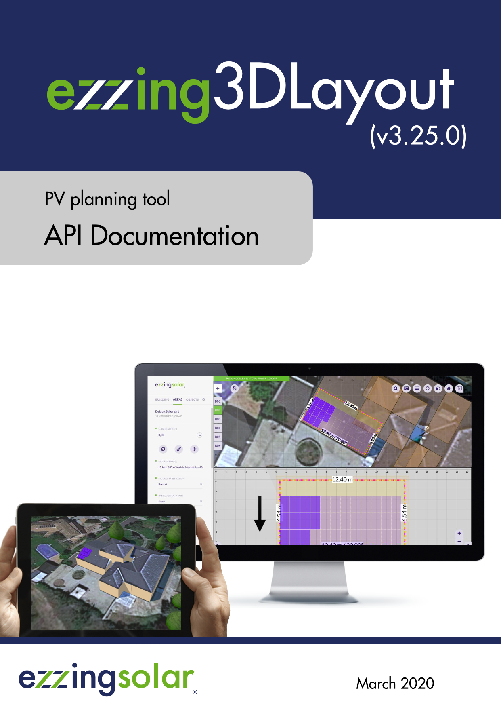

# ezzing3DLayout

## PV planning tool - API Documentation

# Table of contents

  - [Introduction](#introduction)
  - [Screenshots](#screenshots)
  - [3DLayout Interface](#3dlayout-interface)
      - [Aside Panel](#aside-panel)
      - [Canvas Area](#canvas-area)
          - [Buildings Index](#buildings-index)
          - [Main Options](#main-options)
          - [Control Buttons](#control-buttons)
          - [Notifications](#notifications)
  - [Buildings](#buildings)
      - [Building creation](#building-creation)
      - [Add building](#add-building)
      - [Edit building](#edit-building)
  - [Areas](#areas)
      - [Edit area](#edit-area)
  - [Subareas](#subareas)
      - [Subarea creation](#subarea-creation)
      - [Add subarea](#add-subarea)
          - [Crop subarea to the area
            shape](#crop-subarea-to-the-area-shape)
          - [Edit subarea vertices](#edit-subarea-vertices)
      - [Edit subarea](#edit-subarea)
      - [Remove subarea](#remove-subarea)
  - [Keepouts](#keepouts)
      - [Invisible keepouts](#invisible-keepouts)
      - [Crop keepout to the building
        shape](#crop-keepout-to-the-building-shape)
      - [Vertical and inclined
        keepouts](#vertical-and-inclined-keepouts)
  - [Trees](#trees)
  - [Drawing with Snaps](#drawing-with-snaps)
      - [Guide lines](#guide-lines)
      - [Grid](#grid)
      - [Context panel](#context-panel)
  - [Textures](#textures)
  - [Shortcuts](#shortcuts)
  - [Layout Coordinate Systems](#layout-coordinate-systems)
      - [World Coordinate System](#world-coordinate-system)
      - [Scene Coordinate System](#scene-coordinate-system)
      - [Building Coordinate System](#building-coordinate-system)
      - [Area Coordinate System](#area-coordinate-system)
  - [How to use](#how-to-use)
      - [API key and autentication](#api-key-and-autentication)
      - [DOM element](#dom-element)
      - [Basic functions](#basic-functions)
          - [createLayout](#createlayout)
          - [getLayout](#getlayout)
          - [listLayouts](#listlayouts)
          - [loadLayout](#loadlayout)
      - [Showcase mode](#showcase-mode)
          - [Showcase without camera
            spin](#showcase-without-camera-spin)
          - [Showcase with camera spin](#showcase-with-camera-spin)
  - [3DLayout Communication System](#3dlayout-communication-system)
      - [Info Events sent by 3DLayout](#info-events-sent-by-3dlayout)
          - [zoomChanged](#zoomchanged)
          - [fullscreen](#fullscreen)
          - [tabChanged](#tabchanged)
          - [editArea](#editarea)
          - [editKeepout](#editkeepout)
          - [editTree](#edittree)
          - [areaChanged](#areachanged)
          - [buildingChanged](#buildingchanged)
          - [roofChanged](#roofchanged)
          - [editRoof](#editroof)
          - [editVertices](#editvertices)
          - [buildingRemoved](#buildingremoved)
          - [buildingSelected](#buildingselected)
          - [buildingCreated](#buildingcreated)
      - [Functions to retrieve info from
        3DLayout](#functions-to-retrieve-info-from-3dlayout)
          - [Generic Functions](#generic-functions)
          - [Building related functions](#building-related-functions)
          - [Area related functions](#area-related-functions)
          - [Subarea related functions](#subarea-related-functions)
      - [Functions to send info to the
        3DLayout](#functions-to-send-info-to-the-3dlayout)
          - [CustomAlert event](#customalert-event)
  - [Layout Rules](#layout-rules)
      - [Scene preferences](#scene-preferences)
          - [Project](#project)
          - [Development](#development)
          - [3D canvas](#3d-canvas)
          - [Model](#model)
          - [GUI](#gui)
      - [Default buttons](#default-buttons)
      - [Default languages](#default-languages)
      - [Default colors](#default-colors)
          - [Css colors](#css-colors)
          - [Building and roof colors](#building-and-roof-colors)
          - [Keepout colors](#keepout-colors)
          - [Area colors](#area-colors)
          - [Dilatation lines colors](#dilatation-lines-colors)
          - [Module colors](#module-colors)
          - [Tree colors](#tree-colors)
          - [Custom colors](#custom-colors)
      - [Default modules](#default-modules)
      - [Default providers](#default-providers)
      - [Default model values](#default-model-values)
          - [Default model area values](#default-model-area-values)
          - [Default model building
            values](#default-model-building-values)
          - [Default model keepout
            values](#default-model-keepout-values)
          - [Default model roof by type
            values](#default-model-roof-by-type-values)
          - [Default model roof values](#default-model-roof-values)
          - [Default model subarea by roof type
            values](#default-model-subarea-by-roof-type-values)
          - [Default model subarea
            values](#default-model-subarea-values)
          - [Default model tree values](#default-model-tree-values)

# Introduction

Ezzing 3DLayout is a PV planning tool that allows you to generate a 3d
model of a building based on a satellite image. You can model any number
of buildings, select between up to five different type of roofs, define
keepouts and trees with custom heights...

Inside each roof area you can customize different structures, select
module models and get automated previews of your setup.

It also provides you with a perspective view and a sun simulator to
determine where the shadows will be in your installation.

Ezzing 3DLayout is an embebible webapp. You can integrate it inside your
own system and customize many elements inside, from module models to
prefered default settings for each roof type.

In this document you will find a brief showcase of the different areas
of the app, a technical explanation on how to integrate this webapp
inside your platform, a full description of the API that will allow you
to communicate with the 3DLayout, and finally a description of how to
customize different parts of the app.

  

You can test the app by visiting this link:

<https://layout.ezzing.com/#/demo>

# Screenshots

# 3DLayout Interface

The 3DLayout interface has two diferent parts: the **aside panel** and
the **canvas area**.

## Aside Panel

In the aside panel you can find functionalities related to the current
active building and other objects in the scene.

  
     

## Canvas Area

In the canvas area you can see the satellite view and three different
sets of elements: the **buildings index** on the left side, the **main
options buttons** on the top, and the **control buttons** on the
bottom-right corner.

### Buildings Index

In the buildings index you can see the active building and select
another one to become active. The color represented on each index is the
color of the building.

### Main Options

These are the main options in the canvas area:

All these buttons are the **main options custom buttons**. You can
customize this set of buttons by hidding some of them, by sorting them,
or by adding new buttons.

The default custom buttons are:

  - Save: saves the layout in crm
  - Search address: moves the project center to the address specified
  - Snapshot: takes a photograph of the project (with or without modules
    in jpg format, or in svg format)
  - Fullscreen
  - Sun simulation: sun and shadow simulation
  - Perspective view: switches to 2D/3D view
  - Renderer
  - Satellite provider selector (only showed if available)

> Please, visit the section [Custom Buttons](#custom-buttons) to learn
> how to add your own buttons.

### Control Buttons

These are map related buttons. You can also customize the upper section
of this set of buttons by hidding some of them or by adding new buttons.

Fixed buttons in this area:

  - Zoom in
  - Zoom out

  

3D control custom buttons:

  - Compass: centers 3D view to north
  - Geolocation: centers 3D view to the project
  - Zoom in
  - Zoom out

> Please, visit the section [Custom Buttons](#custom-buttons) to learn
> how to add your own functions.

### Notifications

Everytime an operation is being executed, it will appear at the bottom
of the canvas a bar with the name of that operation. Its color
represents the type of notification:

  - Red: error
  - Orange: warning (you should wait until the operation is finished)
  - Green: success
  - Blue: info

# Buildings

## Building creation

To start using the tool you need to create your first building. You will
be able to customize its shape, name or height (from gutter or ridge).

The 'Populated with modules' option determines if the building will be
created with or without modules. It is useful to deactivate it for
simulating the shadows of the buildings.

You can activate the modules in the building edition (this configuration
will be shown everytime the layout is loaded) or enabling the
corresponding area in the area section.

> Please, visit the section [Drawing with Snaps](#drawing-with-snaps) to
> learn how to draw.

The next step once you have drawn the building is configurating the
roof. There are different types of roofs depending on the shape of the
building (if the building is irregular, the roof can only be flat or
pent).

These are all the types of roof (available on regular buildings):

Each roof is composed of a determined number of areas that are
automatically created.

You can also choose a roof material despite it is only informative. The
material options are common for all roof types (tiled, trapezoidal, and
corrugated) except for the flat ones (gravel, bitumen, membrane, and
concrete):

When the operation is finished, the textures of the building are
generated using the mapper tool and the modules appear in a default
subarea.

> Please, visit the section [Textures](#textures) to learn how they are
> generated.

Once the building is created, you will be able to:

  - Edit
  - Move
  - Remove
  - Clone (it will be cloned with the same settings)
  - Paint

## Add building

By clicking the '+' button at the top-left of the canvas you enter in
the building creation process. There is no limit on buildings to create.

## Edit building

You can select between editing the building or editing the roof.

In the first option you can modify the building vertices following the
steps of the building creation. If you edit the roof you can select any
type of roof and it will be recalculated.

# Areas

The areas are sections on the roof that are automatically created when
selecting the type of roof.

Each area is composed of at least one subarea and has the information of
the number of modules it contains and the power that generates.

If you want to disable one area, you can click on the eye button next to
its name. By doing this, its module count and power generated will be
set to 0.

## Edit area

To edit an area you can modify the edge zone value. It is a numeric
value that specifies the distance between the building limits and the
subareas that exist within that area.

# Subareas

## Subarea creation

A subarea is a region inside an area that allows you to define a modules
installation just in a section of the area.

To create a subarea click on the 'Create subarea' button.

Once the subarea is created, you will be able to:

  - Edit
  - Move
  - Refresh
  - Remove (only if the area has more than one subarea)
  - Clone (it will be cloned with the same settings)

If you want to disable one subarea, you can click on the eye button next
to its name. By doing this, its module count and power generated will be
set to 0.

## Add subarea

By clicking the 'Create subarea' button you enter in the subarea
creation process.

If you create the first subarea it will replace the default one.

### Crop subarea to the area shape

When editing the vertices of a subarea you can check the 'Crop' option.
This helps you to draw subareas that extends to the border of the
building with more precision.

If you uncheck this option then the subarea can extend outside the area,
following the area plane.

### Edit subarea vertices

By clicking this button you can modify subarea vertices and the subarea
will be recalculated.

## Edit subarea

By clicking on a subarea you enter in the subarea edition process.

You will be able to refresh, paint or move all the modules.

These are all the subarea edition options:

  - Module model: there are different module models available that have
    different size, weight and watt peak capacity
  - Module orientation: you can choose between 'landscape' and
    'portrait'
  - Panels orientation: you can choose between 'south' and 'east/west'
  - Module inclination
  - Distance between modules
  - Distance between rows
  - Distance between centers
  - Use max. shadow calculation: calculates the distance between rows
    and centers depending on the module inclination
  - Azimuth: modules rotation
  - Staggered enabled
  - Dilatation lines enabled

Here, you can click on any module to enable/disable it. If you right
click on a module it will be displayed its position (row and column).

## Remove subarea

By clicking this button you can remove a single subarea from the
subareas list. It is only available if there exists more than one
subarea.

# Keepouts

Keepouts are created for simulating any obstacle that might interrupt
the installation of modules.

When a keepout is created, there can't be any module that occupies the
same position.

You can customize them by changing their height, offset and type
(vertical or inclined).

> Note that for flat roofs it is posible to create 0 height keepouts,
> but for inclinated roofs you need to use the invisible keepouts
> feature to allow keepouts at roof surface level.

## Invisible keepouts

If you want to simulate a skylight or any keepout object without drawing
the 3D volume you can check the 'Invisible keepout' option to hide the
3D volume but still taking the obstacle into account.

## Crop keepout to the building shape

When editing the vertices of a keepout you can check the 'Crop shape to
building limits' option. This helps you to draw keepouts that extends to
the border of the building with more precision.

If you uncheck this option then the keepout can be floating outside the
building limits. At least one vertex of the keepout should be inside the
building limits to be created.

## Vertical and inclined keepouts

You can create a keepout as vertical or inclined. If the keepout is
inclined, it will be created starting from the inclination of the
building.

# Trees

Trees belong to the scene, not to a building.

It is important to create trees for simulating the shadows on the roofs.
Therefore, you will be able to move them and modify their height and
radius. The shape of the tree is calculated according to the proportion
of these values.

# Drawing with Snaps

The snap is a helpful tool for drawing buildings, subareas and keepouts.

There are two ways for drawing points: using **guide lines** or a
**grid**.

## Guide lines

'Guide lines' is the default option when drawing. There are two ways for
drawing points that can be combined to make the process easier: lines
and vertices.

To use them, you need first to draw two points. Once you have drawn
them, there will appear parallel and perpendicular guide lines to the
last drawn point. This way you can create regular shapes with right
angles (it is also possible to move points along these guide lines).

Switching to the 'Vertices' option allows you to draw points at the
intersections of the guide lines and the vertices of the buildings.

> Please, visit the section [Context panel](#context-panel) to see more
> drawing features.

## Grid

When selecting this option appears a grid that occupies the entire
canvas area.

You can customize it by specifying a number for the grid size (size of
each square) and an offset in the x and y coordinates for moving the
grid.

> Please, visit the section [Context panel](#context-panel) to see more
> drawing features.

## Context panel

This menu is available in both options, guide lines and grid, by right
clicking on a point or edge.

When right clicking a point, you can:

  - Draw guides here (only in 'Guide lines' option): draws parallel and
    perpendicular guide lines to this point in relation to the selected
    edge
  - Remove all guides (only in 'Guide lines' option): removes all guide
    lines except the ones to the selected point
  - Select/deselect point: this is useful for moving many points along a
    guide line at once
  - Deselect all points: deselects all points except the last selected
    one
  - Delete point

When right clicking an edge (only in 'Guide lines' option), you can:

  - Select/deselect edge as guide: redraws the parallel and its
    perpendicular guide lines to the selected edge
  - Select/deselect all edges as guide

# Textures

The textures are images obtained from the satellite displayed on the
roof, with the same size and position.

They are generated by default when a building is created. You can
disable their automatic creation in the Preferences panel.

> Please, visit the section [Layout Rules](#layout-rules) to learn how
> to customize this property.

In the building panel you can see the different options for the
satellite image textures:

  - '+' : adds satellite texture for the active building
  - Refresh (available when the active building has textures)
  - Remove (available when the active building has textures)
  - Generate for all buildings
  - Remove all satellite textures

> Note that the textures generation might fail because of the speed of
> the internet connection or the speed of response of the satellite
> image provider. For preventing the failure you can select each
> building and wait for the satellite images to load or refresh the
> textures individually.

# Shortcuts

The shortcuts can be used in three cases:

  - When drawing:
      - To enable/disable snap to guides, press 'S'
      - To toggle between guide lines and vertices you can hold 'Ctrl'
      - To select/deselect vertices, click on them while pressing
        'Shift'
  - Editing a subarea:
      - Hold 'Shift' for selecting the hole row
      - Hold 'Ctrl' for selecting the hole column
  - Moving a building, subarea or keepout:
      - Down: Numpad 1, 2, 3 | 'End' | 'Down arrow' | 'Page down'
      - Left: Numpad 1, 4, 7 | 'End' | 'Left arrow' | 'Home'
      - Right: Numpad 3, 6, 9 | 'Page down' | 'Right arrow' | 'Page up'
      - Center: Numpad 5 | 'Clear'
  - Save: for saving the project in crm you can press 'Ctrl + Shift + S'

Anyways, these shortcuts will be displayed on a widget, so you can
consult them when necessary.

# Layout Coordinate Systems

The 3DLayout works in four different coordinate systems, depending on
which context we are requesting info.

## World Coordinate System

World coordinate system works with spherical coordinates, latitude and
longitude.

The values stored in this system and the API calls to retrieve this data
are:

  - Layout project center \> getLayout

## Scene Coordinate System

Scene coordinate system works with cartesian coords, with origin in the
layout project center and distances measured in meters. It is used to
place each building relative to the project center.

The values stored in this system and the API calls to retrieve this data
are:

  - Building data center \> getBuildingInfo()

## Building Coordinate System

Building coordinate System works with cartesian coords, with origin in
the building center and measured in meters. Al tilted surfaces are
represented in ortographic view.

The values stored in this system and the API calls to retrieve this data
are:

  - Building vertices (verticesMCoords) \> getBuildingInfo()

## Area Coordinate System

Area Coordinate System works in cartesian coords, with origin in the
bottom-left corner of the area, and rotated with the exterior wall
azimuth of the area. On flat roofs the first wall drawed is considered
the main wall.

The values stored in this system and the API calls to retrieve this data
are:

  - Area vertices (verticesMCoords) \> getAreaInfo()
  - Area offset vertices (verticesOffsetMCoords) \> getAreaInfo()
  - Area modules coords (modulesData (x/y)) \> getAreaInfo()

This is the same for subareas, just using **getSubareaInfo**

# How to use

## API key and autentication

The 3DLayout allows you to provide Google and Bing API keys.

In case these API keys don't exist, the default provider will be Open
Street Maps.

To add them as layout rules, please visit the [Scene
preferences](#scene-preferences) section within the [Layout
Rules](#layout-rules) section.

## DOM element

You need an element in the body of your html page, a div where **the
3DLayout will fit inside this element**.

> This div can't be bigger than the view size, and **no scroll** has to
> be applied to the html page.

You should not change the ezzing3d element size (width or height) but
change the size of this container div.

    

        <ezzing3d id='ezzing3d'></ezzing3d>
    

## Basic functions

Adding the `client.min.js` script with a valid API key makes available
the `Ezzing3DClient` global object, which we will use to start using the
3DLayout.

The Ezzing3DClient object has the following functions:

  - createLayout
  - getLayout
  - listLayouts
  - loadLayout
  - destroyLayout

### createLayout

Create a new layout with the specified information.

    var data = {
        title: "EzzingSolar",
        latitude: 40.428121,
        longitude: -3.698695,
        address: "Calle de Sagasta, 18",
        zip: "28004",
        city: "Madrid",
        province: "Madrid",
        country: "Spain"
    };

Where all values are optional except latitude and longitude that are
required.

    Ezzing3DClient.createLayout(data, function(err, layoutData) {
        if (err) throw err;
        console.log(layoutData);
    });

Which will return the information from the created layout:

    {
      id: 1093,
      title: "EzzingSolar",
      address: "Calle de Sagasta, 18",
      zip: "28004",
      city: "Madrid",
      province: "Madrid",
      country: "Spain",
      latitude: "40.428121",
      longitude: "-3.698695",
      created_at: "2016-08-18T17:15:15+0000",
      updated_at: "2016-08-19T10:14:34+0000",
      url: "https://layout.ezzing.com/#/GXXlgzDk0rPsrdxWfDsE5Cdi9FwUrBPx7GfuxSf0::1093"
    }

where:

  - **id**: the layout id, you need this id to load the project or
    retrieve information,
  - **title**: A title for the project,
  - **address**: the address
  - **city**: the city,
  - **province**: the province,
  - **country**: the contry,
  - **zip**: the zip code,
  - **latitude**: latitude value in decimal degrees (remember to include
    the negative sign for south and west coordinates) ,
  - **longitude**:longitude value in decimal degrees (remember to
    include the negative sign for south and west coordinates),
  - **created\_at**: creation date,
  - **updated\_at**: modification date,
  - **url**: an url to visit the project or embed it as an iframe

> The url can be used to embed a readonly version of the project. You
> can read a description of this methods in the [Showcase
> mode](#showcase-mode) section.

The data types in which each value is stored are:

  - **id**: integer
  - **title**: string 255 chars
  - **address**: string 255 chars
  - **city**: string 255 chars
  - **province**: string 255 chars
  - **country**: string 255 chars
  - **zip**: string 255 chars
  - **latitude**: decimal (+/-)xx.yyyyyyyy (max. precision 8 decimal
    digits)
  - **longitude**: decimal (+/-)xxx.yyyyyyyy (max. precision 8 decimal
    digits)
  - **created\_at**: ISO8601
  - **updated\_at**: ISO8601
  - **url**: string 2000 chars

### getLayout

Returns the information of a layout related to the given
    id

    Ezzing3DClient.getLayout(layoutId, function(err, layoutData, container) {
        if (err) throw err;
        console.log(layoutData);
    });

### listLayouts

Returns a list of all your created layouts.

    Ezzing3DClient.listLayouts(function(err, layoutData) {
        if (err) throw err;
        console.log(layoutData);
    });

### loadLayout

Sets up the 3DLayout interface into the ezzing3D container and loads the
project related to the given
    id.

    Ezzing3DClient.loadLayout(layoutId, function(err, layoutApi, container) {
        if (err) throw err;
    });

loadLayout can receive an `options` argument where you can setup some
customizations.

> You can read a description of this methods in the [Layout
> Rules](#layout-rules) section.

    var rules = {};
    
    Ezzing3DClient.loadLayout(layoutId, rules, function(err, layoutApi, container) {
        if (err) throw err;
    });

This method returns two objects, where:

  - layout: Exposes an object with methods to interact with the
    3DLayout.

> You can read a description of this methods in the [3DLayout
> Communication System](#dlayout-communication-system) section.

  - container: the DOM element where the 3DLayot is created.

## Showcase mode

If you want to show the layout to a customer or embed it in read-only
mode in another page of your platform (to act as a thumbnail of the
project) you can do it by adding an iframe element to an html page, with
a modified version of the url of the layout.

### Showcase without camera spin

    <iframe src=(url + "/showcase")> </iframe>

In this mode the 3DLayout will show the project in perspective mode
without any gui elements and a quiet 3d view. You can click and drag
with the mouse to rotate the view and zoom with the mouse wheel.

### Showcase with camera spin

    <iframe src=(url + "/spin-showcase")> </iframe>

In this mode the 3DLayout will show the project in perspective mode
without any gui elements and a rotating 3d view. You can click and drag
with the mouse to rotate the view and zoom with the mouse wheel. Once
clicked the rotation will stop.

# 3DLayout Communication System

## Info Events sent by 3DLayout

The 3DLayout triggers different events to report actions when they are
accomplished or to inform on GUI changes.

An example on how to listen this events:

    var container = window.document.getElementById('ezzing3d');
    
    container.addEventListener("buildingSelected", function(event, data){
        console.log(event.detail);
    });

The full list of events emmited by the 3DLayout are:

  - zoomChanged
  - fullscreen
  - tabChanged
  - editArea
  - editKeepout
  - editTree
  - areaChanged
  - buildingChanged
  - roofChanged
  - editRoof
  - editVertices
  - buildingRemoved
  - buildingSelected
  - buildingCreated
  - customAlertOk

### zoomChanged

This event is triggered when the zoom is changed in the canvas. It sends
the zoom level value.

### fullscreen

This event is triggered when the user changes from normal view to
fullscreen. It sends **true** when changing to fullscreen and **false**
when disabling fullscreen mode.

### tabChanged

This event is triggered every time the user changes the aside panel
navigation tab. It sends a string with the current tab name, the values
can be one of this: \[ "building", "areas", "keepouts", "trees" \].

### editArea

This event is triggered every time the user enters the edit section of
an area. The event sends the **area.id**.

### editKeepout

This event is triggered every time the user enters the edit section of a
keepout. The event sends the **keepout.id**.

### editTree

This event is triggered every time the user enters the edit section of a
tree. The event sends the **tree.id**.

### areaChanged

This event is triggerd every time an area attribute is changed. The
event sends back an array with this info:

    [area.id, attribute, value]

### buildingChanged

This event is triggered every time a building is changed. The event
sends back an array with this info:

    [building.id, building attribute, value]

### roofChanged

This event is triggered every time a roof attribute is changed. The
event sends back an array with this info:

    [building.id, roof attribute, value]

### editRoof

This event is triggered every time the user enters the roof edit section
of a building. The event sends the **building.id**

### editVertices

This event is triggered every time the user enters the vertices edit
section of a building. The event sends the **building.id**

### buildingRemoved

This event is triggered every time a building is deleted. The event
sends the **building.id** (after this operation this building won't
longer exist in the project)

### buildingSelected

This event is triggered every time a new building becomes active. The
event sends the **building.id**

### buildingCreated

This event is triggered every time a new building is created. The event
sends the **building.id**

## Functions to retrieve info from 3DLayout

There is a set of functions to retrieve information from the 3DLayout.

For all these functions you can pass a callback as an argument to be
executed when data is retrieved.

### Generic Functions

Set of generic functions to retrieve project information from the
layout. You just need to pass the **callback**, no other arguments are
needed.

  - getCurrentBuildingId
  - getLayoutData
  - getNumberOfModules
  - getTotalPower
  - getPower

#### getCurrentBuildingId

    layout.getCurrentBuildingId(callback);

This function returns the id value of the current active building.

#### getLayoutData

    layout.getLayoutData(callback);

This function returns a JSON with an array of buildings.

Each building in the array contains:

    {
        id: the building id,
        name: the building name,
        areas: an array of areas in the building
    }

Each area in the areas array contains:

    {
        id: the area id,
        name: the area name,
        subareas: an array of subareas in the area
    }

Each subarea in the subareas array contains:

    {
        id: the subarea id,
        name: the subarea name
    }

#### getNumberOfModules

    layout.getNumberOfModules(callback);

This function returns a JSON with an array of buildings.

Each building in the array contains:

    {
        id: the building id,
        name: the building name,
        modules: total of modules in the building
        areas: an array of areas in the building
    }

Each area in the areas array contains:

    {
        id: the area id,
        name: the area name,
        modules: total of modules in the area,
        subareas: an array of subareas in the area
    }

Each subarea in the subareas array contains:

    {
        id: the subarea id,
        name: the subarea name,
        modules: total of modules in the subarea
    }

#### getTotalPower

    layout.getTotalPower(callback);

Returns the total power for all the buildings in the project.

#### getPower

    layout.getPower(callback);

Returns an array of all buildings in the project.

Each building in the array contains:

    {
        id: the building id,
        name: the building name,
        power: the total power for this building,
        areas: array of areas in this building
    }

Each area in the areas array contains:

    {
        id: the area id,
        name: the area name,
        power: total power in this area,
        subareas: an array of subareas in the area
    }

Each subarea in the subareas array contains:

    {
        id: the subarea id,
        name: the subarea name,
        power: total power in this subarea
    }

### Building related functions

Set of generic functions to retrieve building related information from
the layout. In this set of functions you should pass an existing
building id and a callback.

  - getBuildingInfo
  - getRoofInfo
  - getBuildingPosition

#### getBuildingInfo

    layout.getBuildingInfo(id, callback);

Returns building information for a given building.id

The data returned is:

    {
        id: the building id,
        name: the building name,
        height: building height (in meters),
        regular: true if building angles are all equal to 90º, false otherwise.
        buildingArea: building area measure (in square meters),
        centerDeg: building center in World coordinate system,
        centerMCoords: building center in Scene coordinate system,
        vertices: building vertices in world coordinate system  [DEPRECATED],
        verticesMCoords: building vertices in building coordinate system,
        modules: total of modules in the building
        power: total power of the building,
        areas: array of areas in this building
    }

Each area in the areas array contains:

    {
        id: the area id,
        name: the area name,
        subareas: an array of subareas in the area
    }

Each subarea in the subareas array contains:

    {
        id: the subarea id,
        name: the subarea name
    }

#### getRoofInfo

    layout.getRoofInfo(id, callback);

Returns roof information for a given building.id\]

The data returned is:

    {
        height: roof height (in meters, not including building height),
        inclination: roof angle (in degrees),
        material: roof material (i.e: tiled/corugated),
        orientation: roof orientation (i.e: east/west or nort/south),
        type: roof type (i.e: flat, pent, gabled, etc...)
    }

#### getBuildingPosition

    layout.getBuildingPosition(id, callback);

Returns building position info for a given building.id.

The data returned is:

    {
        center: building center in world coord system [DEPRECATED],
        vertices: array of building vertices, world coord system [DEPRECATED],
        centerDeg: building center in World coord system,
        centerMCoords: building center in Scene coord system,
        verticesMCoords: building vertices in building coord system,
    }

### Area related functions

Set of generic functions to retrieve Area related information from the
layout. In this set of functions you should pass an existing area id and
a callback.

  - getAreaInfo
  - getModuleInfoByArea
  - getModulesStructureByArea
  - getAreaOffset

#### getAreaInfo

    layout.getAreaInfo(id, callback);

Returns area info for a given area.id.

The data returned is:

    {
        id: the area id,
        name: the area name,
        offset: the area offset,
        placement: placement (i.e: portrait / landscape),
        structure: i.e: east-west / standard,
        inclination: modules inclination (in degrees),
        azimuth: modules azimuthal inclination (in degrees),
        areaMCoords: array with area vertices coordinates in Area system coords [DEPRECATED],
        areaOffsetMCoords: array with offseted area vertices in Area system coords [DEPRECATED],
        verticesMCoords: array with area vertices coordinates in Area system coords,
        verticesOffsetMCoords: array with offseted area vertices in Area system coords,
        wallSizes: size in meters for each area wall,
        wallAzimuth: azimuthal angle for the external area wall,
        power: total power of the area,
        subareas: an array of subareas in the area
    }

Each subarea in the subareas array contains:

    {
        id: the subarea id,
        name: the subarea name
    }

#### getModuleInfoByArea

    layout.getModuleInfoByArea(id, callback);

Returns module info for a given area.id.

The data returned is:

    {
        id: the module id,
        name: the module model name,
        reference: extra model information,
        width: the width of the module (in meters),
        height: the height of the module (in meters),
        length: the lenght of the module (in meters),
        power: the power of the module
    }

#### getModulesStructureByArea

    layout.getModulesStructureByArea(id, callback);

Returns a JSON with an array of modules for a given area.id.

The data for each module in the array is:

    {
        x: x position of the module in Area system coords,
        y: y position of the module in Area system coords,
        col: column to which the module belongs,
        row: row to which the module belongs,,
        rX: rotation of the module in the X axis (inclination),
        rZ: rotation of the module in the Z axis (azimuth),
        color: the color of the module (only exist if color is not default),
    }

#### getAreaOffset

    layout.getAreaOffset(id, offset, callback);

Returns an array of vertices containing the offseted area for a given
area.id and offset.

If the offset is a negative value, then the area is reduced by the
offset value (in meters).

### Subarea related functions

Set of generic functions to retrieve Area related information from the
layout. In this set of functions you should pass an existing area id and
a callback.

  - getSubareaInfo
  - getModuleInfoBySubarea
  - getModulesStructureBySubarea

#### getSubareaInfo

    layout.getSubareaInfo(id, callback);

Returns subarea info for a given subarea.id.

The data returned is:

    {
        id: the subarea id,
        name: the subarea name,
        offset: the subarea offset,
        placement: placement (i.e: portrait / landscape),
        structure: i.e: east-west / standard,
        inclination: modules inclination (in degrees),
        azimuth: modules azimuthal inclination (in degrees),
        verticesMCoords: array with subarea vertices coordinates in Area system coords,
        verticesOffsetMCoords: array with offseted subarea vertices in Area system coords,
        wallSizes: size in meters for each subarea wall,
        wallAzimuth: azimuthal angle for the external area wall,
        power: total power of the subarea,
    }

#### getModuleInfoBySubarea

    layout.getModuleInfoBySubarea(id, callback);

Returns module info for a given subarea.id.

The data returned is:

    {
        id: the module id,
        name: the module model name,
        reference: extra model information,
        width: the width of the module (in meters),
        height: the height of the module (in meters),
        length: the lenght of the module (in meters),
        power: the power of the module
    }

#### getModulesStructureBySubarea

    layout.getModulesStructureBySubarea(id, callback);

Returns a JSON with an array of modules for a given subarea.id.

The data for each module in the array is:

    {
        x: x position of the module in Area system coords,
        y: y position of the module in Area system coords,
        col: column to which the module belongs,
        row: row to which the module belongs,,
        rX: rotation of the module in the X axis (inclination),
        rZ: rotation of the module in the Z axis (azimuth),
        color: the color of the module (only exist if color is not default),
    }

## Functions to send info to the 3DLayout

### CustomAlert event

You can send this event to show an alert with some information to the
user at any time.

    layout.customAlert(title_text_string, body_text_string, callback);

# Layout Rules

The user can customize many options in the 3DLayout. By passing a
'rules' attribute to the 3DLayout instance with a collection of objects,
you can define the default values, add special behaviours to the
3DLayout and customize the interface.

Example of rules object:

    var rules = {
        'display': true,
        'zoom': 21,
        'logo': false,
        'CustomPalette': ['#ff0000', '#00ff00']
    }

Available rule objects expected by the 3DLayout:

  - Scene preferences
      - Project
      - Development
      - 3D canvas
      - Model
      - GUI
  - Default buttons
  - Default languages
  - Default colors
      - Css colors
      - Building and roof colors
      - Keepout colors
      - Area colors
      - Dilatation lines colors
      - Module colors
      - Tree colors
      - Custom colors
  - Default modules
  - Default providers
  - Default model values
      - Default model area values
      - Default model building values
      - Default model keepout values
      - Default model roof by type values
      - Default model roof values
      - Default model subarea by roof type values
      - Default model subarea values
      - Default model tree values

## Scene preferences

### Project

The attributes are:

    {
        defaultProjectId: crm project to load if there's no hash (set to 0 to load the demo version),
        loadMockup: if true it loads a mockup,
        userToken: user token
    }

### Development

All the attributes are boolean:

    {
        debugPromises: debug promises (console log),
        disableUndoRedo: disable undo/redo feature (WIP),
        enableApi: enable Api feature,
        snapShotCrm: allow snapshots to be sent to crm
    }

### 3D canvas

Sample values:

    {
        activeMapper: true,
        activeRenderer: true,
        buildingTextures: true,
        zoomRatio: 1,
        translationRatio: 1,
        rotationRatio: 1,   
        enablePlayer: true
    }

The attributes are:

    {
        activeMapper: activate mapper on start,
        activeRenderer: activate renderer on start,
        buildingTextures: generate building textures when creating a building,
        zoomRatio: zoom ratio for 3D mode,
        translationRatio: translation ratio for 3D mode,
        rotationRatio: rotation ratio for 3D mode,
        enablePlayer: enable three.js canvas
    }

### Model

Sample values:

    {
        collisionBias: 0.03,
        angleBias: 0.5,
        maxAreaInclination: 75,
        sunSpeed: 1,
        googleApiKey: '',
        bingApiKey: ''
    }

The attributes are:

    {
        collisionBias: factor to validate collisions (with bigger values less collision),
        angleBias: factor to validate regular angles (with bigger values less angle precision),
        maxAreaInclination: area is disabled when the area inclination is bigger than this value,
        sunSpeed: position of element of the sun simulator speed,
        googleApiKey: Google api key for provider,
        bingApiKey: Bing api key for provider
    }

### GUI

Sample values:

    {
        closeRightCanvas: true,
        showCoordinates: false,
        showTotalPower: true,
        customLogo: 'default',
        customNav: 'default',
        showNav: true,
        showLogo: true,
        defaultLanguage: 'en',
        defaultUnits: 'm',
        enableNotifications: true,
        manageFullscreen: true,
        movementStep: 0.1,
        snapToGrid: false,
        gridSize: 1,
        gridOffsetX: 0,
        gridOffsetY: 0,
        snapToGuides: true,
        snapToLines: true,
        snapToVertices: false,
        maxAllowedBuildings: 0,
        viewportMode: 4,
        hidden: []
    }

The attributes are:

    {
        closeRightCanvas: close right canvas on start,
        showCoordinates: show coordinates of the mouse in the right bottom corner,
        showTotalPower: show 'Total power' indicator in the left upper corner,
        customLogo: custom logo url,
        customNav: show or hide nav ('default' shows nav),
        showNav: creates structure of panels,
        showLogo: show logo,
        defaultLanguage: string from available keys at 'defaultLanguages',
        defaultUnits: string from available keys at 'units',
        enableNotifications: enable operator notifications feature,
        manageFullscreen: manage fullscreen mode,
        movementStep: amount of movement in meters when using arrow keys to move solar panels,
        snapToGrid: enable snap vertices to grid,
        gridSize: grid distance to use as snap when using snap to move vertices,
        gridOffsetX: offset grid drawing in x axis,
        gridOffsetY: offset grid drawing in y axis,
        snapToGuides: activate snap to guides,
        snapToLines: enable snap to guidelines or edges,
        snapToVertices: enable snap to vertices or guideline intersections,
        maxAllowedBuildings: hides the button to create new buildings when their quantity is >= to this value (if it's 0 there is no max quantity),
        viewportMode: viewport mode,
        hidden: array of json properties within that json that don't want to be shown in panels
    }

The viewportMode options are:

  - 0: invisible interface
  - 1: showcase mode
  - 2: open street map
  - 3: hide interface \[DEPRECATED\]
  - 4: google streetview
  - 5: default values editor
  - 6: simple mode
  - 7: documentation
  - 8: autocad export

## Default buttons

There are several areas in the 3DLayout where the user can add his own
functions. The defaultButtons property has different properties
depending on the area of the buttons:

    {
        buttonsPanelLeft: { },
        buttonsPanelRight: { },
        buttonsPanelBottomZoom: { },
        buttonsPanelBottomRight: { },
        buttonsPanelBottomLeft: { },
        buttonsPanelBottomCenter: { },
        buttonsPanelRightViewportRight: { }
    }

Each buttons panel has the following properties:

    buttonsPanelRight: {
        position: 'right',
        buttonsPanel: {
            type: 'groupBlock',
            elements: { }
        }
    }

To create a button panel you must specify its type ('groupBlock').

The 'elements' property within 'buttonsPanel' contains all the buttons
that exist in that button panel. For example, to create the 'Snapshot'
and 'Fullscreen' buttons at the right-top of the canvas:

    elements: {
        classed: 'ez3d-panel-buttons ez3d-flex-start-wrap-row viewport_left_controls_left',
        snapshot: {
            type: 'button',
            tooltip: 'snapshot',
            classed: 'ez3d-button fa-camera-retro',
            confirmation: true,
            confirmationWidget: {
                'name': 'snapshot',
                'title': 'snapShot',
                'functionOnCreation': ['managerWidgetSnapShot', 'snapshot']
            }
        },
        fullScreen: {
            type: 'button',
            tooltip: 'fullScreen',
            classed: 'ez3d-button ez3d-screen-icon',
            changeIcon: 'screen',
            functionOnClick: ['fullScreen', '']
        },
    }

The 'elements' property is composed of a 'classed' property to position
the buttons, and the buttons by their name.

All the properties that a button can have are:

    buttonName: {
        type: 'button',
        id: button id,
        classed: class button attribute,
        content: button text,
        tooltip: button tooltip,
        property: attribute only model,
        confirmation: boolean for showing a button confirmation widget,
        confirmationWidget: {
            'eventOk': event sent when clicking on the 'Ok' button,
            'eventCancel': event sent when clicking on the 'Cancel' button,
            'name': widget id,
            'title': widget title,
            'content': widget content,
            'functionOnCreation': function called when creating the widget
        }
        value: button value,
        changeIcon: toggle button icon string,
        editable: disabled button attribute,
        active: active button class,
        elements: foldable elements list (object),
        functionOnClick: function called when clicking on the button,
        eventOnClick: event sent when clicking on the button
    }

It is very important to specify the type of element (in this case
'button') for creating correctly these elements.

These buttons will be created following the order of the
'buttonsPanel.elements' object.

## Default languages

To customize the existing languages or add new ones, you have to edit
them or create a new json property with the name of that language
abbreviation ('EN', 'FR', 'ES', etc).

    var defaultLanguages = {
        'EN': {
            'key': 'english key value'
        },
        'FR': {
            'key': 'french key value'
        }
    }

## Default colors

All the customizable colors can be also edited in the Preferences menu
selecting the 'Default values editor' on the viewport mode. These are:

    var defaultColors = {
        cssColors: { },
        buildingColors: { },
        roofPointsColors: { },
        roofRidgeColors: { },
        keepoutColors: { },
        areaColors: { },
        subareaColors: { },
        dilatationLinesColors: { },
        moduleColors: { },
        treeColors: { },
        customColor: { }
    }

### Css colors

These colors are used in the viewport and buttons in the canvas areas.

    cssColors: {
        first: '#7AAD37',
        second: '#222960',
        third: '#E68A14',
        lightgray: '#DDDCE6',
        mediumgray: '#A7A3BC',
        darkgray: '#999',
        disabledbuttons: '#808080',
        disabledCustomSwtch: '#e0dfe4',
        primaryFont: '#ff0000',
        white: '#ffffff',
    }

### Building and roof colors

Building and roof colors have the same main attributes:

    {
        fill: '#a52a2a',
        fillOpacity: 0.1,
        stroke: '#000',
        strokeWidth: 0.4,
        strokeDasharray: 0
    }

These attributes can belong to different properties. For example
'standard', 'hover', 'active', 'vertices', etc.

> Note that every time it appears an empty object ({ }) in the examples,
> these main attributes exist in them.

    buildingColors: {
        path: {
            standard: {
                fill: '#a52a2a',
                fillOpacity: 0.1,
                stroke: '#000',
                strokeWidth: 0.4,
                strokeDasharray: 0
            },
            hover: { },
            active: { },
            roofContext: { },
            move: { }
        },
        vertices: {
            standard: { }
        },
        center: { },
        autocad: { }
    }

Also, in 'roofPointsColors' and 'roofRidgeColors' properties there's a
new property called 'radius' on each property.

    roofPointsColors: {
        standard: {
            fill: '#008000',
            fillOpacity: 1,
            stroke: '#fff',
            strokeWidth: 0,
            strokeDasharray: 0,
            radius: 3
        },
        locked: { }
    },
    roofRidgeColors: {
        path: {
            standard: { }
        }
    }

### Keepout colors

In keepout colors property there are two new properties called
'offsettedPath' and 'autocad':

    keepoutColors: {
        path: {
            standard: { },
            active: { },
            hover: { },
            move: { },
            offsettedPath: { }
        },
        autocad: { }

### Area colors

Areas and subareas have the same properties except for 'autocad'
property, which is only available in areaColors.

    areaColors: {
        path: {
            standard: { },
            active: { },
            move: { },
            hover: { },
            offsettedPath: { },
        },
        vertices: {
            standard: { },
            move: { }
        },
        autocad: {
            fill: 'transparent',
            fillOpacity: 1,
            stroke: '#ff3047',
            strokeWidth: 0.3,
            strokeDasharray: 0,
            strokeLine: '#6fff6d',
            strokeWidthLine: 0.02
        }
    },

### Dilatation lines colors

Sample values:

    dilatationLinesColors: {
        cols: {
            stroke: '#ffa500'
        },
        rows: {
            stroke: '#00ffff'
        }
    }

### Module colors

Properties for module colors:

    moduleColors: {
        path: {
            module: { },
            moduleSelected: { },
            moduleHover: { },
            empty: { },
            emptyHover: { },
            collision: { }
        },
        autocad: { }
    },

### Tree colors

Properties for tree colors:

    treeColors: {
        standard: { },
        active: { },
        hover: { }
    }

### Custom colors

Sample values:

    customColor: [
        '#0000FF', '#a52a2a', '#ff0000', '#1f77b4', '#aec7e8', '#ff7f0e',
        '#ffbb78', '#2ca02c', '#98df8a', '#d62728', '#ff9896', '#9467bd',
        '#c5b0d5', '#8c564b', '#c49c94', '#e377c2', '#f7b6d2', '#7f7f7f',
        '#c7c7c7', '#bcbd22', '#dbdb8d', '#17becf', '#9edae5'
    ]

## Default modules

The defaultModules variable is an array of objects with the modules
information:

    var defaultModules = [
        {
            id: 47113,
            name: 'BenQ',
            reference: '327Wp Mono Zwart',
            power: 327,
            length: 1.559,
            width: 1.046,
            height: 0.046
        }

## Default providers

The defaultProviders variable is an array of strings with the providers
names:

    var defaultProviders = ['White Map', 'Google Hybrid', 'Bing', 'Carto', 'Open Street Maps'];

## Default model values

The defaultModelValues property is an object with the following
properties:

    var defaultModelValues = {
        area: areaDefaultValues,
        building: buildingDefaultValues,
        keepout: keepoutDefaultValues,
        roofByType: roofByTypeDefaultValues,
        roof: roofDefaultValues,
        subareaByRoofType: subareaByRoofTypeDefaultValues,
        subarea: subareaDefaultValues,
        tree: treeDefaultValues
    }

### Default model area values

Sample values:

    var areaDefaultValues = {
        disabled: false,
        populated: true
    }

### Default model building values

Sample values:

    var buildingDefaultValues = {
        overlapping: true,
        name: ' ',
        height: 10,
        maxHeight: Infinity,
        minHeight: 0,
        offset: [0],
        padding: {
            eaves: false,
            parapet: 0,
            height: 0
        },
        populated: true,
        regular: true,
        ridge: {
            enabled: false
        },
        hidden: [ ]
    }

### Default model keepout values

Sample values:

    var keepoutDefaultValues = {
        crop: false,
        height: 1,
        invisible: false,
        offset: [0],
        regular: true,
        type: 'vertical',
        hidden: [ ]
    }

### Default model roof by type values

Sample values:

    var roofByTypeDefaultValues = {
        flat: {
            material: 'bitumen',
            availableMaterial: {
                gravel: {
                    value: 'gravel',
                    image: 'gravel',
                    label: 'gravel'
                },
                bitumen: { },
                membrane: { },
                concrete: { }
            },
            availableOrientation: [ ],
            inclination: 0,
            offset: [1],
            orientation: '',
            hidden: [ ],
            locked: [ ]
        },
        gabled: { },
        hipped: { },
        pyramid { },
        mansard { },
        pent: {
            material: 'tiled',
            availableMaterial: [
                'tiled',
                'trapezoidal',
                'corrugated'
            ],
            offset: [0.4],
            orientation: 'S',
            availableOrientation: ['E', 'W', 'N', 'S'],
            inclination: 30,
            hidden: [ ],
            locked: [ ]
        }
    }

### Default model roof values

Sample values:

    var roofDefaultValues = {
        disabled: false,
        inclination: 0,
        lockRoofPoints: false,
        roofPointsSymmetry: true,
        material: 'bitumen',
        offset: [0],
        orientation: 'SN',
        type: 'flat',
        hidden: [ ]
    }

### Default model subarea by roof type values

Sample values:

    var subareaByRoofTypeDefaultValues = {
        flat: {
            modelId: 471131,
            azimuth: '',
            inset: {x: 0.025, y: 0.025},
            inclination: 15,
            useShadowsCalculation: false,
            availableInclination: '',
            placement: 'landscape',
            availablePlacement: ['landscape','portrait'],
            structure: 'Standard',
            availableStructure: ['EW','Standard'],
            staggered: {
                enabled: false,
                offset: 0,
                offsetMax: 3,
                alternate: false
            },
            dilatationLines: {
                enabled: false,
                x: 30,
                y: 30,
                w: 0.35,
                h: 0.1
            }
        },
        pent: { },
        gabled: { },
        hipped: { },
        pyramid: { },
        mansard: { }
    }

### Default model subarea values

Sample values:

    var subareaDefaultValues = {
        crop: false,
        disabled: false,
        offset: [0],
        regular: true,
        hidden: [ ]
    }

### Default model tree values

Sample values:

    var treeDefaultValues = {
        disabled: false,
        crownTopHeight: 10,
        crownHigherHeight: 7,
        crownHigherRadius: 1.42,
        crownMiddleHeight: 5,
        crownMiddleRadius: 1.75,
        crownLowerHeight: 3.5,
        crownLowerRadius: 1.42,
        trunkHeight: 2.5,
        trunkRadius: 0.33,
        hidden: [ ]
    }
